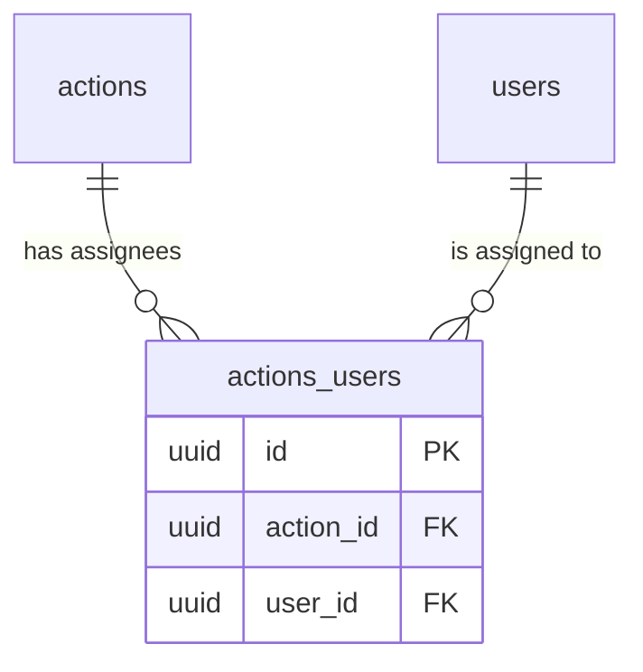
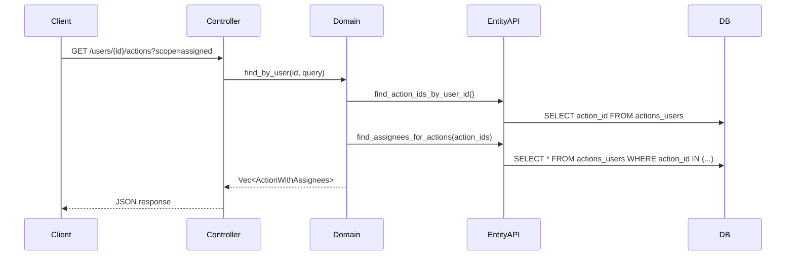

# Action Assignees

Actions can be assigned to one or more users (coach and/or coachee) via a many-to-many relationship.

## Data Model

## Layer Responsibilities

| Layer | Module | Responsibility |
|-------|--------|----------------|
| entity | `actions_users` | SeaORM entity definition |
| entity_api | `actions_user` | CRUD operations, batch queries |
| domain | `action` | `ActionWithAssignees` struct, `find_by_user()` |
| web | `action_controller` | Unified `/users/{id}/actions` endpoint |

## Key Functions

**entity_api** (`entity_api/src/actions_user.rs`):
- `set_assignees(db, action_id, user_ids)` - Atomically replaces all assignees (uses transaction)
- `find_assignees_for_actions(db, action_ids)` - Batch fetches assignees to avoid N+1 queries

**domain** (`domain/src/action.rs`):
- `find_by_user(db, user_id, query)` - Unified query with scope (assigned vs sessions) and filters

## Query Flow

