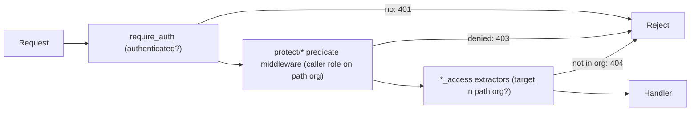

# Authorization Architecture

How the backend decides whether a request is allowed. Authorization happens in two layers: caller authorization (who is asking) and resource scoping (what they are allowed to act on). This document currently covers the organization user-management routes; other route groups follow the same model and can be added here over time.

## Role model

Roles live in the `user_roles` table. A user can hold roles in more than one organization, and a role is the pairing of a `role` value with an `organization_id`.

| Role | `organization_id` | Scope |
|---|---|---|
| `SuperAdmin` | `NULL` | Platform-wide. Implicitly satisfies organization membership and admin checks for every organization. |
| `Admin` | set | Administrator of that one organization. |
| `User` | set | Member of that one organization (coach or coachee). |

The admin check (`entity_api`/`domain` `has_admin_access`) treats a request as having admin rights when the caller is a `SuperAdmin` (org `NULL`) or an `Admin` of the specific organization named in the path.

## Two-layer enforcement

Every protected route runs `require_auth` first (rejects unauthenticated requests), then applies up to two further layers.

1. **Caller authorization** (predicate middleware, `web/src/protect/`). Attached with `route_layer(from_fn_with_state(..))`, so it runs before the handler. Predicates such as `UserIsAdmin` and `UserIsNotSelf` (`web/src/protect/mod.rs`) check the caller's role on the path organization and the caller's identity. They do not look at the target resource.
2. **Resource scoping** (`FromRequestParts` extractors, `web/src/extractors/`). Declared in the handler signature. An `*_access` extractor loads the target resource named in the path, verifies it belongs to the path organization (or that the caller participates in it), and yields the loaded model to the handler. A target outside the path organization resolves to `404` so its existence in another organization is not disclosed.

Splitting the two layers is deliberate: the handler can only ever name a resource id that the extractor already proved belongs to the path organization, so a missing scope check cannot be reintroduced by editing the handler alone.

## Response semantics

| Status | Meaning |
|---|---|
| `401` | Not authenticated. |
| `403` | Authenticated, but the caller lacks the required role on the path organization (a predicate denied the request). |
| `404` | The caller is authorized for the organization, but the target resource is not a member of it. Returned instead of `403` so cross-organization existence is not disclosed. |

## Organization user routes

Source: `web/src/router.rs` (`organization_user_routes`), handlers in `web/src/controller/organization/user_controller.rs`, predicates in `web/src/protect/organizations/users.rs`.

| Method and path | Caller must be | Target `{user_id}` scoping | Enforced by |
|---|---|---|---|
| `GET /organizations/{org}/users` | Member of `{org}` (any role), or `SuperAdmin` | n/a | `OrganizationMemberAccess` |
| `POST /organizations/{org}/users` | `Admin` of `{org}` (or `SuperAdmin`) | n/a | `UserIsAdmin` + `OrganizationMemberAccess` |
| `POST /organizations/{org}/users/{user_id}/resend-invite` | `Admin` of `{org}` (or `SuperAdmin`) | `{user_id}` must be a member of `{org}`, else `404` | `UserIsAdmin` + `OrganizationMemberAccess` + `OrganizationUserAccess` |
| `DELETE /organizations/{org}/users/{user_id}` | `Admin` of `{org}` (or `SuperAdmin`), and not the caller themselves | `{user_id}` must be a member of `{org}`, else `404` | `UserIsAdmin` + `UserIsNotSelf` + `OrganizationMemberAccess` + `OrganizationUserAccess` |

Notes:

* `GET` has no predicate middleware: any organization member may list the organization's users. The write routes additionally require admin rights.
* The `{user_id}` scoping on `resend-invite` and `DELETE` ensures an organization admin can only act on users that belong to the organization named in the path. Without it, an admin of one organization could name a `{user_id}` from another organization and operate on it.
* `DELETE` cascades: removing a user also removes that user's roles and coaching relationships (`domain::user::delete`), which is why target scoping matters most here.

## Related code

* Predicate middleware and predicates: `web/src/protect/organizations/users.rs`, `web/src/protect/mod.rs`
* Resource-scoping extractors: `web/src/extractors/organization_member_access.rs`, `web/src/extractors/organization_user_access.rs`
* Admin check query: `has_admin_access` in the `entity_api`/`domain` user modules
