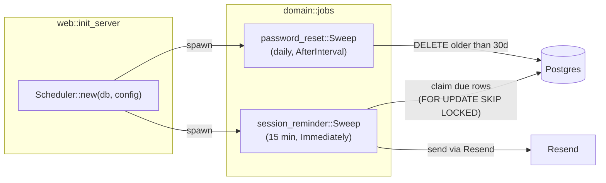

# Background Jobs Architecture

Recurring background work runs in-process, inside the same Axum binary that serves the
API. `domain::jobs` defines the interface; `web::init_server` registers the jobs at
startup.

## The shape: sweeps, not a queue

Every job is a **periodic sweep**. It wakes on a fixed interval, asks the database what
is due *right now*, and acts on it. Nothing is enqueued ahead of time — Postgres is the
queue, and each job's `run` holds the predicate that defines "due".

This was a deliberate choice over a durable job queue (`apalis`, `sqlxmq`, and friends)
and over a cron-expression scheduler (`tokio-cron-scheduler`):

| Option | Why not |
|---|---|
| Durable job queue | A queue must be told at enqueue time what work exists. Every later edit — a session moved, a session cancelled, a relationship ended — then needs a matching dequeue or re-enqueue, and any missed one leaves a job that fires against a reality that no longer holds. A sweep re-derives the work list from current rows every tick, so it is correct after any edit with no compensating logic. |
| Cron scheduler crate | Replaces the ten lines of `tokio::time::interval` we already have and solves none of the hard part, which is idempotency and multi-replica safety. |

The cost of a sweep is latency bounded by the tick interval. For work measured in hours
(a reminder 24 hours out, a 30-day retention purge) that is free.

If a future job ever needs sub-second dispatch, per-item retry/backoff state, or a
dead-letter queue, that is the point to revisit a real broker — none of the current jobs
do.

## Interface

```rust
#[async_trait]
pub trait Job: Send + Sync + 'static {
    fn name(&self) -> &'static str;          // log prefix, kebab-case
    fn interval(&self) -> Duration;          // time between ticks
    fn first_run(&self) -> FirstRun { ... }  // Immediately | AfterInterval
    async fn run(&self, ctx: &Context) -> Result<Outcome, Error>;
}
```

`Context` carries an `Arc<DatabaseConnection>` and the `Config`, cloned once per job at
spawn time. `Outcome::processed` is a job-defined unit; `0` (`Outcome::IDLE`) means
"nothing was due" and is logged at DEBUG so quiet jobs stay quiet.

`Scheduler` spawns one tokio task per job. Ticking uses `MissedTickBehavior::Delay`, so a
tick that comes due while `run` is still working does not queue up a burst of catch-up
ticks. A tick returning `Err` is logged and the loop continues — **`run` must therefore
be safe to re-enter after a partial failure.**



## Idempotency and multiple replicas

Durability comes from the queries, not from a broker. A job that must not double-act
claims its rows in the *same statement* that selects them, so two backend replicas
running the same sweep divide the work instead of duplicating it.

`entity_api::coaching_session::claim_due_reminders` is the canonical example:

```sql
UPDATE refactor_platform.coaching_sessions AS cs
SET reminder_sent_for_start = cs.date
FROM (
    SELECT id FROM refactor_platform.coaching_sessions
    WHERE date > $1 AND date <= $2
      AND reminder_sent_for_start IS DISTINCT FROM date
    ORDER BY date LIMIT $3
    FOR UPDATE SKIP LOCKED
) AS due
WHERE cs.id = due.id
RETURNING cs.*
```

Two details carry most of the weight:

- **`SKIP LOCKED`** — a second replica steps over rows the first is claiming rather than
  blocking on them or double-sending.
- **The stamp is the session's start, not a "sent at" timestamp.** `IS DISTINCT FROM date`
  means a rescheduled session stops matching its own stamp and falls back into scope
  automatically. No reschedule-path code has to remember to clear a flag.

Delivery happens *after* the claim commits, so a failed send would otherwise be lost. The
reminder sweep therefore releases the claim (`release_reminder_claim`) on failure, costing
one tick instead of the whole reminder.

`LIMIT` bounds one tick's batch, so a backlog — the first run after an outage, say —
drains over several ticks instead of bursting against the Resend API.

## Registered jobs

| Job | Interval | First run | What it does |
|---|---|---|---|
| `password-reset-sweep` | 24h | After interval | Deletes `password_reset_attempts` rows older than 30 days. Retention outlives the 24-hour daily-cap window; the rest is forensics. |
| `session-reminder` | `SESSION_REMINDER_POLL_MINUTES` (default 15) | Immediately | Emails each coachee ahead of an upcoming session. Not scheduled at all when `SESSION_REMINDER_EMAIL_TEMPLATE_ID` is unset. |

The session-store expiry task in `web::init_server` stays hand-rolled: it is
`tower_sessions`' own `continuously_delete_expired` helper, not one of our jobs.

## Adding a job

1. Implement `Job` in a new submodule of `domain/src/jobs/`.
2. Register it in `web::init_server` via `Scheduler::spawn`.
3. If the job acts on rows and must not double-act, claim them the way
   `claim_due_reminders` does — do not select-then-update in two statements.
4. Return `Outcome::IDLE` on a quiet tick.

## Key files

| File | Role |
|---|---|
| `domain/src/jobs/mod.rs` | `Job` trait, `Context`, `Outcome`, `Scheduler` |
| `domain/src/jobs/session_reminder.rs` | Upcoming-session reminder sweep |
| `domain/src/jobs/password_reset.rs` | Password-reset attempt retention sweep |
| `entity_api/src/coaching_session.rs` | `claim_due_reminders` / `release_reminder_claim` |
| `web/src/lib.rs` | Registers the jobs at server start |
