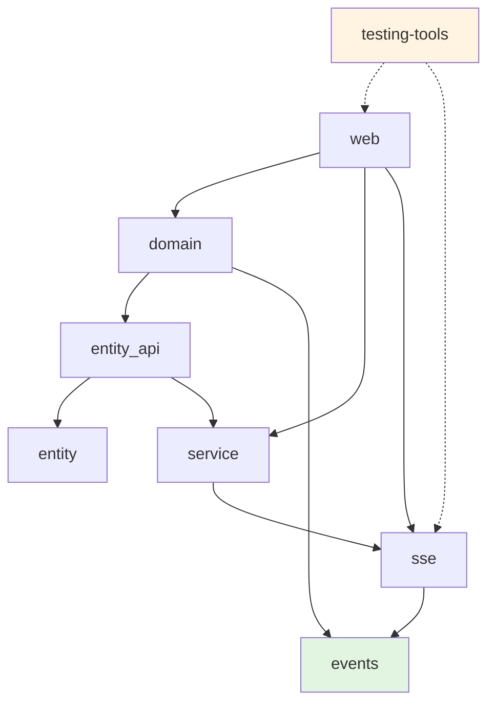

This diagram represents the dependency structure of the crates in this project. Each arrow indicates a dependency relationship between the crates. For example, the `web` crate depends on both the `domain` and `service` crates, while the `entity_api` crate depends on the `entity` and `service` crates.

The `events` crate is a foundation layer with no internal dependencies, providing domain event definitions. The `sse` crate depends only on `events`, avoiding circular dependencies by using generic types. The `testing-tools` crate is standalone for integration testing.

