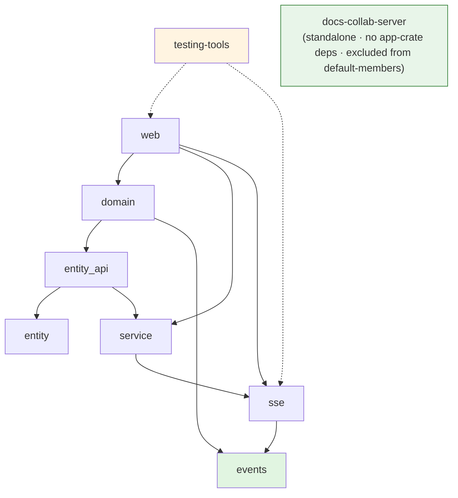

This diagram represents the dependency structure of the crates in this project. Each arrow indicates a dependency relationship between the crates. For example, the `web` crate depends on both the `domain` and `service` crates, while the `entity_api` crate depends on the `entity` and `service` crates.

The `events` crate is a foundation layer with no internal dependencies, providing domain event definitions. The `sse` crate depends only on `events`, avoiding circular dependencies by using generic types. The `testing-tools` crate is standalone for integration testing.

The `docs-collab-server` crate is a workspace member but is **standalone**: it has no dependency on any application crate (it depends only on third-party crates such as `axum`, `yrs`, `sqlx`, and `jsonwebtoken`). It is excluded from `default-members`, so the normal app build/deploy does not include it. This isolation is intentional so it can be extracted into its own published repository later. It integrates with the application only over the wire (REST + WebSocket), not via Cargo dependencies. See `docs/architecture/docs_collab_server_components.md`.

```mermaid
graph TD;
    web-->domain;
    web-->service;
    web-->sse;
    service-->sse;
    domain-->entity_api;
    domain-->events;
    entity_api-->entity;
    entity_api-->service;
    sse-->events;
    testing-tools-.->web;
    testing-tools-.->sse;

    docs-collab-server["docs-collab-server<br/>(standalone · no app-crate deps · excluded from default-members)"]

    style events fill:#e1f5e1
    style testing-tools fill:#fff4e1
    style docs-collab-server fill:#e8f5e9,stroke:#2e7d32
```