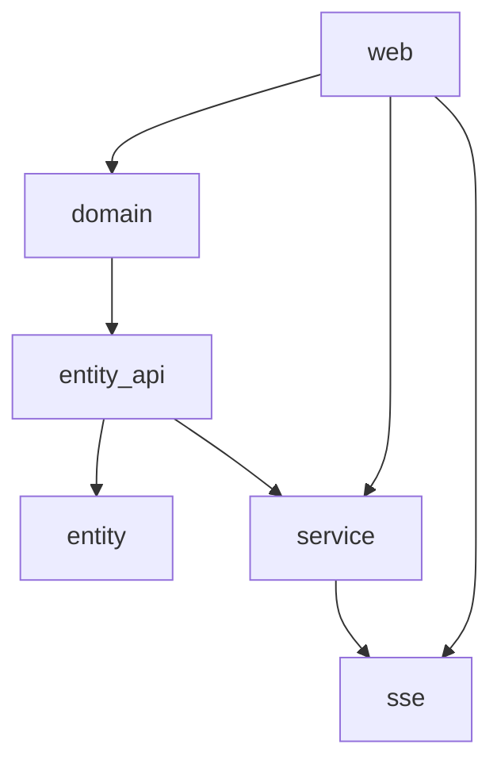

This diagram represents the dependency structure of the crates in this project. Each arrow indicates a dependency relationship between the crates. For example, the `web` crate depends on both the `domain` and `service` crates, while the `entity_api` crate depends on the `entity` and `service` crates.

The `sse` crate is standalone with no domain dependencies, using generic types to avoid circular dependencies.

