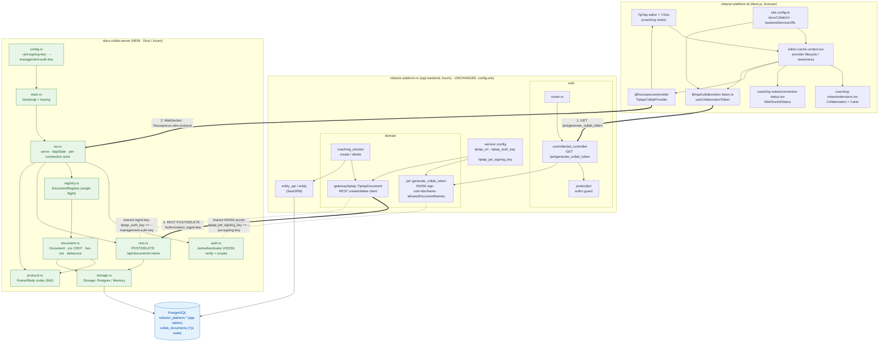

# Collaboration System: Component Architecture

How the self-hosted **docs-collab-server** integrates with the existing app backend
(**refactor-platform-rs**) and frontend (**refactor-platform-fe**) to replace TipTap
Cloud for collaborative coaching notes.

This is one layer deeper than the box-level overview in
`docs/implementation-plans/docs-collab-server.md`: it shows the **first-order modules**
inside each component and the three contracts that bind them together.

The app backend's Rust crates are **unchanged** by this migration; only the
`tiptap_*` config values in `service::config` repoint from Cloud to the local server.

## Diagram

## The three cross-component contracts

1. **Token mint (FE → app backend).** `useCollaborationToken` calls
   `GET /jwt/generate_collab_token`; `jwt_controller` (behind the `protect/jwt` guard)
   delegates to `domain::jwt::generate_collab_token`, which HS256-signs a JWT whose
   `sub` is the document name and whose `allowedDocumentNames` claim scopes it to
   `{org}.{rel}.*`. The token is handed to the provider unchanged.
2. **Collaboration WebSocket (FE → docs-collab-server).** `TiptapCollabProvider`
   (pointed at `docsCollabUrl` via `baseUrl`) opens one WebSocket and speaks the
   Hocuspocus wire protocol. This is the **same topology as TipTap Cloud** (the
   browser's provider always connected straight to the collaboration host, never
   through the app backend); only the endpoint changed from Cloud to the self-hosted
   server. `ws.rs` runs a per-connection actor: `auth.rs` verifies
   the token + scope, `registry.rs` loads the `Document`, `document.rs` applies/merges
   updates via `yrs` and fans out to peers, and `protocol.rs` is the lib0 codec used on
   every frame.
3. **Document management (app backend → docs-collab-server).** On session create/delete,
   `domain::coaching_session` uses `gateway::tiptap::TiptapDocument` to
   `POST`/`DELETE /api/documents/:name`; `rest.rs` seeds or removes the row in
   `collab_documents`.

## Two shared-secret invariants (dashed edges)

These are process-boundary contracts with no compile-time check, and the most likely
thing to misconfigure:
- **JWT signing key:** the app signs with `tiptap_jwt_signing_key`; docs-collab-server
  verifies with `--jwt-signing-key`. Mismatch → every WS auth is `PermissionDenied`.
- **Management key:** the app sends `tiptap_auth_key` as the verbatim `Authorization`
  header; docs-collab-server compares it to `--management-auth-key`. Mismatch → session
  provisioning returns 401.

## First-order modules at a glance

- **docs-collab-server** (new): `main` → `ws` (owns `AppState`, the connection actor,
  graceful shutdown) → {`auth`, `registry`, `rest`}; `registry` → `document` → {`protocol`,
  `storage`}; `config` parameterizes the bootstrap. `protocol` is pure (no I/O);
  `storage` abstracts Postgres vs in-memory.
- **refactor-platform-rs** (app backend, unchanged): layered `web → domain → entity_api
  → entity`. Collab touchpoints are only `web::controller/jwt_controller` (mint) and
  `domain::coaching_session → gateway::tiptap` (REST create/delete). `service::config`
  holds the `tiptap_*` values that repoint to the local server.
- **refactor-platform-fe** (unchanged except config): `editor-cache-context` owns the
  provider lifecycle and awareness; `collaboration-token` fetches the JWT;
  `site.config` surfaces `docsCollabUrl`/`backendServiceURL`; the editor's `Y.Doc` is the
  CRDT the provider syncs.

## Shared data store

One PostgreSQL instance backs both services: the app's tables live in the
`refactor_platform` schema (via SeaORM), and docs-collab-server adds a single
`collab_documents` table (name PK, Yjs `state` BYTEA, `updated_at`) it reads/writes via
`sqlx`. They share the database but not the access path.
