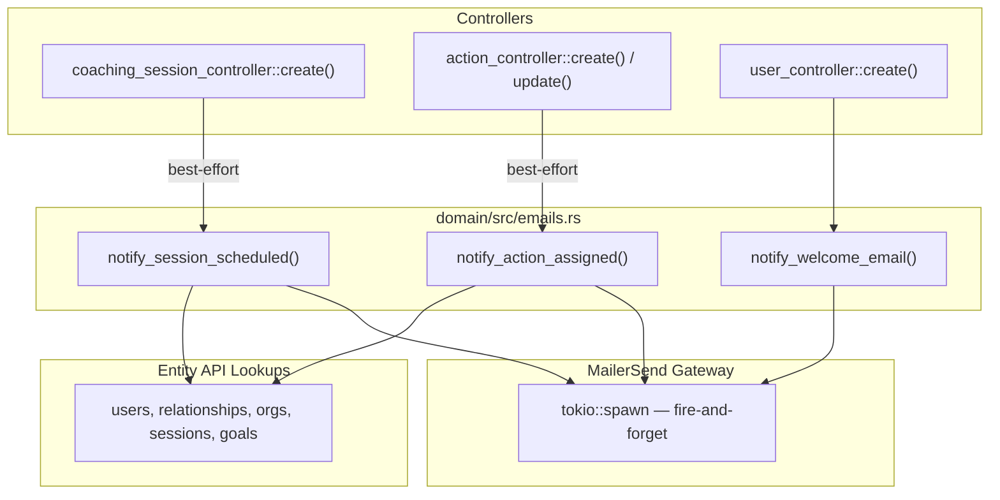

# Email Notifications Architecture

Transactional emails are sent via [Mailersend](https://www.mailersend.com/) using template-based personalization. The backend handles all email logic — the frontend has no involvement.

## Notification Types

| Notification | Trigger | Recipients |
|---|---|---|
| Welcome | User created | New user |
| Session Scheduled | Coaching session created | Coach + coachee |
| Action Assigned | Action created/updated with assignees | All assignees |

## Two-Tier Pattern

All email logic lives in `domain/src/emails.rs`, organized into two tiers:

**Tier 1 — `notify_*` orchestration (public).** Controllers call these. They look up any additional data needed via `entity_api`, then delegate to a private `send_*` function.

**Tier 2 — `send_*` construction (private).** Pure email senders. They take all data as parameters, build a `SendEmailRequest` with personalization variables, and fire via `MailerSendClient::send_email()`.

## Error Handling

All email sending is **best-effort** — failures never block the primary operation.

- **Session scheduled / action assigned**: Controllers use `if let Err(e) = ... { warn!(...) }`
- **Welcome email**: Uses `?` propagation for config errors (missing API key/template ID is a deployment issue worth surfacing). HTTP delivery is still fire-and-forget via `tokio::spawn()`.

## EmailNotification Trait

Encapsulates config resolution so `send_*` functions don't leak config details to controllers.

| Implementor | Env Var |
|---|---|
| `SessionScheduled` | `SESSION_SCHEDULED_EMAIL_TEMPLATE_ID` |
| `ActionAssigned` | `ACTION_ASSIGNED_EMAIL_TEMPLATE_ID` |

## Timezone Handling

Session dates are stored as UTC. The `format_session_date_time()` helper converts to each recipient's timezone (from `users.timezone`, an IANA string) using `chrono-tz`, falling back to UTC if invalid.

## Environment Variables

| Variable | Description |
|---|---|
| `MAILERSEND_API_KEY` | API authentication |
| `WELCOME_EMAIL_TEMPLATE_ID` | Welcome email template |
| `SESSION_SCHEDULED_EMAIL_TEMPLATE_ID` | Session scheduled template |
| `ACTION_ASSIGNED_EMAIL_TEMPLATE_ID` | Action assigned template |
| `FRONTEND_BASE_URL` | Base URL for email links (e.g. `https://app.myrefactor.com`) |
| `SESSION_SCHEDULED_EMAIL_URL_PATH` | URL path template for session links (default: `/coaching-sessions/{session_id}`) |
| `ACTION_ASSIGNED_EMAIL_URL_PATH` | URL path template for action links (default: `/coaching-sessions/{session_id}?tab=actions`) |

## Key Files

| File | Role |
|---|---|
| `domain/src/emails.rs` | `notify_*` + `send_*` + `EmailNotification` trait |
| `domain/src/gateway/mailersend.rs` | HTTP client, request builder, fire-and-forget delivery |
| `service/src/config.rs` | Template ID and URL config |
