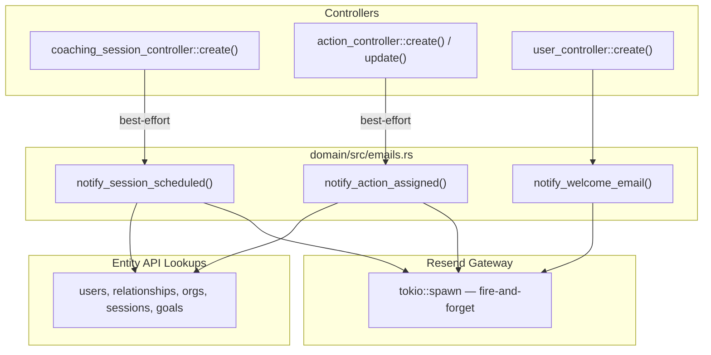

# Email Notifications Architecture

Transactional emails are sent via [Resend](https://resend.com/) using template-based variable interpolation. The backend handles all email logic — the frontend has no involvement.

## Notification Types

| Notification | Trigger | Recipients |
|---|---|---|
| Welcome | User created | New user |
| Session Scheduled | Coaching session created | Coach + coachee |
| Session Reminder | Periodic sweep, 24h before the session starts | Coachee |
| Action Assigned | Action created/updated with assignees | All assignees |

## Two-Tier Pattern

All email logic lives in `domain/src/emails.rs`, organized into two tiers:

**Tier 1 — `notify_*` orchestration (public).** Controllers call these. They look up any additional data needed via `entity_api`, then delegate to a private `send_*` function.

**Tier 2 — `send_*` construction (private).** Pure email senders. They take all data as parameters, build a `SendEmailRequest` with template variables, and fire via `gateway::resend::Client::send_email()`.

```mermaid
flowchart TD
    subgraph web["Controllers"]
        CC["coaching_session_controller::create()"]
        AC["action_controller::create() / update()"]
        UC["user_controller::create()"]
    end

    subgraph domain["domain/src/emails.rs"]
        NS["notify_session_scheduled()"]
        NA["notify_action_assigned()"]
        NW["notify_welcome_email()"]
    end

    subgraph entity_api["Entity API Lookups"]
        EF["users, relationships, orgs, sessions, goals"]
    end

    subgraph gateway["Resend Gateway"]
        MS["tokio::spawn — fire-and-forget"]
    end

    CC -->|best-effort| NS
    AC -->|best-effort| NA
    UC --> NW

    NS & NA --> EF
    NS & NA & NW --> MS
```

## Error Handling

All email sending is **best-effort** — failures never block the primary operation.

- **Session scheduled / action assigned**: Controllers use `if let Err(e) = ... { warn!(...) }`
- **Welcome email**: Uses `?` propagation for config errors (missing API key/template ID is a deployment issue worth surfacing). HTTP delivery is still fire-and-forget via `tokio::spawn()`.

## EmailNotification Trait

Encapsulates config resolution so `send_*` functions don't leak config details to controllers.

| Implementor | Env Var |
|---|---|
| `SessionScheduled` | `SESSION_SCHEDULED_EMAIL_TEMPLATE_ID` |
| `RecurringSessionsScheduled` | `RECURRING_SESSIONS_SCHEDULED_EMAIL_TEMPLATE_ID` |
| `SessionRescheduled` | `SESSION_RESCHEDULED_EMAIL_TEMPLATE_ID` |
| `RecurringSessionsRescheduled` | `RECURRING_SESSIONS_RESCHEDULED_EMAIL_TEMPLATE_ID` |
| `SessionCancelled` | `SESSION_CANCELLED_EMAIL_TEMPLATE_ID` |
| `RecurringSessionsCancelled` | `RECURRING_SESSIONS_CANCELLED_EMAIL_TEMPLATE_ID` |
| `ActionAssigned` | `ACTION_ASSIGNED_EMAIL_TEMPLATE_ID` |
| `AddedToOrganization` | `ADDED_TO_ORGANIZATION_EMAIL_TEMPLATE_ID` |
| `SessionReminder` | `SESSION_REMINDER_EMAIL_TEMPLATE_ID` |

The two cancellation implementors deliberately keep the trait's `None` URL template: the
record is deleted by the time a recipient could click through, so those emails carry no link.

## Calendar Invites (`.ics`)

Session and series lifecycle emails carry an `invite.ics` attachment, base64-inlined via Resend with content type `text/calendar; method=REQUEST|CANCEL; charset=UTF-8`. One builder (`domain/src/gateway/ical.rs`) serves every flow and is pure: `dtstamp` is injected rather than read from the clock, so output is deterministic and unit-testable.

`UID` is stable per session (`<session_id>@myrefactor.com`) or per series (`<series_id>@myrefactor.com`), and `SEQUENCE` increments on every change. That pair is what lets a calendar client update or remove an existing event in place instead of accumulating duplicates. The `ical_sequence` columns on `coaching_sessions` and `coaching_session_series` persist the counter; cancellations bump it in memory only, since the row is being deleted in the same operation.

The anchor timezone is the coach's `users.timezone`, with a real IANA `VTIMEZONE` block spliced in so strict clients render local time rather than floating time. When the zone is UTC or unrecognized, times are emitted as UTC with no `TZID`.

Single sessions and series use separate templates for both reschedule and cancel. Resend templates have no conditional syntax, and the two paths supply different variables, so one template cannot render both shapes.

A series is a single recurring event with one `UID`, so rescheduling or cancelling one replaces or removes the whole event, including occurrences already in the past. Those sessions remain in the database; only the calendar view of them is lost.

## Session Reminders

Unlike every other notification here, the reminder has no triggering request. It is sent
by a periodic sweep (`domain::jobs::session_reminder`) that each tick claims the sessions
whose start has entered the lead window and emails the coachee. See
[Background Jobs](background_jobs.md) for the scheduler and the claim mechanism.

Three properties fall out of deriving "due" from the sessions table rather than from a
queue of pre-scheduled sends:

- A **rescheduled** session becomes due again on its own, because the claim stamp records
  the start it was sent for and no longer matches.
- A **cancelled** session simply stops being due — there is no orphaned job to cancel.
- A session **booked inside the lead window** is due immediately and reminded on the next
  tick, so a same-day booking still gets one heads-up.

The reminder goes to the coachee only: the coach already holds the invite from the
scheduled send, and the copy is written from the coachee's side. It carries no `.ics` —
the calendar event was delivered when the session was scheduled, and re-sending the same
`UID`/`SEQUENCE` pair either does nothing or duplicates the event.

Template variables: `first_name`, `coach_first_name`, `coach_full_name`,
`organization_name`, `session_date`, `session_time`, `session_when`, `session_duration`,
`session_url`, plus `session_title` and `meeting_url` when the session has them (omitted
rather than blanked, so the template's `fallback_value` fires).

Leaving `SESSION_REMINDER_EMAIL_TEMPLATE_ID` unset disables the job — nothing is
scheduled, rather than a job that logs a config error every few minutes.

## Timezone Handling

Session dates are stored as UTC. The `format_session_date_time()` helper converts to each recipient's timezone (from `users.timezone`, an IANA string) using `chrono-tz`, falling back to UTC if invalid.

## Environment Variables

| Variable | Description |
|---|---|
| `RESEND_API_KEY` | API authentication |
| `WELCOME_EMAIL_TEMPLATE_ID` | Welcome email template |
| `SESSION_SCHEDULED_EMAIL_TEMPLATE_ID` | Session scheduled template |
| `RECURRING_SESSIONS_SCHEDULED_EMAIL_TEMPLATE_ID` | Recurring Sessions scheduled template |
| `SESSION_RESCHEDULED_EMAIL_TEMPLATE_ID` | Single-session reschedule template |
| `RECURRING_SESSIONS_RESCHEDULED_EMAIL_TEMPLATE_ID` | Series reschedule template |
| `SESSION_CANCELLED_EMAIL_TEMPLATE_ID` | Single-session cancellation template |
| `RECURRING_SESSIONS_CANCELLED_EMAIL_TEMPLATE_ID` | Series cancellation template |
| `ACTION_ASSIGNED_EMAIL_TEMPLATE_ID` | Action assigned template |
| `ADDED_TO_ORGANIZATION_EMAIL_TEMPLATE_ID` | Added-to-organization template |
| `SESSION_REMINDER_EMAIL_TEMPLATE_ID` | Upcoming-session reminder template. Unset disables the reminder job |
| `SESSION_REMINDER_LEAD_HOURS` | How far ahead of a session its reminder is sent (default: `24`) |
| `SESSION_REMINDER_POLL_MINUTES` | How often the reminder sweep runs (default: `15`) |
| `FRONTEND_BASE_URL` | Base URL for email links (e.g. `https://app.myrefactor.com`) |
| `SESSION_SCHEDULED_EMAIL_URL_PATH` | URL path template for session links (default: `/coaching-sessions/{session_id}`) |
| `ACTION_ASSIGNED_EMAIL_URL_PATH` | URL path template for action links (default: `/coaching-sessions/{session_id}?tab=actions`) |
| `ADDED_TO_ORGANIZATION_EMAIL_URL_PATH` | URL path for added-to-organization links, supports `{organization_id}` (default: `/dashboard`) |

## Key Files

| File | Role |
|---|---|
| `domain/src/emails.rs` | `notify_*` + `send_*` + `EmailNotification` trait |
| `domain/src/gateway/resend.rs` | HTTP client, request builder, fire-and-forget delivery |
| `domain/src/jobs/session_reminder.rs` | The reminder sweep |
| `service/src/config.rs` | Template ID and URL config |
