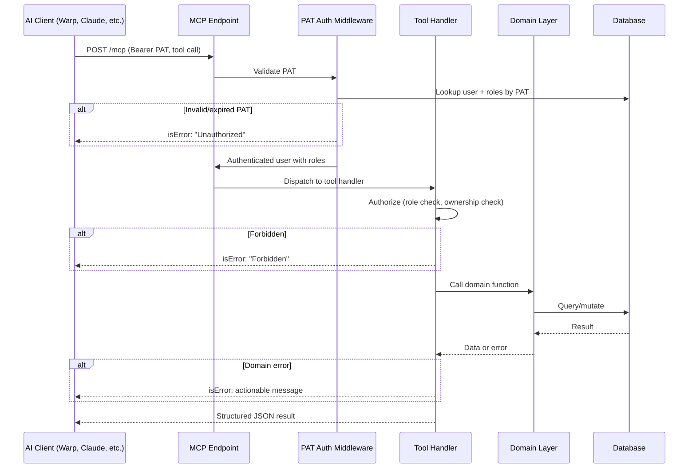

# MCP Server
Add an MCP server to the rust backend so that AI clients can interact with the coaching platform through structured tools.

## Context
Enable users to interact with the platform without leaving their AI workflow.
Opens the door to AI automation and generative features like session summarization that the REST API alone cannot provide.

The MCP server will exist inside the existing rust crate as a separate endpoint.

## Data Model
One new table: `personal_access_tokens`. All MCP tools read from existing tables.

Value is never stored, only the token hash. This means users must be allowed to regenerate their token and deactivate the old one.

Operations: create, show (metadata only, not the raw token), deactivate. No delete — inactive tokens are kept for audit history.

Limit one active PAT per user, enforced by a partial unique index: `UNIQUE (user_id) WHERE status = 'active'`.

| Column | Type | Description |
|--------|------|-------------|
| id | uuid PK | |
| user_id | uuid FK → users | Owner of the token |
| token_hash | varchar | SHA-256 of the raw token (raw token is never stored) |
| status | enum `pat_status` (active, inactive) | New Postgres enum, separate from existing `refactor_platform.status`. Only active tokens are accepted. Users can deactivate a lost token and generate a new one. |
| last_used_at | timestamptz | Optional, for observability |
| created_at | timestamptz | |
| updated_at | timestamptz | |

## Layer Responsibilities

| Layer | Module | Responsibility |
|-------|--------|----------------|
| `entity` | `personal_access_tokens` | SeaORM entity for PAT table |
| `entity_api` | `personal_access_token` | PAT operations: create, find by token hash, deactivate |
| `domain` | `personal_access_token` | Business logic: hash on create, validate status |
| `web` | `mcp/mod` | Module root |
| `web` | `mcp/auth` | PAT bearer middleware: extract header → hash → lookup user + roles |
| `web` | `mcp/tools/mod` | `McpToolHandler` struct + `#[tool_router]`/`#[tool_handler]` wiring. Holds `AppState`. |
| `web` | `mcp/tools/*` | Individual tool methods using `#[tool]` macro |
| `web` | `router` | MCP service nested via `nest_service("/mcp", service)` in existing `define_routes()` |
| `web` | `controller/pat_controller` | REST endpoints for PAT management (create, show, deactivate) used by the UI |
| `web` | `protect/users/tokens` | Authorization middleware for PAT routes: user can only manage own tokens |
| `migration` | new migration | `personal_access_tokens` table + partial unique index |

## Dependencies

`sha2` + `rand` — added to the `domain` crate for PAT token generation. `rand` (with `OsRng`) generates cryptographically secure random bytes for the raw token value. `sha2` hashes the raw token to produce the `token_hash` stored in the database and also identify and validate PATs. Both are already in the workspace via `meeting-auth`.

`rmcp` — the official Rust MCP SDK (`modelcontextprotocol/rust-sdk`). Added to the `web` crate with the `transport-streamable-http-server` feature. Provides:
- `StreamableHttpService` — integrates with Axum via `nest_service("/mcp", service)`, handling JSON-RPC parsing, `initialize`/`tools/list`/`tools/call` dispatch, session management, and SSE. `StreamableHttpService::new` accepts a factory closure (`Fn() -> Result<H>`) — after initializing, every session gets its own `McpToolHandler` instance to manage requests and hold app state. The authenticated user is not stored on the handler — it flows through `RequestContext.extensions` on each tool call (see [rmcp integration](./mcp_server/rmcp_integration.md#user-context-propagation)).
- `#[tool]`, `#[tool_router]`, `#[tool_handler]` macros — generate tool schemas and dispatch from annotated functions.
- Does not own auth — PAT middleware is applied as a `.layer()` on the Router containing the nested MCP service, matching rmcp's official auth examples. `route_layer` is not used because it only applies to `.route()` registrations, not `nest_service`.

## Authentication
Personal Access Token (PAT) as bearer token. PATs will be issued through the UI in the personal settings page.
- New UI to create/view PAT.
- New endpionts to create and get a PAT, scoped to current user.

## Authorization
Authorization is built off of the existing authorization model.

- New `mcp` module and submodules for authorization
- auth submodule for PAT auth middleware. Extract authorization header and authorizes.
- Utilize existing authorization patterns, like those in `coaching_relationships::is_coach_of`. There is some maintenance burden here if the authorization logic of the API were to change, it would need to be updated for the MCP server too.
- The PAT middleware inserts the authenticated `users::Model` into HTTP request extensions. `rmcp` propagates these into `RequestContext.extensions`, making the user available inside tool handlers without storing it on the handler struct. See [rmcp integration — user context propagation](./mcp_server/rmcp_integration.md#user-context-propagation) for details.

## Connection Protocols
- MVP — Stateless Streamable HTTP: `stateful_mode: false` in `StreamableHttpServerConfig`. Every POST is self-contained — no session ID, no persistent handler state. The factory creates a fresh `McpToolHandler` per request. Simpler auth bridging, no stale session cleanup.
- Later — Stateful mode (`stateful_mode: true`) for SSE streaming and server-initiated events. Handler persists across requests in a session. Same tools and auth, only the config changes.
- No stdio — the MCP server runs inside the existing backend process.

## Tool List (MVP)
- [Exhaustive tool list](./mcp_server/exhaustive_list.md)
- [MVP tool list](./mcp_server/mvp_tools.md)

## Tool Design
Tools that require a specific resource (session, coachee) expect an exact ID. Discovery tools (`list_coachees`, `list_sessions`) return enough data for the LLM to identify and select the right record. No fuzzy matching or inline disambiguation — the LLM chains a list call before a get call.

### Inputs
- Input schemas are auto-generated by `rmcp` via `schemars`. Each tool defines a `Parameters<T>` struct deriving `Deserialize` + `schemars::JsonSchema`. The `#[tool]` macro produces the JSON Schema from that struct and returns it in `tools/list`. No manual schema definition needed — field types, optionality, and `#[schemars(description = "...")]` annotations are the single source of truth for what the tool accepts.
- Tools identify the caller via PAT — no user ID parameter needed.
- Coach tools that operate on a coachee accept an optional `coachee_id`. Defaults to self when omitted (coachee calling for themselves).
- `get_coachee` supports an optional `include` array (`["goals", "actions", "notes"]`) to inline related records filtered to active status. Without `include`, returns profile + aggregated stats only.
- `list_sessions` accepts optional `date_from`, `date_to` for date range filtering.
- `list_actions` accepts optional `coaching_session_id`, `keyword` (searches body text), `date_from`/`date_to`, `status`. Coaches optionally provide `coachee_id` (defaults to self for coachees). Returns `ActionResponse` arrays (flattened `actions::Model` + `SessionRef` with frontend URL). See [response structs](./mcp_server/mcp_response_structs.md).
- `get_session` accepts an optional `session_id`. Defaults to the latest session for the coaching relationship.

### Outputs
- All tools return structured JSON.
- Existing entity models (e.g. `actions::Model`, `goals::Model`, `users::Model`) already derive `Serialize` with `#[serde(skip_serializing)]` on sensitive fields (passwords, OAuth tokens). Tool handlers serialize these models directly rather than redefining every field. Where a tool needs computed or nested fields not on the entity (e.g. `session_url`, inline `assignees`), a thin response wrapper uses `#[serde(flatten)]` to inline the entity and adds only the extra fields. This avoids duplicating field definitions and keeps the entity model as the source of truth. See [response struct definitions](./mcp_server/mcp_response_structs.md) for the full output shapes.
- `get_coachee` without `include`: profile fields + stat counts (active goals, open actions, overdue actions, last/next session date).
- `get_coachee` with `include`: same as above, plus arrays of raw entity models (`goals::Model`, `actions::Model`, `notes::Model`) filtered to active statuses. No nested refs or computed fields — keeps the tool lightweight. Rich action responses (with session URLs, nested goals, assignees) are deferred to a future dedicated action search tool.
- `list_sessions`: array of session summaries (id, date, meeting_url).
- `get_session`: structured data bundle of the session record + associated notes, actions, agreements, and linked goals. The client LLM generates the prose summary from this data — no server-side LLM needed.

### Error Handling
On error, response will have:
- isError: true
- ErrorMessage: "Descriptive error including error type and actionable steps"

## Request Flow

## Security Considerations
- **Data ownership via PAT**: Data is scoped by the authorized PAT. Coaches cannot manage other coaches data, only their own and their associated coachees. Coachees can only manage their own data. This pattern is extensible to organizations, if we wanted to add multi tenancy. Associating tools with a PAT also supports auditing and observability of MCP usage, if we wanted it.
- **No deletes**: MVP excludes all delete operations. Writes are limited to append-only creates and status updates.
- **Prompt injection via stored data**: Note bodies, goal titles, and action text are user-generated and returned in tool responses. A malicious string in a note could instruct the client LLM to take unintended actions. The MCP server does not sanitize output — this is the client's responsibility.
- **Data exfiltration**: Tool responses contain names, emails, and session content. This data flows through whatever LLM provider the client uses. Users should be aware their coaching data is sent to third-party models.
- **Rate limiting**: PAT-scoped rate limits prevent a misbehaving client from enumerating data or overwhelming the backend. Exact limits TBD.
- **No secrets in responses**: Passwords and PAT values are never included in tool output.

## Future Considerations
- **OAuth**: PAT is MVP. OAuth enables MCP clients (Claude Desktop, Warp, etc.) to authenticate via browser redirect without manual token generation. The auth middleware will be designed to support a second credential type — OAuth would resolve to the same user + roles as a PAT, reusing the existing authorization layer.

Oauth would require lifecycle management, the mcp server will need to be able to issue access and refresh tokens. Fortunately Axum allows Oauth support through hooks, making it easier to add on later without breaking auth.

- **Admin-only tools**: Post-MVP. Cross-organization data views, user management, platform-wide analytics. Scoped to SuperAdmin role.
- **Write tools**: MVP is read-only plus status updates. Next tier adds `create_action`, `create_note`, `create_goal`, `create_agreement`, `create_session` — all append-only, no edits or deletes. See [exhaustive tool list](./mcp_server/exhaustive_list.md) for the full set.

## Decisions

- **`rmcp` over hand-rolling the MCP protocol.** The official Rust MCP SDK handles JSON-RPC parsing, session management, and tool dispatch. It integrates with Axum via `nest_service` and doesn't own auth. Saves 1-2 days of protocol boilerplate with no loss of control. This should be the first target for proof of concept to ensure the sdk works with the codebase.
- **Streamable HTTP only.** No stdio — the MCP server is an endpoint inside the existing backend, not a standalone binary. Streamable HTTP is the current MCP spec transport for remote servers.
- **Reuse existing authorization patterns.** Try to limit maintenance burden by reusing domain-level ownership functions like `coaching_relationship::is_coach_of`.
- **No deletes for MVP.** Too destructive for LLM-initiated calls.
- **PAT-direct as bearer token over access/refresh tokens.** The PAT is sent as `Authorization: Bearer <token>` on every request. No token expiration, no refresh flow, no token endpoint. Simpler for MVP. OAuth will require access/refresh tokens later.
- **Store only the token hash; support deactivation instead of expiration.** The raw PAT is shown once at creation and never stored. Only the SHA-256 hash is persisted. If a user loses their token, they deactivate the old one and generate a new one. One active PAT per user, enforced by a partial unique index.
- **`get_coachee` with `include` replaces individual list tools.** Instead of separate `list_goals`, `list_actions`, `list_notes` tools, `get_coachee` accepts an optional `include` array to inline related records filtered to active status. Fewer tools, fewer round-trips, one call answers "how is this coachee doing?"
- **Disambiguation via separate list/get tools.** Tools that operate on a specific resource require an exact ID. Discovery tools (`list_coachees`, `list_sessions`) return enough identifying data (name, email, date) for the LLM to select the right record. No fuzzy matching or server-side disambiguation — the LLM chains a list call before a get call, matching the pattern used by GitHub and other major MCP servers.
- **`.layer()` over `route_layer` for MCP auth.** `route_layer` only applies to routes added via `.route()`, not `nest_service`. The auth middleware is applied as a `.layer()` on the Router wrapping the nested `StreamableHttpService`, matching rmcp's official examples.
- **Factory closure per session, not singleton clone.** `StreamableHttpService::new` takes `Fn() -> Result<H>`, creating a fresh handler per MCP session (per request in stateless mode). The `McpToolHandler` struct owns app state; the authenticated user flows through `RequestContext.extensions` on each tool call.
- **Stateless mode for MVP.** No session management, no in-memory session map, no stale session cleanup. Every request carries a PAT and is validated independently. SSE streaming deferred to stateful mode later.
- **No server-side LLM for MVP.** Tools return structured data, not generated prose. The client LLM (Warp, Claude, etc.) handles summarization and natural language from the data. This avoids adding an LLM provider dependency, API keys, token costs, and prompt management to the backend.

## Implementation
The MCP server is delivered through three PRs:
- **PR 1 — PAT infrastructure + REST endpoints.** Migration, entity, entity_api, domain, controller, and routes for personal access tokens. Independent of MCP.
- **PR 2 — MCP skeleton with auth.** `rmcp` dependency, module structure, `ServerHandler` implementation, PAT auth middleware, router integration. Zero tools, but `initialize` and `tools/list` work end-to-end.
- **PR 3 — MVP tools.** `list_coachees`, `get_coachee` (with `include`), `list_sessions`, `list_actions`, `get_session`. Documentation updates.
