# Meeting Recording & Transcription Sequence

Full lifecycle from coach starting a recording through transcript segments being rendered in the UI.

**Webhook delivery note:** Bot lifecycle events (`bot.*`) are delivered to the `webhook_url` embedded in each bot creation request (driven by `WEBHOOK_BASE_URL`). Artifact events (`recording.done`, `transcript.done`, `transcript.failed`) are delivered via the account-level subscription configured in the Recall.ai dashboard. Both routes hit `POST /webhooks/recall_ai`.

```mermaid
sequenceDiagram
    participant FE as Next.js (FE)
    participant BE as Axum Backend
    participant DB as PostgreSQL
    participant Recall as Recall.ai

    rect rgb(220, 235, 255)
        Note over FE,Recall: Phase 1 — Start Recording
        FE->>BE: POST /coaching_sessions/:id/meeting_recording<br/>{ meeting_url }
        BE->>DB: find_latest_by_coaching_session (conflict check)
        DB-->>BE: None (or Completed/Failed — safe to proceed)
        BE->>Recall: POST /api/v1/bot<br/>{ meeting_url, bot_name, webhook_url,<br/>metadata: { coaching_session_id } }
        Recall-->>BE: { id: bot_id }
        BE->>DB: INSERT meeting_recordings (status: Pending, bot_id)
        DB-->>BE: recording row
        BE-->>FE: 201 { status: "pending", bot_id, ... }
        FE->>FE: mutate SWR cache, begin polling every 5s
    end

    rect rgb(220, 255, 220)
        Note over FE,Recall: Phase 2 — Bot Joins Meeting (per-bot webhooks)
        Recall->>BE: POST /webhooks/recall_ai<br/>{ event: "bot.joining_call", data: { bot: { id } } }
        BE->>DB: update_status → Joining
        Recall->>BE: POST /webhooks/recall_ai { event: "bot.in_waiting_room" }
        BE->>DB: update_status → WaitingRoom
        Recall->>BE: POST /webhooks/recall_ai { event: "bot.in_call_not_recording" }
        BE->>DB: update_status → InMeeting
        Recall->>BE: POST /webhooks/recall_ai { event: "bot.in_call_recording" }
        BE->>DB: update_status → Recording
    end

    rect rgb(255, 255, 220)
        Note over FE,BE: Phase 3 — FE Polls During Active Recording (every 5s)
        loop While status is Joining / WaitingRoom / InMeeting / Recording / Processing
            FE->>BE: GET /coaching_sessions/:id/meeting_recording
            BE->>DB: find_latest_by_coaching_session
            DB-->>BE: recording
            BE-->>FE: { status: "recording", ... }
        end
    end

    rect rgb(255, 235, 220)
        Note over FE,Recall: Phase 4 — Stop Recording (user-initiated)
        FE->>BE: DELETE /coaching_sessions/:id/meeting_recording
        BE->>Recall: DELETE /api/v1/bot/:bot_id
        Recall-->>BE: 200
        BE->>DB: update_status → Processing, set ended_at
        DB-->>BE: recording
        BE-->>FE: 200 { status: "processing" }
        FE->>FE: mutate SWR cache
    end

    rect rgb(235, 220, 255)
        Note over BE,Recall: Phase 5 — Bot Shutdown (per-bot webhook)
        Recall->>BE: POST /webhooks/recall_ai { event: "bot.done",<br/>data: { bot: { id } } }
        BE->>DB: update_status → Processing (idempotent — already Processing)
    end

    rect rgb(240, 220, 255)
        Note over FE,Recall: Phase 6 — Recording Artifact Ready (dashboard webhook)
        Recall->>BE: POST /webhooks/recall_ai<br/>{ event: "recording.done",<br/>data: { bot: { id, metadata: { coaching_session_id } } } }
        BE->>DB: find_by_bot_id
        DB-->>BE: recording
        BE->>DB: find_by_coaching_session (idempotency: transcription exists?)
        DB-->>BE: None
        BE->>DB: update_status → Completed, set ended_at
        Note over BE: Async task spawned (tokio::spawn)
        BE->>Recall: POST /api/v1/recordings/:bot_id/async-transcripts<br/>{ assemblyai: { language_detection, sentiment_analysis, speaker_labels },<br/>diarization: { use_separate_streams_when_available: true } }
        Recall-->>BE: { id: transcript_id }
        BE->>DB: INSERT transcriptions (status: Queued, external_id: transcript_id)
        BE-->>Recall: 200 (webhook acknowledged)
    end

    rect rgb(255, 220, 235)
        Note over FE,Recall: Phase 7 — Transcription Processing
        FE->>BE: GET /coaching_sessions/:id/transcriptions
        BE->>DB: find_by_coaching_session
        DB-->>BE: transcription (status: queued)
        BE-->>FE: { status: "queued" }
        FE->>FE: Begin polling every 10s (30 min timeout)

        Note over Recall: AssemblyAI processes audio internally
        Recall->>BE: POST /webhooks/recall_ai<br/>{ event: "transcript.done",<br/>data: { transcript: { id } } }
        BE->>DB: find_by_external_id (idempotency: already Completed?)
        DB-->>BE: transcription (status: Queued)
        Note over BE: Async task spawned (tokio::spawn)
        BE->>Recall: GET /api/v1/recordings/:bot_id/async-transcripts/:transcript_id
        Recall-->>BE: { download_url, word_count, confidence, ... }
        BE->>Recall: GET {download_url} (pre-signed S3 URL, no auth)
        Recall-->>BE: transcript JSON { utterances: [{ speaker, text, start, end, ... }] }
        BE->>DB: update_status → Completed, set word_count, confidence
        BE->>DB: batch INSERT transcript_segments
        BE-->>Recall: 200 (webhook acknowledged)
    end

    rect rgb(220, 255, 245)
        Note over FE,BE: Phase 8 — FE Renders Transcript
        FE->>BE: GET /coaching_sessions/:id/transcriptions
        BE->>DB: find_by_coaching_session
        DB-->>BE: transcription (status: completed)
        BE-->>FE: { status: "completed", id }
        FE->>FE: Stop polling (terminal status)
        FE->>BE: GET /coaching_sessions/:id/transcriptions/:id/transcription_segments
        BE->>DB: list segments for transcription_id
        DB-->>BE: [{ speaker, text, start_ms, end_ms, confidence, sentiment }]
        BE-->>FE: segments array
        FE->>FE: Render transcript in UI
    end

    rect rgb(255, 220, 220)
        Note over FE,Recall: Error Paths
        Note over Recall,BE: bot.fatal → update recording status → Failed (sub_code stored as error_message)
        Note over Recall,BE: transcript.failed → update transcription status → Failed (sub_code stored as error_message)
        Note over FE,BE: FE polls until Failed status, then stops and shows error UI
    end
```

