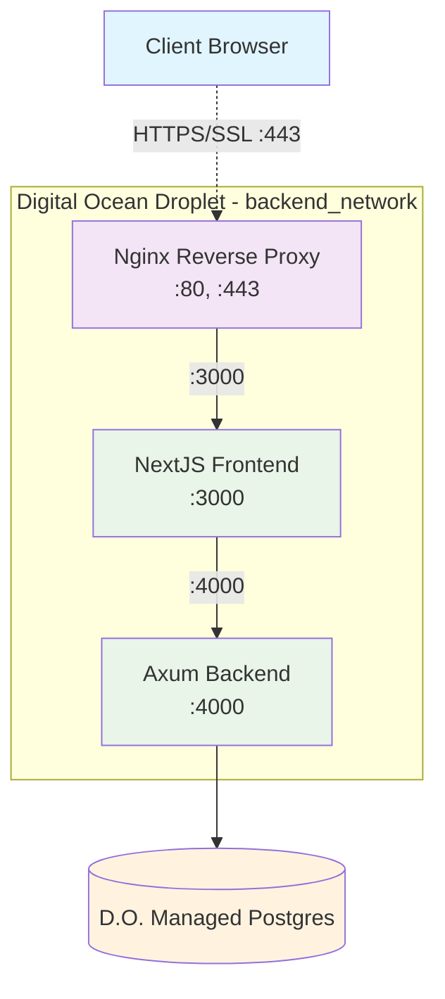

# Network Flow Diagram

This diagram shows the HTTPS request flow for API calls through the Refactor Platform infrastructure.

## Flow Description

1. **Client Request**: Web browser makes HTTPS requests (SSL/TLS encrypted) to the platform on port 443
2. **SSL Termination**: Nginx handles SSL termination at port 443 and routes traffic internally
3. **Frontend Processing**: Nginx forwards requests to NextJS frontend on port 3000
4. **API Forwarding**: NextJS forwards API calls to Axum backend on port 4000
5. **Backend Processing**: Axum backend handles API endpoints like `/api/login` with secure caching
6. **Database Operations**: Backend connects to Digital Ocean Managed PostgreSQL
7. **SSE Connections**: Long-lived `/api/sse` connections for real-time events (24h timeout, no buffering)

## Infrastructure Notes

- **Digital Ocean Droplet**: Hosts the containerized application stack (Nginx, NextJS, Axum) in the `backend_network` Docker network
- **Port Configuration**: 
  - Nginx: External ports 80/443, internal routing to services
  - NextJS: Internal port 3000 
  - Axum: Internal port 4000
- **Managed PostgreSQL**: Separate Digital Ocean managed database service, accessed over the internet with SSL
- **SSL/TLS**: HTTPS encryption from client to Nginx using Let's Encrypt certificates managed by `certbot`, then unencrypted internal traffic within the container network
- **Database Connection**: Axum connects to managed PostgreSQL over SSL outside the container network
- **SSE Configuration**: Nginx configured for long-lived connections (24h timeout, proxy buffering disabled) at `/api/sse` endpoint
- **Scaling Limitation**: SSE uses in-memory connection tracking - **single backend instance only** until Redis pub/sub is implemented