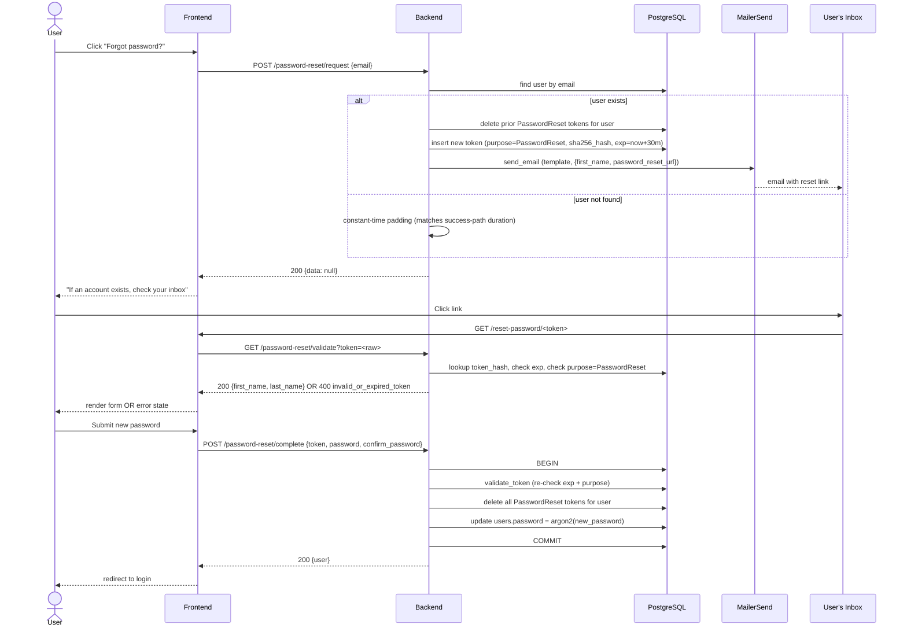

# Password Reset Architecture

User-initiated password reset via a single-use, email-delivered magic link. Reuses the magic-link token infrastructure that powers the welcome/setup flow ([authentication_error_flow.md](authentication_error_flow.md), [email_notifications.md](email_notifications.md)), with a new `purpose` column on `magic_link_tokens` to prevent cross-flow token reuse.

## Endpoints

All three are unauthenticated — by design, a user who has forgotten their password cannot authenticate.

| Method | Path | Purpose |
|---|---|---|
| `POST` | `/password-reset/request` | Generate token, email reset link. Always 200 (enumeration-safe). |
| `GET` | `/password-reset/validate?token=<raw>` | Non-destructive validity check for FE state machine. Returns sanitized user (`first_name`, `last_name` only). |
| `POST` | `/password-reset/complete` | Consume token, set new password. Returns full user. |

Wire format is the source-of-truth `PasswordResetEndpoints` v1 contract on the cross-repo coordinator blackboard.

## End-to-End Flow



## Token Lifecycle

Two distinct tables are involved in the password-reset flow, with very different semantics:

| Table | Role | Cardinality | Lifecycle |
|---|---|---|---|
| `magic_link_tokens` (purpose = `PasswordReset`) | **State table** — the currently-redeemable token | At most one row per user (delete-then-create on issuance) | Created on `/request`, deleted on `/complete` or on next issuance |
| `password_reset_attempts` | **Append-only audit log** — every request attempt | One row per request for known emails (no row for unknown-email path) | Created on `/request`, only removed by the ops sweep job |

Keeping them separate prevents a design conflict that would otherwise make the daily-cap rate limit unenforceable: counting rows in the state table would always return 0 or 1 because the state-table semantics require deletion of the prior row on every issuance. The audit table preserves history so `count_since(user_id, now − 24h)` produces a meaningful count.

| Stage | Action | Effect on `magic_link_tokens` | Effect on `password_reset_attempts` |
|---|---|---|---|
| Issuance — `/request` (known email, rate limit passes) | 32 random bytes → URL-safe base64 → SHA-256 hex digest | Delete prior PasswordReset row(s); insert new row | INSERT one row at `NOW()` (before token issuance, see "Why record-first") |
| Issuance — `/request` (unknown email) | Constant-time padding only | No change | No change (no audit row for unknown emails — no inbox to flood) |
| Validation — `/validate` | Hash incoming raw token, lookup by hash, check `exp > now`, check `purpose = PasswordReset` | No mutation | No mutation |
| Consumption — `/complete` | Same checks as validation, then `DELETE` all of user's `PasswordReset` tokens + `UPDATE users.password` in one transaction | Row removed; password updated atomically | No change — attempts are kept; deleting them would let an attacker mask their tracks by completing a reset |
| Expiry (passive) | 30 minutes from issuance (`PASSWORD_RESET_TOKEN_EXPIRY_SECONDS=1800`) | Expired rows remain until next issuance or admin cleanup; queries filter on `exp > now` | N/A — attempts have no TTL semantic |
| Ops sweep (active) | `domain::password_reset::sweep_old_attempts(db, retention_days)` | No effect | DELETE rows where `attempted_at < NOW() - retention_days` |

### Why record-first

The audit row is inserted **before** token creation, not after. Two reasons:

1. **Consistency under failure.** If the rate-limit check passes but token issuance fails (DB transient error), the next request — moments later — must still see the previous attempt and apply rate-limiting. Recording first guarantees this.
2. **Conceptual correctness.** "Attempt" means "user tried to trigger a reset," not "we succeeded." A user who triggers 5 requests that all fail mid-issuance has still used the system 5 times in the rate-limit's eyes.

The cost is that a transient DB error during issuance burns one of the user's 5 daily attempts — slightly user-hostile but the right default for a security mechanism.

## Security Decisions

Every decision below was made deliberately to defeat a specific class of attack. See [Threat Model](#threat-model) for the scenarios these mitigations defend against.

### Enumeration Safety

| Mechanism | Defends Against |
|---|---|
| `POST /password-reset/request` always returns 200 regardless of email existence | Status-code-based user enumeration |
| Constant-time padding when email not found (matches success-path latency) | Timing-based user enumeration (latency oracle) |
| `GET /password-reset/validate` returns only `first_name` + `last_name` on success | PII over-exposure if a token is ever guessed/leaked |
| Collapsed `400 invalid_or_expired_token` (no distinction between unknown / expired / wrong-purpose) | Status-code-based token-state oracle |

### Token Strength & Protection

| Mechanism | Defends Against |
|---|---|
| 256 bits of entropy per token (32 random bytes from `rand::thread_rng()`) | Brute-force guessing (search space ≈ 10⁷⁷) |
| SHA-256 hash stored in DB, never the raw token | DB-leak token harvesting |
| Single-use: token deleted atomically with password update | Replay after legitimate use |
| 30-minute TTL (vs 72h for setup tokens) | Bounded exposure if email is intercepted or phished |
| Path-segment URL format (`/reset-password/<token>`) | Token leakage via HTTP `Referer` and query-string-aware logs |
| Per-email rate limit (1/60s, 5/24h) backed by a **separate append-only `password_reset_attempts` audit table** → `429 password_reset_rate_limited` | Inbox-flooding harassment and brute-force probing |

### Purpose Separation

The `magic_link_tokens.purpose` column (enum `Setup` | `PasswordReset`) ensures token usage is scoped to its intended flow:

- `find_by_token_hash` filters on `purpose = ?` so a leaked Setup token cannot be redeemed at `/password-reset/complete`, and vice versa.
- `delete_all_for_user` is purpose-scoped — issuing a reset token does NOT invalidate a pending Setup token. The two flows operate on disjoint token sets for the same user.

Existing tokens in the table at migration time are backfilled to `Setup`. The column is `NOT NULL` with no default — every new insertion must explicitly declare its purpose, preventing accidental defaulting.

### Logging Hygiene & Security Audit Trail

The password-reset code path emits a **WARN-level audit trail** so security/ops operators can grep `[password-reset]` and see every interesting event without enabling DEBUG. PII (raw emails, raw tokens) stays at DEBUG or is never logged.

| Event | Level | Where | Contains |
|---|---|---|---|
| Endpoint hit — `/request`, `/validate`, `/complete` | WARN | `web/src/controller/password_reset_controller.rs` | endpoint name only |
| Raw email value on `/request` | DEBUG | controller | email (PII — only when log filter is at DEBUG) |
| Reset requested for unknown email | WARN | `domain::password_reset` | no PII (the email itself drops to DEBUG) |
| Reset link issued for known user | WARN | `domain::password_reset` | `user_id` UUID |
| Password mismatch on `/complete` | WARN | `domain::password_reset` | no PII |
| Rate-limit hit (min-interval or daily cap) | WARN | `domain::password_reset` | `user_id` UUID |
| Email-send failure | WARN | `domain::password_reset` | `user_id` UUID + error |
| Password successfully reset (password changed) | WARN | `domain::password_reset` | `user_id` UUID |
| Token validation (underlying) — not found / expired | WARN | `domain::magic_link_token` | purpose discriminator |

**General rules across the path:**

- Raw email addresses are **never** logged at INFO level or above — they are PII. Once a user is resolved by email, subsequent log lines reference the `user_id` UUID instead.
- The raw token is **never** logged at any level. Only the SHA-256 hash (already stored in the DB) may be logged, and even that is reserved for ERROR-level audit traces if needed.
- Every WARN message uses the `[password-reset]` prefix so operators can `grep` the entire flow with one search.

### Authorization Model

| Endpoint | Authorization Signal |
|---|---|
| `POST /password-reset/request` | None — by design. Submitting any email is harmless because the token never goes to the requester. |
| `GET /password-reset/validate` | Possession of a valid `PasswordReset` token. |
| `POST /password-reset/complete` | Possession of a valid `PasswordReset` token. |
| `PUT /users/:id/password` (pre-existing, distinct endpoint) | `authenticated_user.id == user_id` ([protect/users/passwords.rs:21](../../web/src/protect/users/passwords.rs#L21)) |

The unauthenticated reset endpoints do **not** weaken the authenticated `PUT /users/:id/password` model — they are an additive credential-recovery channel, not a replacement.

## Threat Model

| Scenario | Mitigation |
|---|---|
| Mallory submits Alice's email to `/password-reset/request` to take over her account | Reset link is delivered to Alice's inbox, not Mallory. Mallory has no path to the token. Alice's current password is unchanged. |
| Mallory floods Alice's inbox with reset emails | Per-email rate limit caps issuance at 1/60s, 5/24h → `429`. |
| Mallory probes the request endpoint to map which emails have accounts | Always-200 response + constant-time padding eliminate both status and timing oracles. |
| Mallory brute-forces `/password-reset/complete` with random tokens | 256-bit entropy + 30-minute TTL make guessing computationally infeasible. |
| Mallory reuses a stolen setup-email token at `/password-reset/complete` | Purpose-scoped lookup rejects tokens with `purpose ≠ PasswordReset`. |
| Mallory tries to replay a previously-consumed reset link | Token is deleted atomically with the password update; subsequent attempts return `400 invalid_or_expired_token`. |
| Mallory intercepts the email in transit | TLS protects SMTP transit. Out-of-scope at the application layer. |
| Mallory has compromised Alice's email account | Out of scope: at this point Mallory controls account recovery for every service Alice uses. |
| Authenticated user A tries to reset user B's password via the existing change-password endpoint | `protect::users::passwords::update_password` middleware enforces `authenticated_user.id == user_id`. Pre-existing, unchanged. |
| Token leaks via HTTP `Referer` when the FE reset page loads a third-party resource | Path-segment format prevents query-string-style leakage. FE additionally sets `Referrer-Policy: same-origin` on token-bearing pages (tracked separately on the coordinator blackboard). |

## Out of Scope for v1

Each deferral is a deliberate scoping decision, not an oversight.

| Item | Reason for Deferral |
|---|---|
| Multi-device session invalidation on successful reset | Current `tower_sessions` store is in-memory — sessions don't survive a backend restart anyway. Will land alongside the future persistent-session-store migration (Redis/Postgres). The FE's existing `SessionCleanupProvider` will handle the 401-on-next-request flow automatically when this ships. |
| Per-IP rate limiting | v1 ships with per-email DB-based limit only (cheap, no new dependencies). Per-IP throttle deferred to a follow-up — likely `tower_governor` middleware applied globally to authentication endpoints. The `password_reset_attempts` table is positioned to accept an `ip_address INET` column when this lands. |
| Password strength rules (length, complexity) | v1 accepts any non-empty password, matching the existing `/magic-link/complete-setup` behavior. Strength rules will be applied to both setup and reset endpoints together when introduced, to avoid divergent UX. |
| Periodic sweep of expired tokens | Expired tokens in `magic_link_tokens` are validated as inert (`validate_token` refuses them) but are not auto-deleted. Three implicit cleanup paths cover the common case: (a) issuing a new token of the same purpose runs `delete_all_for_user(user_id, purpose)` first; (b) user deletion cascades via the `user_id` FK; (c) successful consumption deletes inside the consume transaction. A separate periodic sweep would only matter at scale or under a regulatory deletion requirement — neither applies today. **Add a sweep migration when**: (i) the table exceeds ~10⁶ rows, (ii) `EXPLAIN` shows index degradation on the `token_hash` UNIQUE index, or (iii) a compliance requirement mandates prompt deletion. |
| Automatic scheduled sweep of `password_reset_attempts` | v1 ships the `sweep_old_attempts(db, retention_days)` function but **does not** invoke it on a schedule. Ops are expected to run it as a nightly cron / external job (see [Ops Maintenance](#ops-maintenance) below). Bringing this in-process would couple retention policy to deployment cadence and complicate alerting on missed sweeps. |

## Monitoring & Operational Visibility

The WARN-level audit trail (see [Logging Hygiene & Security Audit Trail](#logging-hygiene--security-audit-trail) above) is the substrate for both ad-hoc operator triage and a dedicated Grafana monitoring panel. Every monitoring recipe in this section builds on the same `[password-reset]` log prefix — no new instrumentation is required for v1.

### Ad-hoc Operator Recipes (`journalctl`)

Use these for incident triage or quick spot-checks from a shell on the backend host.

```bash
# What's happening on the reset endpoints right now?
journalctl -u refactor-platform -f | grep '\[password-reset\]'

# Audit: who got reset emails in the last hour?
journalctl --since '1 hour ago' | grep '\[password-reset\] reset link issued for user'

# Abuse signal: anyone hitting the rate limit?
journalctl --since today | grep '\[password-reset\] rate-limited'

# Enumeration probes: requests for unknown emails over the last 24h
journalctl --since '24 hours ago' | grep '\[password-reset\] reset requested for unknown email' | wc -l

# Operational health: email-send failures
journalctl --since '6 hours ago' | grep '\[password-reset\] failed to send email'

# Forensic: which email values hit /request? (requires DEBUG log level)
journalctl --since '15 minutes ago' | grep '\[password-reset\] unknown-email value was:'
```

### Grafana Panel Setup (Loki + LogQL)

A single Grafana dashboard — call it **"Password Reset (Security)"** — should host the panels below. All queries assume logs are shipped to Loki with `app="refactor-platform"` as a label; adjust the selector to match your shipping setup.

| Panel | Type | LogQL query | Why it matters |
|---|---|---|---|
| **Endpoint activity** (stacked rate) | Time-series, stacked | `sum by (endpoint) (rate({app="refactor-platform"} \|~ "\\[password-reset\\] /(?P<endpoint>request\|validate\|complete) endpoint hit" [5m]))` | Shows traffic shape across the three endpoints. Baseline is near-zero; spikes warrant investigation. |
| **Reset links issued** | Time-series + single-stat | `sum(rate({app="refactor-platform"} \|~ "\\[password-reset\\] reset link issued for user" [5m]))` | Direct count of successful issuances. Should correlate with email-send success below. |
| **Passwords actually changed** | Time-series + single-stat | `sum(rate({app="refactor-platform"} \|~ "\\[password-reset\\] .* completed password reset" [5m]))` | Most consequential event — a password actually changed. Compare against "links issued" for drop-off rate. |
| **Rate-limit triggers** ⚠️ | Time-series, alert candidate | `sum by (kind) (rate({app="refactor-platform"} \|~ "\\[password-reset\\] rate-limited \\((?P<kind>min-interval\|daily-cap)\\)" [5m]))` | Healthy baseline = zero. Sustained non-zero is the abuse signal. Split by `min-interval` vs `daily-cap` to distinguish rapid-fire from slow-and-steady. |
| **Unknown-email probes** ⚠️ | Time-series, alert candidate | `sum(rate({app="refactor-platform"} \|~ "\\[password-reset\\] reset requested for unknown email" [5m]))` | Healthy baseline = near-zero (legitimate typos). Sustained elevated rate = enumeration probe; pair with IP-level inspection. |
| **Email-send failures** | Time-series, alert candidate | `sum(rate({app="refactor-platform"} \|~ "\\[password-reset\\] failed to send email" [5m]))` | Operational health — distinguishes "MailerSend is down" from "our code is broken." |
| **Password-mismatch errors** | Time-series | `sum(rate({app="refactor-platform"} \|~ "\\[password-reset\\] password confirmation mismatch" [5m]))` | Mostly user error (typos in the form). A persistent spike for a single user could indicate phishing attempt with stolen-link replay against a real user. |
| **Issuance → completion ratio** (gauge) | Stat / gauge | `sum(count_over_time({app="refactor-platform"} \|~ "completed password reset" [24h])) / sum(count_over_time({app="refactor-platform"} \|~ "reset link issued for user" [24h]))` | The healthy ratio is roughly 0.6–0.9 (some users start the flow and never finish). Sustained <0.2 = bogus reset emails being sent (phishing campaign targeting your users); sustained >1.0 is impossible and indicates a parser bug. |
| **Recent audit log** (table) | Logs | `{app="refactor-platform"} \|~ "\\[password-reset\\]" \| line_format "{{.timestamp}} {{.message}}"` | Raw scrolling audit table for the most recent N events. |

#### Suggested alert rules

Each is paired with the panel it sits on. Set in Grafana Alerting or whatever the platform uses.

| Alert | Condition | Severity | Why |
|---|---|---|---|
| **Reset-rate-limit storm** | Rate-limit triggers > 10 per 5-min window | Warning | Either a single attacker or a misbehaving FE retry loop. |
| **Enumeration probe** | Unknown-email rate > 20 per 5-min window | Warning | Someone is mapping the user base via `/request`. |
| **Email-send failure** | Failures > 5% of issuances over 15 min | Critical | MailerSend or config breakage — users can't get reset links. |
| **Anomalous completion drop** | Issuance→completion ratio drops <0.2 over 24h | Warning | Possible phishing campaign or systemic problem with the FE reset page. |
| **No activity at all** | Zero `/request` hits over 7 days | Informational | The endpoint may be unreachable (routing/DNS regression). Catches silent breakage. |

#### Optional future enhancement — Prometheus counters

If steady-state log volume hits a level where LogQL queries become expensive (rough threshold: tens of thousands of password-reset events per day), the right move is to add Prometheus counter instrumentation in [domain/src/password_reset.rs](../../domain/src/password_reset.rs). Counter names should mirror the log signals:

```
password_reset_endpoint_hit_total{endpoint="request|validate|complete"}
password_reset_link_issued_total
password_reset_completed_total
password_reset_rate_limit_total{kind="min_interval|daily_cap"}
password_reset_unknown_email_total
password_reset_email_send_failure_total
```

Both signals (log + counter) can coexist; the counter would just become the primary panel source. Not in v1 scope.

## Ops Maintenance

### Sweeping the `password_reset_attempts` audit table

The audit table is append-only and is not pruned automatically. Two retention horizons matter:

| Horizon | Why |
|---|---|
| 24 hours | **Hard lower bound.** The daily-cap rate-limit check looks back 24 hours; deleting rows younger than this would silently corrupt rate-limit state. The Rust function rejects `retention_days < 1` with a `Validation` error. |
| 30 days | **Recommended.** Long enough for security forensics (a user reports "someone kept trying to reset my password last week"); short enough to keep the table small. Adjust upward if you have compliance requirements. |

#### Invocation options

**Option A — Rust function (preferred when a scheduled job is in place):**

```rust
use sea_orm::Database;

// Inside an ops binary, cron handler, or admin endpoint:
let db = Database::connect(env!("DATABASE_URL")).await?;
let deleted = domain::password_reset::sweep_old_attempts(&db, 30).await?;
log::info!("nightly sweep removed {deleted} old password-reset attempts");
```

Logs an INFO-level message with the count when non-zero so the job's effect is visible in normal log queries.

**Option B — ad-hoc psql (for incident response or before scheduled jobs exist):**

```sql
-- Dry-run: how many rows would be removed?
SELECT COUNT(*) FROM refactor_platform.password_reset_attempts
WHERE attempted_at < NOW() - INTERVAL '30 days';

-- Actually delete:
DELETE FROM refactor_platform.password_reset_attempts
WHERE attempted_at < NOW() - INTERVAL '30 days';
```

Both options are safe to run concurrently with live request traffic — PostgreSQL MVCC ensures an INSERT with `attempted_at = NOW()` is outside the `< cutoff` predicate.

### Suggested scheduled cadence

| Cadence | Why |
|---|---|
| Daily, off-peak (e.g. 03:00 UTC) | At ≤5 attempts/user/day, daily sweeps keep the working set bounded without competing with peak traffic. |
| Weekly | Acceptable if traffic is low and table growth is minimal. |
| Hourly | Overkill — wastes write amplification on the WAL. |

Pair the scheduled run with a monitoring alert: if `sweep_old_attempts` hasn't logged a success message in >2 days, page on-call. Without that, a silently-failing cron leaves the table to grow unbounded.

## Key Files

| File | Role |
|---|---|
| `migration/src/m20260513_000000_add_purpose_to_magic_link_tokens.rs` | Adds `purpose` column to `magic_link_tokens`, backfills existing rows to `setup` |
| `migration/src/m20260514_000000_add_password_reset_attempts.rs` | Creates the append-only `password_reset_attempts` audit table + composite index |
| `entity/src/token_purpose.rs` | `TokenPurpose` enum (Setup / PasswordReset) |
| `entity/src/magic_link_tokens.rs` | `purpose` field on the token model |
| `entity/src/password_reset_attempts.rs` | Audit-row entity |
| `entity_api/src/magic_link_token.rs` | Purpose-scoped `find_by_token_hash`, `delete_all_for_user`, `find_by_user_ids` |
| `entity_api/src/password_reset_attempt.rs` | `record`, `find_most_recent`, `count_since`, `delete_older_than` |
| `domain/src/password_reset.rs` | `request_password_reset()`, `validate_reset_token()`, `complete_password_reset()`, rate-limit check, constant-time padding, `sweep_old_attempts()` ops function |
| `domain/src/emails.rs` | `send_password_reset_email()` following the [two-tier pattern](email_notifications.md#two-tier-pattern) |
| `web/src/controller/password_reset_controller.rs` | Three handlers (request / validate / complete) |
| `web/src/router.rs` | Route registration + `ApiDoc::paths(...)` registration |
| `service/src/config.rs` | `password_reset_email_template_id`, `password_reset_email_url_path`, `password_reset_token_expiry_seconds` |

## Environment Variables

| Variable | Default | Description |
|---|---|---|
| `PASSWORD_RESET_EMAIL_TEMPLATE_ID` | *(none — required)* | MailerSend template ID. Template must accept personalization vars `first_name`, `last_name`, `password_reset_url`. |
| `PASSWORD_RESET_EMAIL_URL_PATH` | `/reset-password/{token}` | URL path template. The literal `{token}` placeholder is substituted with the raw token; the FE route is `/reset-password/[token]`. |
| `PASSWORD_RESET_TOKEN_EXPIRY_SECONDS` | `1800` (30 min) | Token lifetime. Shorter than the 24h `MAGIC_LINK_EXPIRY_SECONDS` because the user is actively at their keyboard when requesting reset. |

## Cross-References

- **Wire contract:** `PasswordResetEndpoints` v1 on the coordinator blackboard (single source of truth for request/response shapes; this doc cross-references but does not duplicate it).
- **Related architecture:** [email_notifications.md](email_notifications.md) (two-tier email pattern), [authentication_error_flow.md](authentication_error_flow.md) (login error propagation — same `password_auth` crate and error chain).
- **Frontend coordination:** `referrer_policy_token_pages` question on the coordinator blackboard (FE-side `Referrer-Policy` audit for `/setup/[token]` and `/reset-password/[token]` pages).
