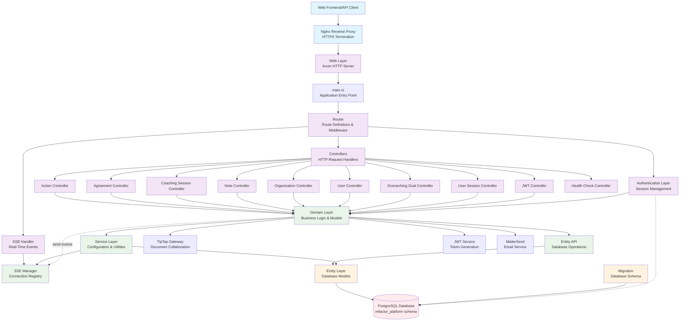

# System Architecture Overview

The Refactor Platform is a coaching management system built with Rust (Axum backend) and Next.js (frontend). This diagram shows the internal application architecture and how requests flow through the system.

## Key Architecture Principles

- **Layered Architecture**: Clear separation between web, business logic, and data layers
- **Domain-Driven Design**: Core business logic centralized in the domain layer
- **Repository Pattern**: Entity API layer abstracts database operations
- **Dependency Injection**: Service layer provides configuration and utilities
- **Authentication**: Session-based auth with JWT token support

## System Components

### External Layer
- **Client**: Web frontend (Next.js) and potential API clients
- **Nginx**: Reverse proxy handling HTTPS termination and load balancing

### Web Layer (Axum HTTP Server)
- **main.rs**: Application entry point, bootstraps the server
- **Router**: Defines API routes and applies middleware (auth, CORS, logging)
- **Controllers**: Handle HTTP requests, validate input, call business logic
- **Authentication**: Manages user sessions and request authorization

### Business Logic Layer
- **Domain**: Core business models and logic (Users, Organizations, Coaching Sessions, etc.)
- **Entity API**: Database operations abstraction layer
- **Service**: Configuration management, logging, utilities

### Data Layer
- **Entity**: Database models using SeaORM
- **Migration**: Database schema versioning and migrations
- **Database**: PostgreSQL with `refactor_platform` schema

### Real-Time Communication
- **SSE (Server-Sent Events)**: Unidirectional push notifications from server to client
- **Connection Management**: In-memory registry for active user connections (single-instance only)

### External Integrations
- **TipTap**: Collaborative document editing service
- **JWT**: Token generation and validation service
- **MailerSend**: Transactional email service for notifications

## Data Flow Example

1. **HTTP Request** → Nginx → Axum Web Server
2. **Routing** → Router matches URL to controller
3. **Authentication** → Middleware validates session/token
4. **Controller** → Validates input, calls domain logic
5. **Domain** → Implements business rules, calls Entity API
6. **Entity API** → Performs database operations via Entity models
7. **Response** → Results flow back through the layers

## Core Business Entities

- **Users**: Coaches and coachees in the system
- **Organizations**: Groups that manage coaching relationships
- **Coaching Relationships**: Connections between coaches and coachees
- **Coaching Sessions**: Individual coaching meetings with notes and goals
- **Actions**: Commitments and next steps from sessions
- **Agreements**: Formal coaching agreements and contracts
- **Overarching Goals**: Long-term objectives for coaching relationships

