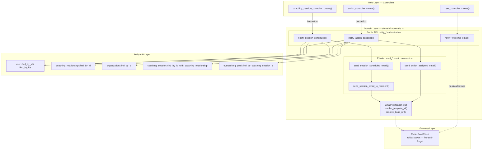

# Email Notifications for Session Scheduling & Action Assignment

## Context

Two GitHub issues request email notifications for key platform events:
- **refactor-platform-fe#170** - Email when a coaching session is scheduled (both coach and coachee)
- **refactor-platform-fe#251** - Email when an action is created/assigned to a user

The backend already had a working Mailersend integration for welcome emails (`notify_welcome_email` in `domain/src/emails.rs`). The two new email functions follow the same `MailerSendClient` + `SendEmailRequestBuilder` flow, with an added `EmailNotification` trait to avoid leaking config concerns into controllers.

Notification settings (on/off toggle per user) are deferred to a follow-up issue (refactor-platform-fe#301) since the Settings page doesn't exist yet.

## Related Issues

| Issue | Repo | Description |
|---|---|---|
| [#170](https://github.com/refactor-group/refactor-platform-fe/issues/170) | refactor-platform-fe | New Coaching Session Scheduled Email |
| [#251](https://github.com/refactor-group/refactor-platform-fe/issues/251) | refactor-platform-fe | Send email when Action is assigned |
| [#301](https://github.com/refactor-group/refactor-platform-fe/issues/301) | refactor-platform-fe | Deferred: Notification preferences panel |
| [#226](https://github.com/refactor-group/refactor-platform-rs/issues/226) | refactor-platform-rs | Backend: Session scheduled email |
| [#227](https://github.com/refactor-group/refactor-platform-rs/issues/227) | refactor-platform-rs | Backend: Action assigned email |

---

## Architecture

### Standardized Email Notification Pattern

All email notifications follow a two-tier pattern that respects the backend's layer boundaries:



**Tier 1: `notify_*` orchestration functions (public, called by controllers)**
- Take `&DatabaseConnection`, `&Config`, and data the controller already has from the preceding operation
- Look up any additional required data via `entity_api` functions (through domain re-exports)
- Call the corresponding private `send_*` function with fully assembled data
- Never use raw SeaORM — always go through `entity_api`

**Tier 2: `send_*` email construction functions (private, called by `notify_*`)**
- Pure email senders — take all data as parameters, no DB access
- Handle MailerSend client creation, template ID resolution (via `EmailNotification` trait), personalization building
- Fire emails via `tokio::spawn()` (fire-and-forget)

This pattern matches the domain-level orchestration used elsewhere in the codebase:
- `domain/src/coaching_session.rs::create` — looks up relationship + organization via entity_api for Tiptap side effect
- `domain/src/overarching_goal.rs::create` — looks up session + relationship via entity_api for domain event publishing

### EmailNotification Trait

**File:** `domain/src/emails.rs`

A trait that encapsulates common config prerequisites for email notifications. The `send_*` functions resolve what they need via the trait — controllers have no awareness of config details.

```rust
trait EmailNotification {
    fn template_id(config: &Config) -> Option<String>;
    fn notification_name() -> &'static str;

    // Default implementations:
    fn resolve_template_id(config: &Config) -> Result<String, Error> { ... }
    fn resolve_base_url(config: &Config) -> Result<String, Error> { ... }
}
```

Two implementors:
- `SessionScheduled` — resolves `session_scheduled_email_template_id`
- `ActionAssigned` — resolves `action_assigned_email_template_id`

### Email Flow

```
Controller (create handler)
  → domain::emails::notify_*() (orchestration — looks up related data via entity_api)
    → domain::emails::send_*() (private — constructs and fires the email)
      → EmailNotification trait (resolves template ID + base URL from Config)
      → MailerSendClient + SendEmailRequestBuilder
        → tokio::spawn() → Mailersend API (fire-and-forget)
```

All email sending is best-effort: failures are logged with `warn!()` and never block the main operation.

---

## Files Modified

### `entity_api/src/user.rs`
- Added `find_by_ids(db, &[Id])` — bulk user lookup by IDs (used by `notify_action_assigned`)

### `entity_api/src/overarching_goal.rs`
- Added `find_by_coaching_session_id(db, Id)` — find overarching goals for a session (used by `notify_action_assigned`)

### `service/src/config.rs`
- Added `session_scheduled_email_template_id: Option<String>` (env: `SESSION_SCHEDULED_EMAIL_TEMPLATE_ID`)
- Added `action_assigned_email_template_id: Option<String>` (env: `ACTION_ASSIGNED_EMAIL_TEMPLATE_ID`)
- Added `frontend_base_url: Option<String>` (env: `FRONTEND_BASE_URL`)
- Added corresponding accessor methods

### `domain/Cargo.toml`
- Added `chrono-tz = "0.10"` for timezone-aware date formatting

### `domain/src/user.rs`
- Re-exported `find_by_ids` from `entity_api::user`

### `domain/src/overarching_goal.rs`
- Re-exported `find_by_coaching_session_id` from `entity_api::overarching_goal`

### `domain/src/emails.rs`
- Added `EmailNotification` trait with default `resolve_template_id()` and `resolve_base_url()` methods
- Added `SessionScheduled` and `ActionAssigned` trait implementations
- Added `format_session_date_time(date, timezone)` helper — formats a UTC `NaiveDateTime` in the recipient's timezone (falls back to UTC on invalid timezone)
- Added `send_session_email_to_recipient()` — private, sends to one person with role-aware personalization
- Added `send_session_scheduled_email()` — private, sends to both coach and coachee
- Added `send_action_assigned_email()` — private, sends to all assignees
- Added `notify_session_scheduled(db, config, &session)` — public orchestration entry point for controllers
- Added `notify_action_assigned(db, config, &assignee_ids, &assigner, action_body, due_by, session_id)` — public orchestration entry point for controllers

### `web/src/controller/coaching_session_controller.rs`
- Updated `create()` to call `EmailsApi::notify_session_scheduled()` after session creation (best-effort)

### `web/src/controller/action_controller.rs`
- Updated `create()` to call `EmailsApi::notify_action_assigned()` when assignees are present (best-effort)

---

## Mailersend Templates

### Template A: Coaching Session Scheduled

**Template name:** `session-scheduled`
**Subject:** `New coaching session scheduled for {{session_date}}`

| Variable | Description | Example |
|---|---|---|
| `first_name` | Recipient's first name | `Jane` |
| `other_user_first_name` | The other person's first name | `Alex` |
| `other_user_last_name` | The other person's last name | `Smith` |
| `other_user_role` | "coach" or "coachee" | `coach` |
| `organization_name` | The organization name | `Acme Corp` |
| `session_date` | Formatted date | `Tuesday, March 4, 2026` |
| `session_time` | Formatted time | `3:00 PM` |
| `session_url` | Link to session | `https://app.myrefactor.com/coaching-sessions/abc-123` |

**Body:**
```
Hi {{first_name}},

A new coaching session has been scheduled at {{organization_name}}.

Your {{other_user_role}}, {{other_user_first_name}} {{other_user_last_name}}, has a session with you on:

{{session_date}} at {{session_time}}

[View Session]({{session_url}})

If you have any questions, reach out to your {{other_user_role}} directly.

— The {{organization_name}} Coaching Team
```

### Template B: Action Assigned

**Template name:** `action-assigned`
**Subject:** `You've been assigned a new action`

| Variable | Description | Example |
|---|---|---|
| `first_name` | Recipient's first name | `Jane` |
| `action_body` | Description of the action | `Read chapters 3-5 of "Radical Candor"` |
| `due_date` | Formatted due date (or "No due date set") | `Friday, March 7, 2026` |
| `assigner_first_name` | Assigner's first name | `Alex` |
| `assigner_last_name` | Assigner's last name | `Smith` |
| `organization_name` | The organization name | `Acme Corp` |
| `overarching_goal` | Goal title (optional, may be empty) | `Improve team communication` |
| `session_url` | Link to session | `https://app.myrefactor.com/coaching-sessions/abc-123` |

**Body:**
```
Hi {{first_name}},

You've been assigned a new action by {{assigner_first_name}} {{assigner_last_name}} at {{organization_name}}:

"{{action_body}}"

Due by: {{due_date}}

[conditional: only show if overarching_goal is not empty]
This action is associated with your goal: {{overarching_goal}}
[end conditional]

[View in Coaching Session]({{session_url}})

— The {{organization_name}} Coaching Team
```

---

## Environment Variables Required

```bash
SESSION_SCHEDULED_EMAIL_TEMPLATE_ID=<template-id-from-mailersend>
ACTION_ASSIGNED_EMAIL_TEMPLATE_ID=<template-id-from-mailersend>
FRONTEND_BASE_URL=https://app.myrefactor.com  # no trailing slash

# Optional — URL path templates (have sensible defaults, override only if frontend routing changes)
SESSION_SCHEDULED_EMAIL_URL_PATH=/coaching-sessions/{session_id}
ACTION_ASSIGNED_EMAIL_URL_PATH=/coaching-sessions/{session_id}?tab=actions
```

These are in addition to the existing `MAILERSEND_API_KEY` and `WELCOME_EMAIL_TEMPLATE_ID`.

---

## TODO

- [ ] Create Mailersend templates in dashboard and set env vars
- [ ] Add tests for the new email functions (session scheduled, action assigned)
- [x] Wire action assigned email into the `update` handler when `assignee_ids` changes (currently only on `create`)
- [x] Bring welcome email into the `notify_*` naming pattern for consistency
