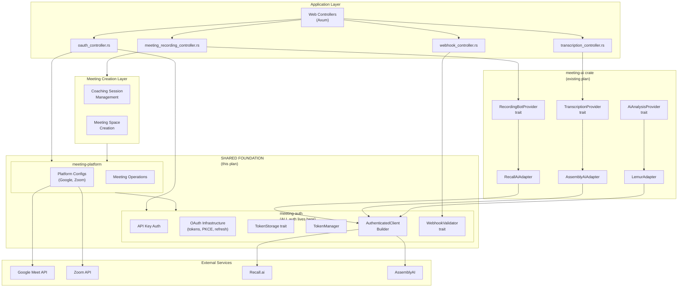
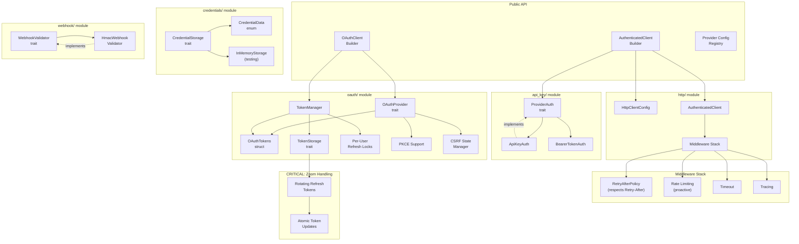
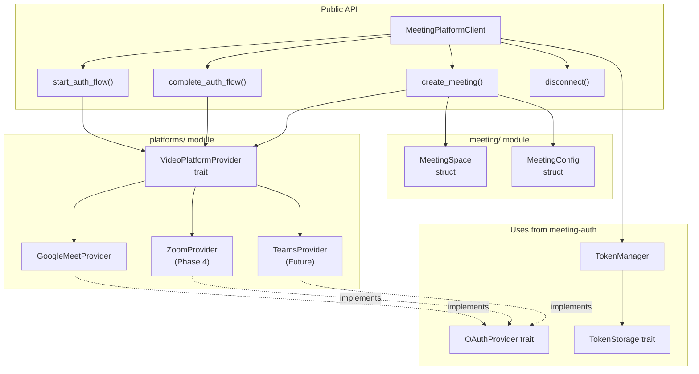
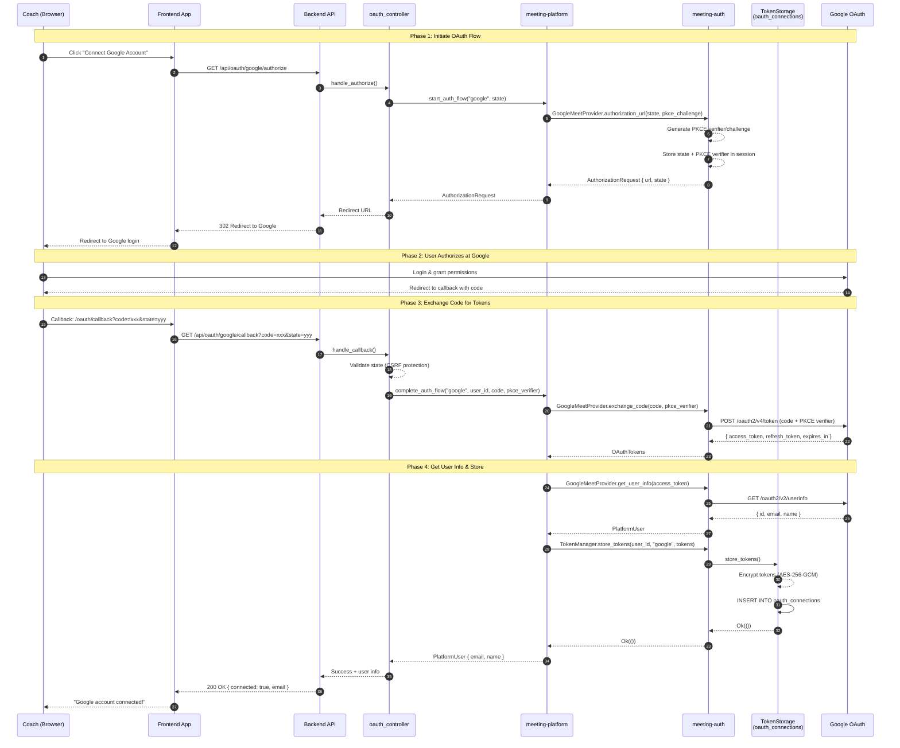
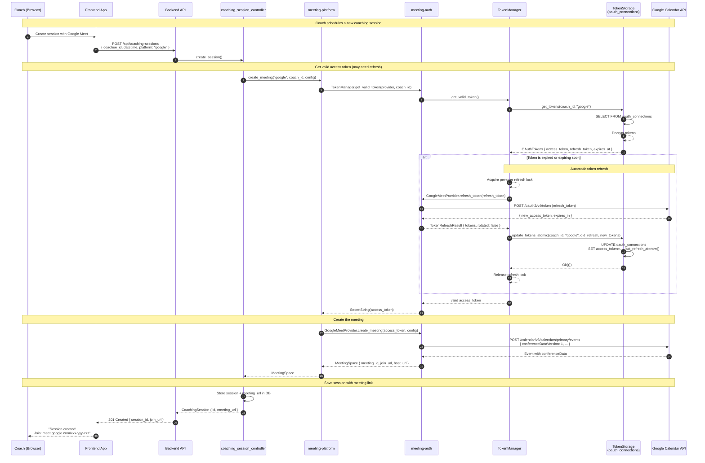

# Meeting Auth & Meeting Platform Crates

**Status:** Ready for Review

**Date:** 2026-01-30

**Supersedes:** `MeetingPlatformProvider` trait from `docs/implementation-plans/meeting-ai-abstraction-layer.md`

**Decision Date:** Weekly Platform Sync Meeting, 2026-01-30

> **Note:** Per the 1/30/26 weekly sync, this plan **replaces** the `MeetingPlatformProvider` abstraction in `meeting-ai-abstraction-layer.md`. The `meeting-platform` crate will serve as a shared foundation for both:
> 1. Meeting creation and management layer
> 2. AI bot/transcription layers (Recall.ai, AssemblyAI, etc.)


## Overview

Create two new library crates with a clear separation of concerns:

1. **`meeting-auth`** - **Single source of truth for ALL authentication**
   - API key authentication (for Recall.ai, AssemblyAI, etc.)
   - OAuth 2.0 infrastructure (tokens, storage, refresh, PKCE)
   - HTTP client building with middleware
   - Webhook signature validation

2. **`meeting-platform`** - **Platform-specific meeting operations** (thin consumer of meeting-auth)
   - Platform configurations (Google, Zoom, Teams endpoints and scopes)
   - Meeting creation and management
   - Implements traits defined in `meeting-auth`

**Key Design Principle:** `meeting-auth` owns all authentication machinery. `meeting-platform` provides platform-specific configurations and meeting operations, delegating all auth concerns to `meeting-auth`.


## Architecture Diagrams

### 1. Overall AI Transcription System Components

Details how this subsystem fits into the overall backend system.

**Key Change:** `meeting-auth` is the single auth foundation. `meeting-platform` is a thin layer for platform-specific operations.



### 2. meeting-auth Crate Components (Comprehensive Auth)



### 3. meeting-platform Crate Components (Thin Layer)



### 4. Sequence Diagram: Google Meet OAuth Link Account Flow

Shows the complete flow when a coach links their Google account for the first time.



### 5. Sequence Diagram: Create Meeting with Linked Google Account

Shows the flow when creating a Google Meet meeting using an already-linked account, including automatic token refresh.



---

## Crate 1: meeting-auth

### Purpose

**Single source of truth for ALL authentication** (except for existing TipTap JWT token handling) - both API key auth for service providers and OAuth for video meeting platforms.

### Location

```
meeting-auth/
├── Cargo.toml
├── src/
│   ├── lib.rs
│   ├── error.rs
│   │
│   ├── api_key/                 # API key authentication
│   │   ├── mod.rs
│   │   ├── auth.rs              # ProviderAuth trait + ApiKeyAuth
│   │   └── bearer.rs            # BearerTokenAuth
│   │
│   ├── oauth/                   # OAuth 2.0 infrastructure
│   │   ├── mod.rs
│   │   ├── provider.rs          # OAuthProvider trait
│   │   ├── tokens.rs            # OAuthTokens struct
│   │   ├── storage.rs           # TokenStorage trait (CRITICAL)
│   │   ├── manager.rs           # TokenManager with refresh locks
│   │   ├── pkce.rs              # PKCE support
│   │   └── state.rs             # CSRF state management
│   │
│   ├── credentials/             # Credential storage abstraction
│   │   ├── mod.rs
│   │   ├── storage.rs           # CredentialStorage trait
│   │   └── memory.rs            # In-memory impl for testing
│   │
│   ├── webhook/                 # Webhook validation
│   │   ├── mod.rs
│   │   └── hmac.rs              # HMAC signature validation
│   │
│   ├── http/                    # HTTP client building
│   │   ├── mod.rs
│   │   ├── client.rs            # AuthenticatedClientBuilder
│   │   ├── middleware.rs        # Tower middleware composition
│   │   └── retry.rs             # Custom retry policy with Retry-After support
│   │
│   └── providers/               # Pre-defined provider configs
│       ├── mod.rs
│       └── config.rs            # recall_ai_config(), assemblyai_config()
```

### Key Traits

#### API Key Authentication

```rust
/// Authentication method enum
pub enum AuthMethod {
    ApiKeyHeader { header_name: String, prefix: Option<String> },
    BearerToken,
    BasicAuth,
}

/// Trait for authenticating HTTP requests (API keys, bearer tokens)
#[async_trait]
pub trait ProviderAuth: Send + Sync {
    fn auth_method(&self) -> AuthMethod;
    fn authenticate(&self, request: RequestBuilder) -> RequestBuilder;
    async fn verify_credentials(&self) -> Result<bool, AuthError>;
    fn provider_id(&self) -> &str;
}
```

#### OAuth 2.0 Infrastructure

```rust
/// OAuth tokens with metadata
pub struct OAuthTokens {
    pub access_token: SecretString,
    pub refresh_token: Option<SecretString>,
    pub expires_at: Option<DateTime<Utc>>,
    pub token_type: String,
    pub scopes: Vec<String>,
}

/// Result of a token refresh operation
pub struct TokenRefreshResult {
    pub tokens: OAuthTokens,
    /// True if the refresh token was rotated (Zoom behavior)
    pub refresh_token_rotated: bool,
}

/// Trait for OAuth providers - implemented by platform-specific providers
#[async_trait]
pub trait OAuthProvider: Send + Sync {
    fn provider_id(&self) -> &str;
    fn authorization_url(&self, state: &str, pkce_challenge: Option<&str>) -> AuthorizationRequest;
    async fn exchange_code(&self, code: &str, pkce_verifier: Option<&str>) -> Result<OAuthTokens, OAuthError>;
    async fn refresh_token(&self, refresh_token: &str) -> Result<TokenRefreshResult, OAuthError>;
    async fn revoke_token(&self, token: &str) -> Result<(), OAuthError>;

    /// Returns true if this provider rotates refresh tokens (e.g., Zoom)
    fn uses_rotating_refresh_tokens(&self) -> bool { false }
}

/// CRITICAL: Token storage with atomic updates for Zoom's rotating refresh tokens
#[async_trait]
pub trait TokenStorage: Send + Sync {
    async fn store_tokens(
        &self,
        user_id: &str,
        provider_id: &str,
        tokens: OAuthTokens,
    ) -> Result<(), TokenStorageError>;

    async fn get_tokens(
        &self,
        user_id: &str,
        provider_id: &str,
    ) -> Result<Option<OAuthTokens>, TokenStorageError>;

    /// Atomic update for rotating refresh tokens (Zoom)
    /// Returns error if old_refresh doesn't match (token was already rotated)
    async fn update_tokens_atomic(
        &self,
        user_id: &str,
        provider_id: &str,
        old_refresh: Option<&str>,
        new_tokens: OAuthTokens,
    ) -> Result<(), TokenStorageError>;

    async fn delete_tokens(
        &self,
        user_id: &str,
        provider_id: &str,
    ) -> Result<(), TokenStorageError>;
}

/// Token manager with per-user refresh locking
pub struct TokenManager<S: TokenStorage> {
    storage: S,
    refresh_locks: DashMap<String, Arc<Mutex<()>>>,
}

impl<S: TokenStorage> TokenManager<S> {
    /// Get a valid access token, refreshing if needed
    pub async fn get_valid_token<P: OAuthProvider>(
        &self,
        provider: &P,
        user_id: &str,
    ) -> Result<SecretString, TokenError>;
}
```

#### Credential Storage (for API Keys)

```rust
/// Trait for storing provider credentials (API keys)
#[async_trait]
pub trait CredentialStorage: Send + Sync {
    async fn store(&self, user_id: &str, provider_id: &str, credentials: CredentialData) -> Result<(), StorageError>;
    async fn get(&self, user_id: &str, provider_id: &str) -> Result<Option<ProviderCredentials>, StorageError>;
    async fn update(&self, user_id: &str, provider_id: &str, credentials: CredentialData) -> Result<(), StorageError>;
    async fn delete(&self, user_id: &str, provider_id: &str) -> Result<(), StorageError>;
}
```

#### Webhook Validation

```rust
/// Webhook signature validation
pub trait WebhookValidator: Send + Sync {
    fn validate(&self, headers: &HashMap<String, String>, body: &[u8]) -> Result<bool, WebhookError>;
    fn provider_id(&self) -> &str;
}
```

### Dependencies

- `oauth2` - OAuth 2.0 flows with PKCE support
- `reqwest-middleware` - Middleware chains for HTTP clients
- `reqwest-retry` - Exponential backoff retry logic
- `tower` - Rate limiting, timeout, concurrency control
- `secrecy` - Secure handling of secrets in memory
- `dashmap` - Concurrent HashMap for refresh locks
- `thiserror` - Error types
- `chrono` - DateTime handling
- `httpdate` - Parse HTTP-date format in Retry-After headers

### Custom Retry Policy with `Retry-After` Header Support

The default `reqwest-retry` crate handles 429 (Too Many Requests) responses by retrying with exponential backoff, but it **does not** parse the `Retry-After` header that APIs include to specify when to retry. This can cause problems:

- API says "retry after 60 seconds" but backoff says "retry in 2 seconds"
- Client burns through retry attempts and still fails
- May trigger additional rate limiting or API bans

We implement a custom `RetryAfterPolicy` that respects server guidance:

```rust
// http/retry.rs

use reqwest::{Response, StatusCode};
use reqwest_retry::{RetryPolicy, Retryable, RetryDecision};
use std::time::Duration;

/// Custom retry policy that respects Retry-After headers
pub struct RetryAfterPolicy {
    /// Fallback exponential backoff when no Retry-After header present
    max_retries: u32,
    base_delay: Duration,
    max_delay: Duration,
}

impl RetryAfterPolicy {
    pub fn new(max_retries: u32) -> Self {
        Self {
            max_retries,
            base_delay: Duration::from_secs(1),
            max_delay: Duration::from_secs(60),
        }
    }

    /// Parse Retry-After header (supports both seconds and HTTP-date formats)
    fn parse_retry_after(response: &Response) -> Option<Duration> {
        let header = response.headers().get("retry-after")?;
        let value = header.to_str().ok()?;

        // Try parsing as seconds first (most common)
        if let Ok(seconds) = value.parse::<u64>() {
            return Some(Duration::from_secs(seconds));
        }

        // Try parsing as HTTP-date (e.g., "Wed, 21 Oct 2026 07:28:00 GMT")
        if let Ok(date) = httpdate::parse_http_date(value) {
            let now = std::time::SystemTime::now();
            if let Ok(duration) = date.duration_since(now) {
                return Some(duration);
            }
        }

        None
    }
}

impl RetryPolicy for RetryAfterPolicy {
    fn should_retry(&self, response: &Response, n_attempts: u32) -> RetryDecision {
        if n_attempts >= self.max_retries {
            return RetryDecision::DoNotRetry;
        }

        let status = response.status();

        match status {
            // Rate limited - check for Retry-After header
            StatusCode::TOO_MANY_REQUESTS => {
                let delay = Self::parse_retry_after(response)
                    .unwrap_or_else(|| self.exponential_delay(n_attempts))
                    .min(self.max_delay);

                RetryDecision::RetryAfter(delay)
            }

            // Server errors - use exponential backoff
            s if s.is_server_error() => {
                RetryDecision::RetryAfter(self.exponential_delay(n_attempts))
            }

            // Request timeout - retry with backoff
            StatusCode::REQUEST_TIMEOUT => {
                RetryDecision::RetryAfter(self.exponential_delay(n_attempts))
            }

            // Success or client errors (except 429) - don't retry
            _ => RetryDecision::DoNotRetry,
        }
    }

    fn exponential_delay(&self, n_attempts: u32) -> Duration {
        let delay = self.base_delay.as_secs_f64() * 2_f64.powi(n_attempts as i32);
        Duration::from_secs_f64(delay.min(self.max_delay.as_secs_f64()))
    }
}
```

**Usage in AuthenticatedClientBuilder:**

```rust
let retry_policy = RetryAfterPolicy::new(3);
let client = ClientBuilder::new(reqwest::Client::new())
    .with(RetryTransientMiddleware::new_with_policy(retry_policy))
    .with(RateLimitingMiddleware::new(/* proactive rate limiting */))
    .build();
```

**Why both retry AND proactive rate limiting?**

| Layer | Purpose |
|-------|---------|
| `RetryAfterPolicy` | **Reactive** - handles failures gracefully when they occur |
| `RateLimitingMiddleware` (Tower) | **Proactive** - prevents hitting limits in the first place |

This dual-layer approach is especially important for APIs like Recall.ai that have strict rate limits.

### Pre-defined Provider Configs

```rust
// For API key providers
pub fn recall_ai_config(region: &str, base_domain: &str) -> ProviderConfig;
pub fn assemblyai_config() -> ProviderConfig;
pub fn deepgram_config() -> ProviderConfig;  // future
```

---

## Crate 2: meeting-platform

### Purpose

**Thin layer for platform-specific meeting operations.** Provides configurations for video platforms and meeting creation, delegating all authentication to `meeting-auth`.

### Location

```
meeting-platform/
├── Cargo.toml
├── src/
│   ├── lib.rs
│   ├── error.rs
│   ├── client.rs                # MeetingPlatformClient
│   │
│   ├── meeting/                 # Meeting types
│   │   ├── mod.rs
│   │   ├── space.rs             # MeetingSpace struct
│   │   └── config.rs            # MeetingConfig struct
│   │
│   └── platforms/               # Platform-specific implementations
│       ├── mod.rs
│       ├── provider.rs          # VideoPlatformProvider trait
│       ├── google_meet.rs       # Google Meet implementation
│       ├── zoom.rs              # Zoom implementation (future)
│       └── teams.rs             # Microsoft Teams (future)
```

### Key Traits

```rust
use meeting_auth::{OAuthProvider, TokenManager, TokenStorage, OAuthTokens};

/// Platform user info retrieved after OAuth
pub struct PlatformUser {
    pub external_id: String,
    pub email: Option<String>,
    pub name: Option<String>,
}

/// Meeting space returned after creation
pub struct MeetingSpace {
    pub meeting_id: String,
    pub join_url: String,
    pub host_url: Option<String>,
    pub dial_in: Option<DialInInfo>,
    pub platform_metadata: serde_json::Value,
}

/// Configuration for creating a meeting
pub struct MeetingConfig {
    pub title: Option<String>,
    pub scheduled_start: Option<DateTime<Utc>>,
    pub duration_minutes: Option<u32>,
    pub settings: PlatformSpecificSettings,
}

/// Video platform provider - extends OAuthProvider with meeting operations
#[async_trait]
pub trait VideoPlatformProvider: OAuthProvider {
    /// Get user info from the platform
    async fn get_user_info(&self, access_token: &str) -> Result<PlatformUser, PlatformError>;

    /// Create a meeting on the platform
    async fn create_meeting(
        &self,
        access_token: &str,
        config: MeetingConfig,
    ) -> Result<MeetingSpace, PlatformError>;

    /// Delete/cancel a meeting
    async fn delete_meeting(
        &self,
        access_token: &str,
        meeting_id: &str,
    ) -> Result<(), PlatformError>;
}
```

### Main Client Interface

```rust
use meeting_auth::{TokenManager, TokenStorage};

/// High-level client for video platform operations
pub struct MeetingPlatformClient<S: TokenStorage> {
    token_manager: TokenManager<S>,
    platforms: HashMap<String, Arc<dyn VideoPlatformProvider>>,
}

impl<S: TokenStorage> MeetingPlatformClient<S> {
    /// Start OAuth flow - returns URL to redirect user to
    pub fn start_auth_flow(
        &self,
        platform_id: &str,
        state: &str,
    ) -> Result<AuthorizationRequest, ClientError>;

    /// Complete OAuth flow after user authorizes
    pub async fn complete_auth_flow(
        &self,
        platform_id: &str,
        user_id: &str,
        code: &str,
        pkce_verifier: Option<&str>,
    ) -> Result<PlatformUser, ClientError>;

    /// Create a meeting (handles token refresh automatically)
    pub async fn create_meeting(
        &self,
        platform_id: &str,
        user_id: &str,
        config: MeetingConfig,
    ) -> Result<MeetingSpace, ClientError>;

    /// Disconnect user from platform (revoke tokens)
    pub async fn disconnect(
        &self,
        platform_id: &str,
        user_id: &str,
    ) -> Result<(), ClientError>;
}
```

### Platform Implementations

Each platform provider implements both `OAuthProvider` (from meeting-auth) and `VideoPlatformProvider`:

```rust
// google_meet.rs
pub struct GoogleMeetProvider {
    client_id: String,
    client_secret: SecretString,
    redirect_uri: String,
}

impl OAuthProvider for GoogleMeetProvider {
    fn provider_id(&self) -> &str { "google" }

    fn authorization_url(&self, state: &str, pkce_challenge: Option<&str>) -> AuthorizationRequest {
        // Google-specific OAuth URL with calendar scopes
    }

    // ... other OAuthProvider methods
}

impl VideoPlatformProvider for GoogleMeetProvider {
    async fn create_meeting(&self, access_token: &str, config: MeetingConfig) -> Result<MeetingSpace, PlatformError> {
        // Use Google Calendar API to create event with conferenceData
    }

    // ... other VideoPlatformProvider methods
}
```

### Dependencies

- `meeting-auth` - All authentication (OAuth + API keys)
- `reqwest` - HTTP client (using meeting-auth's middleware)
- `serde`, `serde_json` - Serialization
- `chrono` - DateTime handling

---

## Integration with Existing Code

### Prototype Schema Analysis

The existing prototype (`user_integrations` table) has several issues that prevent production use:

| Issue | Prototype Approach | Problem |
|-------|-------------------|---------|
| **Hardcoded columns** | `google_access_token`, `recall_ai_api_key`, etc. | Adding new provider requires schema migration |
| **Mixed auth types** | OAuth tokens + API keys in same table | Different lifecycles, refresh patterns |
| **Single account** | `UNIQUE(user_id)` | Can't connect multiple Google/Zoom accounts |
| **No audit trail** | No history tracking | Can't debug Zoom token rotation failures |
| **Tight coupling** | Column names match provider names | Schema knows about specific providers |

### Production Schema Design

We propose **replacing** `user_integrations` with two purpose-built tables that align with the `meeting-auth` trait design:

#### 1. `oauth_connections` - For OAuth Providers (Google, Zoom, Teams)

```sql
CREATE TABLE oauth_connections (
    id UUID PRIMARY KEY DEFAULT gen_random_uuid(),
    user_id UUID NOT NULL REFERENCES users(id) ON DELETE CASCADE,

    -- Provider identification (generic, not hardcoded)
    provider_id VARCHAR(50) NOT NULL,      -- 'google', 'zoom', 'microsoft'

    -- User identity on the provider
    external_user_id VARCHAR(255),         -- Provider's user ID
    external_email VARCHAR(255),           -- User's email on provider
    external_name VARCHAR(255),            -- Display name

    -- OAuth tokens (encrypted at rest)
    access_token TEXT NOT NULL,            -- Encrypted
    refresh_token TEXT,                    -- Encrypted (nullable for some flows)
    token_expires_at TIMESTAMPTZ,
    token_type VARCHAR(50) DEFAULT 'Bearer',
    scopes TEXT[],                         -- Array of granted scopes

    -- Token metadata for debugging/audit
    token_issued_at TIMESTAMPTZ,
    last_refresh_at TIMESTAMPTZ,
    refresh_count INTEGER DEFAULT 0,       -- Track rotation frequency

    -- Connection status
    is_active BOOLEAN DEFAULT true,        -- Soft disable without deleting
    last_used_at TIMESTAMPTZ,
    error_message TEXT,                    -- Last error if any

    -- Timestamps
    created_at TIMESTAMPTZ NOT NULL DEFAULT now(),
    updated_at TIMESTAMPTZ NOT NULL DEFAULT now(),

    -- Allow multiple accounts per provider (e.g., personal + work Google)
    -- But typically one active connection per provider
    UNIQUE(user_id, provider_id, external_user_id)
);

-- Indexes for common queries
CREATE INDEX idx_oauth_connections_user_provider ON oauth_connections(user_id, provider_id);
CREATE INDEX idx_oauth_connections_active ON oauth_connections(user_id, is_active) WHERE is_active = true;
```

#### 2. `api_credentials` - For API Key Providers (Recall.ai, AssemblyAI)

```sql
CREATE TABLE api_credentials (
    id UUID PRIMARY KEY DEFAULT gen_random_uuid(),
    user_id UUID NOT NULL REFERENCES users(id) ON DELETE CASCADE,

    -- Provider identification
    provider_id VARCHAR(50) NOT NULL,      -- 'recall_ai', 'assemblyai', 'deepgram'

    -- Credential (encrypted at rest)
    api_key TEXT NOT NULL,                 -- Encrypted

    -- Provider-specific configuration
    region VARCHAR(50),                    -- e.g., 'us-west-2' for Recall.ai
    base_url VARCHAR(500),                 -- Custom endpoint override
    config JSONB DEFAULT '{}',             -- Provider-specific settings

    -- Verification status
    is_verified BOOLEAN DEFAULT false,
    verified_at TIMESTAMPTZ,
    last_verification_error TEXT,

    -- Connection status
    is_active BOOLEAN DEFAULT true,
    last_used_at TIMESTAMPTZ,

    -- Timestamps
    created_at TIMESTAMPTZ NOT NULL DEFAULT now(),
    updated_at TIMESTAMPTZ NOT NULL DEFAULT now(),

    -- One credential per provider per user
    UNIQUE(user_id, provider_id)
);

CREATE INDEX idx_api_credentials_user_provider ON api_credentials(user_id, provider_id);
```

#### 3. `user_ai_preferences` - Extracted from user_integrations

```sql
CREATE TABLE user_ai_preferences (
    id UUID PRIMARY KEY DEFAULT gen_random_uuid(),
    user_id UUID NOT NULL REFERENCES users(id) ON DELETE CASCADE UNIQUE,

    -- AI feature preferences
    auto_approve_suggestions BOOLEAN DEFAULT false,

    -- Future extensibility
    preferences JSONB DEFAULT '{}',

    -- Timestamps
    created_at TIMESTAMPTZ NOT NULL DEFAULT now(),
    updated_at TIMESTAMPTZ NOT NULL DEFAULT now()
);
```

### Why Two Tables Instead of One?

| Aspect | OAuth Connections | API Credentials |
|--------|------------------|-----------------|
| **Lifecycle** | Tokens expire, need refresh | Keys are long-lived |
| **Rotation** | Automatic (Zoom) or on-demand | Manual by user |
| **Identity** | Has user profile (email, name) | No user identity |
| **Multi-account** | May want personal + work | One key per provider |
| **Verification** | Implicit (token works or not) | Explicit verification endpoint |

### Migration Path from Prototype

Since the prototype schema hasn't been deployed to production:

1. **Delete** the prototype `user_integrations` migration
2. **Create** new migrations for `oauth_connections`, `api_credentials`, `user_ai_preferences`
3. **Update** entity definitions to match new schema
4. **No data migration needed** (prototype data can be discarded)

### Trait Implementation Mapping

```rust
// In domain crate

/// Implements meeting_auth::TokenStorage using oauth_connections table
pub struct OAuthConnectionStorage {
    db: DatabaseConnection,
    encryption_key: String,
}

#[async_trait]
impl TokenStorage for OAuthConnectionStorage {
    async fn store_tokens(&self, user_id: &str, provider_id: &str, tokens: OAuthTokens) -> Result<(), TokenStorageError> {
        // INSERT or UPDATE oauth_connections
        // Encrypt tokens using domain::encryption
    }

    async fn update_tokens_atomic(&self, user_id: &str, provider_id: &str, old_refresh: Option<&str>, new_tokens: OAuthTokens) -> Result<(), TokenStorageError> {
        // UPDATE oauth_connections
        // WHERE refresh_token = $old_refresh (for Zoom atomic update)
        // INCREMENT refresh_count, SET last_refresh_at
        // Returns error if no rows updated (token was already rotated)
    }
}

/// Implements meeting_auth::CredentialStorage using api_credentials table
pub struct ApiCredentialStorage {
    db: DatabaseConnection,
    encryption_key: String,
}

#[async_trait]
impl CredentialStorage for ApiCredentialStorage {
    async fn store(&self, user_id: &str, provider_id: &str, credentials: CredentialData) -> Result<(), StorageError> {
        // INSERT or UPDATE api_credentials
        // Encrypt API key using domain::encryption
    }
}
```

### Migration Strategy

1. **Phase 1**: Create `meeting-auth` crate with all auth infrastructure
2. **Phase 2**: Create `meeting-platform` crate as thin consumer
3. **Phase 3**: Implement database storage traits in domain crate
4. **Phase 4**: Migrate controllers one at a time, starting with `oauth_controller.rs`

---

## Implementation Phases

### Phase 1: Foundation - meeting-auth (Week 1-2)
- [ ] Add crates to workspace in `Cargo.toml`
- [ ] Implement `meeting-auth` API key auth (`ProviderAuth`, `ApiKeyAuth`)
- [ ] Implement `meeting-auth` OAuth infrastructure (`OAuthProvider`, `TokenStorage`, `TokenManager`)
- [ ] Implement PKCE and state management
- [ ] Implement `AuthenticatedClientBuilder` with reqwest-middleware
- [ ] Implement `RetryAfterPolicy` for proper 429 rate limit handling
- [ ] Add webhook validators

### Phase 2: Meeting Platform - Google Meet (Week 3-4)
- [ ] Implement `meeting-platform` crate structure
- [ ] Implement `VideoPlatformProvider` trait
- [ ] Implement `GoogleMeetProvider` (OAuth + meeting creation)
- [ ] Implement `MeetingPlatformClient` high-level API
- [ ] Create database migrations for `oauth_connections`, `api_credentials`

### Phase 3: Integration (Week 5-6)
- [ ] Implement `OAuthConnectionStorage` in domain crate
- [ ] Implement `ApiCredentialStorage` in domain crate
- [ ] Create adapter wrappers for existing clients (`RecallAiAdapter`, etc.)
- [ ] Migrate `oauth_controller.rs` as pilot

### Phase 4: Migration & Polish (Week 7-8)
- [ ] Migrate remaining controllers
- [ ] Add comprehensive tests
- [ ] Write documentation and examples

### Future Phases (Deferred)
- [ ] Zoom integration (`ZoomProvider` with rotating refresh token handling)
- [ ] Microsoft Teams support
- [ ] Additional transcription providers (Deepgram)
- [ ] Additional recording bot providers (Skribby)

---

## Critical Files to Modify

| File | Action |
|------|--------|
| `Cargo.toml` | Add workspace members |
| `domain/src/gateway/google_oauth.rs` | Reference for GoogleMeetProvider |
| `domain/src/gateway/recall_ai.rs` | Reference for API key auth pattern |
| `domain/src/encryption.rs` | Use for storage implementations |
| `web/src/controller/oauth_controller.rs` | First controller to migrate |
| `migration/src/` | Add migrations for new tables |
| `entity/src/` | Add entity definitions for new tables |

---


## Verification Plan

### Unit Tests
- Token refresh with concurrent requests (Zoom rotating tokens)
- OAuth flow state management
- PKCE challenge/verifier generation
- Webhook signature validation
- API key authentication
- `RetryAfterPolicy` parsing (seconds and HTTP-date formats)
- `RetryAfterPolicy` fallback to exponential backoff when header missing

### Integration Tests
- Full OAuth flow with mock server (mockito)
- Meeting creation with automatic token refresh
- Atomic token update race condition handling
- Error handling and retry behavior

### Manual Testing
1. Connect Google account via OAuth
2. Create Google Meet meeting
3. Verify token refresh after expiry
4. Test webhook validation

---

## Decisions Made

*From Weekly Platform Sync (2026-01-30):*

- **Architecture**: `meeting-auth` is the single source of truth for ALL authentication
- **Architecture**: `meeting-platform` is a thin layer for platform-specific operations
- **Shared Foundation**: Both meeting creation layer and AI bot/transcription layers will use these crates
- **Zoom**: Deferred to future phase (after Google Meet is proven)
- **Microsoft Teams**: Deferred to future phase
- **Schema**: Replace prototype `user_integrations` with `oauth_connections` and `api_credentials` tables

---

## Impact on meeting-ai-abstraction-layer.md

The following should be updated in the existing plan:
- **Remove**: `MeetingPlatformProvider` trait definition (replaced by `meeting-platform` crate)
- **Update**: Architecture diagram to show dependency on `meeting-auth` for all auth
- **Update**: `RecordingBotProvider` and `TranscriptionProvider` to use `meeting-auth` for HTTP client building

---

## References

- Existing plan: `docs/implementation-plans/meeting-ai-abstraction-layer.md`
- `oauth2` crate: https://docs.rs/oauth2
- `reqwest-middleware`: https://docs.rs/reqwest-middleware
- `tower`: https://docs.rs/tower
- `zoom-api` crate: https://docs.rs/zoom-api
