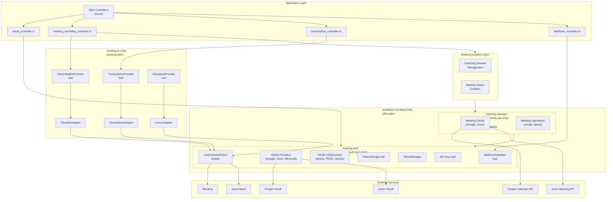
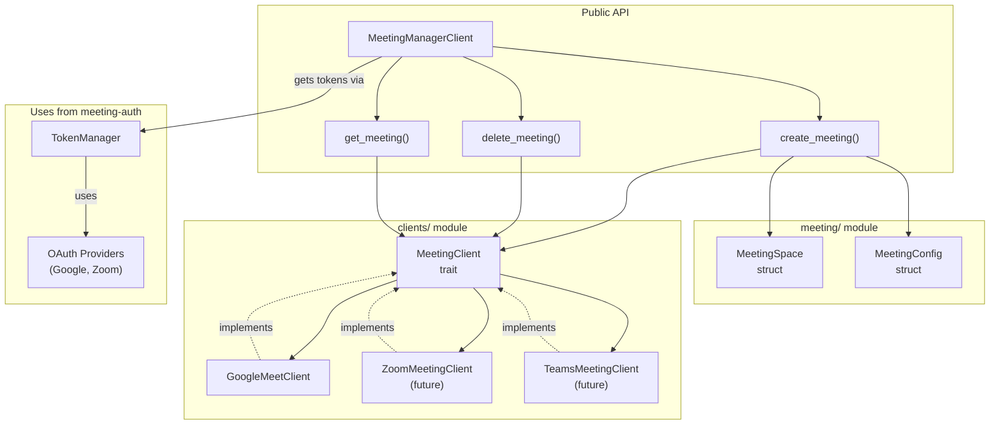
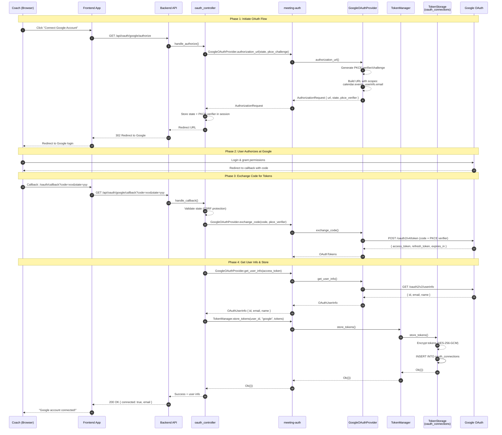
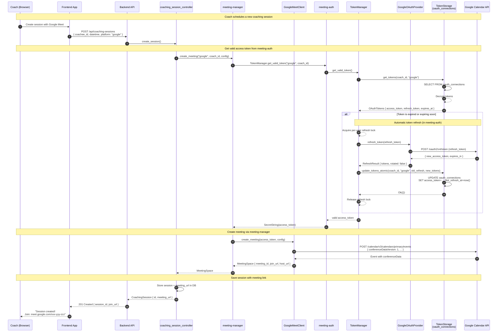

# Meeting Auth & Meeting Manager Crates

**Status:** Ready for Review

**Date:** 2026-01-30

**Supersedes:** `MeetingPlatformProvider` trait from `docs/implementation-plans/meeting-ai-abstraction-layer.md`

**Decision Date:** Weekly Platform Sync Meeting, 2026-01-30

> **Note:** Per the 1/30/26 weekly sync, this plan **replaces** the `MeetingPlatformProvider` abstraction in `meeting-ai-abstraction-layer.md`. The `meeting-manager` crate will serve as a shared foundation for both:
> 1. Meeting creation and management layer
> 2. AI bot/transcription layers (Recall.ai, AssemblyAI, etc.)


## Overview

Create two new library crates with a clear separation of concerns:

1. **`meeting-auth`** - **Single source of truth for ALL authentication**
   - API key authentication (for Recall.ai, AssemblyAI, etc.)
   - OAuth 2.0 infrastructure (tokens, storage, refresh, PKCE)
   - **OAuth provider implementations** (Google, Zoom, Microsoft) — endpoints, scopes, token exchange
   - HTTP client building with middleware
   - Webhook signature validation

2. **`meeting-manager`** - **Meeting operations only** (receives tokens from meeting-auth)
   - Meeting creation and management via platform APIs
   - Uses access tokens provided by `meeting-auth` — does NOT manage OAuth flows
   - Platform-specific API clients (Google Calendar API, Zoom API)

**Key Design Principle:** `meeting-auth` owns **all** authentication machinery, including OAuth provider configurations. `meeting-manager` is purely about meeting operations — it receives valid access tokens and uses them to call meeting APIs.


## Architecture Diagrams

### 1. Overall AI Transcription System Components

Details how this subsystem fits into the overall backend system.

**Key Change:** `meeting-auth` contains ALL authentication including OAuth provider implementations. `meeting-manager` only handles meeting operations using tokens from `meeting-auth`.



### 2. meeting-auth Crate Components (Comprehensive Auth)

```mermaid
flowchart TB
    subgraph PublicAPI["Public API"]
        AuthenticatedClientBuilder["AuthenticatedClient<br/>Builder"]
        OAuthClientBuilder["OAuthClient<br/>Builder"]
        ProviderConfigRegistry["Provider Config<br/>Registry"]
    end

    subgraph ApiKey["api_key/ module"]
        ProviderAuthTrait["ProviderAuth<br/>trait"]
        ApiKeyAuth["ApiKeyAuth"]
        BearerTokenAuth["BearerTokenAuth"]
    end

    subgraph OAuth["oauth/ module"]
        OAuthProviderTrait["OAuthProvider<br/>trait"]
        OAuthTokens["OAuthTokens<br/>struct"]
        TokenStorageTrait["TokenStorage<br/>trait"]
        TokenManager["TokenManager"]
        RefreshLock["Per-User<br/>Refresh Locks"]
        PKCE["PKCE Support"]
        StateManager["CSRF State<br/>Manager"]
    end

    subgraph OAuthProviders["oauth/providers/ module<br/>(implementations)"]
        GoogleOAuthProvider["GoogleOAuthProvider"]
        ZoomOAuthProvider["ZoomOAuthProvider<br/>(future)"]
        MicrosoftOAuthProvider["MicrosoftOAuthProvider<br/>(future)"]
    end

    subgraph Credentials["credentials/ module"]
        CredentialStorageTrait["CredentialStorage<br/>trait"]
        CredentialData["CredentialData<br/>enum"]
        MemoryStorage["InMemoryStorage<br/>(testing)"]
    end

    subgraph Webhook["webhook/ module"]
        WebhookValidatorTrait["WebhookValidator<br/>trait"]
        HmacValidator["HmacWebhook<br/>Validator"]
    end

    subgraph HTTP["http/ module"]
        ClientConfig["HttpClientConfig"]
        AuthenticatedClient["AuthenticatedClient"]
        MiddlewareStack["Middleware Stack"]
    end

    subgraph Middleware["Middleware Stack"]
        RetryAfterPolicy["RetryAfterPolicy<br/>(respects Retry-After)"]
        RateLimitMiddleware["Rate Limiting<br/>(proactive)"]
        TimeoutMiddleware["Timeout"]
        TracingMiddleware["Tracing"]
    end

    subgraph Critical["CRITICAL: Zoom Handling"]
        RotatingTokens["Rotating Refresh<br/>Tokens"]
        AtomicUpdate["Atomic Token<br/>Updates"]
    end

    AuthenticatedClientBuilder --> ClientConfig
    AuthenticatedClientBuilder --> ProviderAuthTrait
    AuthenticatedClientBuilder --> AuthenticatedClient

    OAuthClientBuilder --> OAuthProviderTrait
    OAuthClientBuilder --> TokenManager

    ProviderAuthTrait --> ApiKeyAuth
    ProviderAuthTrait --> BearerTokenAuth

    OAuthProviderTrait --> OAuthTokens
    OAuthProviderTrait --> PKCE
    OAuthProviderTrait --> StateManager

    GoogleOAuthProvider -.->|"implements"| OAuthProviderTrait
    ZoomOAuthProvider -.->|"implements"| OAuthProviderTrait
    MicrosoftOAuthProvider -.->|"implements"| OAuthProviderTrait

    TokenManager --> TokenStorageTrait
    TokenManager --> RefreshLock
    TokenManager --> OAuthTokens

    TokenStorageTrait --> RotatingTokens
    RotatingTokens --> AtomicUpdate

    WebhookValidatorTrait --> HmacValidator

    CredentialStorageTrait --> CredentialData
    CredentialStorageTrait --> MemoryStorage

    AuthenticatedClient --> MiddlewareStack
    MiddlewareStack --> RetryAfterPolicy
    MiddlewareStack --> RateLimitMiddleware
    MiddlewareStack --> TimeoutMiddleware
    MiddlewareStack --> TracingMiddleware

    ApiKeyAuth -.->|"implements"| ProviderAuthTrait
    HmacValidator -.->|"implements"| WebhookValidatorTrait
```



### 3. meeting-manager Crate Components (Meeting Operations Only)



> **Key Difference:** `MeetingClient` does NOT extend `OAuthProvider`. Meeting clients receive access tokens from `token::Manager` and use them to call platform APIs. All OAuth logic stays in `meeting-auth`.

### 4. Sequence Diagram: Google Meet OAuth Link Account Flow

Shows the complete flow when a coach links their Google account for the first time. Note that `meeting-manager` is NOT involved — OAuth is handled entirely by `meeting-auth`.



### 5. Sequence Diagram: Create Meeting with Linked Google Account

Shows the flow when creating a Google Meet meeting using an already-linked account. Note the clean separation: `meeting-auth` handles tokens, `meeting-manager` handles meeting creation.



---

## Crate 1: meeting-auth

### Purpose

**Single source of truth for ALL authentication** (except for existing TipTap JWT token handling):
- API key authentication for service providers (Recall.ai, AssemblyAI)
- OAuth 2.0 infrastructure (tokens, storage, refresh, PKCE)
- **OAuth provider implementations** (Google, Zoom, Microsoft) — including endpoints, scopes, and token exchange

### Location

```
meeting-auth/
├── Cargo.toml
├── src/
│   ├── lib.rs
│   ├── error.rs
│   │
│   ├── api_key/                 # API key authentication
│   │   ├── mod.rs
│   │   ├── auth.rs              # ProviderAuth trait + ApiKeyAuth
│   │   └── bearer.rs            # BearerTokenAuth
│   │
│   ├── oauth/                   # OAuth 2.0 infrastructure + providers
│   │   ├── mod.rs
│   │   ├── provider.rs          # OAuthProvider trait
│   │   ├── pkce.rs              # PKCE support
│   │   ├── state.rs             # CSRF state management
│   │   │
│   │   ├── token/               # Token management
│   │   │   ├── mod.rs           # Tokens struct (access + refresh tokens)
│   │   │   ├── storage.rs       # Storage trait (CRITICAL)
│   │   │   └── manager.rs       # Manager with per-user refresh locks
│   │   │
│   │   └── providers/           # OAuth provider IMPLEMENTATIONS
│   │       ├── mod.rs
│   │       ├── google.rs        # GoogleOAuthProvider (endpoints, scopes)
│   │       ├── zoom.rs          # ZoomOAuthProvider (future - rotating tokens)
│   │       └── microsoft.rs     # MicrosoftOAuthProvider (future)
│   │
│   ├── credentials/             # Credential storage abstraction
│   │   ├── mod.rs
│   │   ├── storage.rs           # CredentialStorage trait
│   │   └── memory.rs            # In-memory impl for testing
│   │
│   ├── webhook/                 # Webhook validation
│   │   ├── mod.rs
│   │   └── hmac.rs              # HMAC signature validation
│   │
│   ├── http/                    # HTTP client building
│   │   ├── mod.rs
│   │   ├── client.rs            # AuthenticatedClientBuilder
│   │   ├── middleware.rs        # Tower middleware composition
│   │   └── retry.rs             # Custom retry policy with Retry-After support
│   │
│   └── providers/               # Pre-defined API key provider configs
│       ├── mod.rs
│       └── config.rs            # recall_ai_config(), assemblyai_config()
```

### Module Summary

#### 📁 `api_key/` — API Key Authentication
**Purpose:** Authenticate requests to services that use API keys (Recall.ai, AssemblyAI, Deepgram).

| File | Responsibility |
|------|----------------|
| `auth.rs` | Defines `ProviderAuth` trait and `ApiKeyAuth` impl — adds API keys to request headers (e.g., `Authorization: Token xxx`) |
| `bearer.rs` | `BearerTokenAuth` impl — standard `Authorization: Bearer xxx` pattern |

**When used:** Any external API that authenticates via static API keys rather than OAuth tokens.

#### 📁 `oauth/` — OAuth 2.0 Infrastructure
**Purpose:** OAuth 2.0 authorization flows and PKCE security.

| File | Responsibility |
|------|----------------|
| `provider.rs` | `OAuthProvider` trait — defines contract for OAuth providers (authorization URL, code exchange, token refresh, revocation) |
| `pkce.rs` | PKCE (Proof Key for Code Exchange) support — generates code verifier/challenge pairs for secure public client flows |
| `state.rs` | CSRF state management — generates and validates OAuth state parameters to prevent cross-site request forgery |

**When used:** Google Meet, Zoom, Microsoft Teams — any platform requiring user authorization.

#### 📁 `oauth/token/` — Token Management
**Purpose:** Token storage, retrieval, and refresh with proper concurrency handling.

| File | Responsibility |
|------|----------------|
| `mod.rs` | `Tokens` struct — holds access token, refresh token, expiry, scopes |
| `storage.rs` | `Storage` trait — **CRITICAL** abstraction for persisting tokens with atomic updates (essential for Zoom's rotating refresh tokens) |
| `manager.rs` | `Manager` — orchestrates token retrieval and refresh with **per-user locking** to prevent race conditions |

**When used:** Any code that needs to store, retrieve, or refresh OAuth tokens.

**Import pattern:**
```rust
use meeting_auth::oauth::token::{Tokens, Storage, Manager};
// Or with aliases for clarity:
use meeting_auth::oauth::token::Storage as TokenStorage;
```

> **Note:** The `Manager` with per-user locks is crucial because multiple concurrent requests for the same user could trigger simultaneous token refreshes. Without locking, you'd get race conditions where both requests try to refresh, one succeeds, and the other fails with an invalid refresh token.

#### 📁 `oauth/providers/` — OAuth Provider Implementations
**Purpose:** Concrete implementations of `OAuthProvider` for each video meeting platform. Contains platform-specific OAuth endpoints, scopes, and token handling.

| File | Responsibility |
|------|----------------|
| `google.rs` | `GoogleOAuthProvider` — Google OAuth endpoints (`accounts.google.com`), scopes (`calendar.events`, `userinfo.email`), user info retrieval |
| `zoom.rs` | `ZoomOAuthProvider` (future) — Zoom OAuth with **rotating refresh token** handling |
| `microsoft.rs` | `MicrosoftOAuthProvider` (future) — Microsoft/Azure AD OAuth for Teams |

**When used:** Any OAuth flow for video meeting platforms. This is where platform-specific OAuth knowledge lives.

> **Key Design Decision:** OAuth provider implementations live in `meeting-auth`, NOT `meeting-manager`. This ensures all authentication logic (endpoints, scopes, token exchange) is centralized in one crate.

#### 📁 `credentials/` — Credential Storage Abstraction
**Purpose:** Generic storage interface for API credentials (keys, not OAuth tokens).

| File | Responsibility |
|------|----------------|
| `storage.rs` | `CredentialStorage` trait — CRUD operations for storing/retrieving encrypted API keys |
| `memory.rs` | `InMemoryStorage` — simple HashMap-based implementation for unit testing |

**When used:** Storing user-provided API keys for Recall.ai, AssemblyAI, etc.

#### 📁 `webhook/` — Webhook Signature Validation
**Purpose:** Verify that incoming webhooks genuinely came from the claimed service.

| File | Responsibility |
|------|----------------|
| `mod.rs` | `WebhookValidator` trait — interface for validating webhook signatures |
| `hmac.rs` | `HmacWebhookValidator` — HMAC-SHA256 signature verification (used by Recall.ai, AssemblyAI) |

**When used:** Receiving bot status updates, transcription completion notifications, etc.

> **Note:** Webhook validation prevents attackers from spoofing callbacks. Without it, anyone could POST fake "transcription complete" events to your endpoint and potentially inject malicious data.

#### 📁 `http/` — Authenticated HTTP Client Building
**Purpose:** Construct `reqwest` clients with middleware for authentication, retries, rate limiting, and observability.

| File | Responsibility |
|------|----------------|
| `client.rs` | `AuthenticatedClientBuilder` — fluent builder API for creating configured HTTP clients |
| `middleware.rs` | Tower middleware composition — stacks rate limiting, timeouts, tracing |
| `retry.rs` | `RetryAfterPolicy` — **custom retry logic** that respects `Retry-After` headers (both seconds and HTTP-date formats), falls back to exponential backoff |

**When used:** Every outbound API call to external services.

> **Note:** The custom `RetryAfterPolicy` is essential because the default `reqwest-retry` ignores the `Retry-After` header. If an API says "retry after 60 seconds" but your backoff says "retry in 2 seconds," you'll burn through retries and potentially get banned.

#### 📁 `providers/` — Pre-defined Provider Configurations
**Purpose:** Factory functions for common service configurations (endpoints, auth patterns, rate limits).

| File | Responsibility |
|------|----------------|
| `config.rs` | `recall_ai_config()`, `assemblyai_config()`, etc. — pre-configured settings for known providers |

**When used:** Simplifies setup — instead of manually configuring endpoints and auth headers, just call `recall_ai_config("us-west-2", "api.recall.ai")`.

### Key Traits

#### API Key Authentication

```rust
/// Known API key providers
#[derive(Debug, Clone, Copy, PartialEq, Eq)]
pub enum ApiKeyProvider {
    RecallAi,
    AssemblyAi,
    Deepgram,
}

/// Authentication method enum
pub enum AuthMethod {
    ApiKeyHeader { header_name: String, prefix: Option<String> },
    BearerToken,
    BasicAuth,
}

/// Trait for authenticating HTTP requests (API keys, bearer tokens)
#[async_trait]
pub trait ProviderAuth: Send + Sync {
    fn provider(&self) -> ApiKeyProvider;
    fn auth_method(&self) -> AuthMethod;
    fn authenticate(&self, request: RequestBuilder) -> RequestBuilder;
    async fn verify_credentials(&self) -> Result<bool, AuthError>;
}
```

#### OAuth 2.0 Infrastructure

```rust
/// Trait for OAuth providers - implemented by platform-specific providers
#[async_trait]
pub trait OAuthProvider: Send + Sync {
    fn provider_id(&self) -> &str;
    fn authorization_url(&self, state: &str, pkce_challenge: Option<&str>) -> AuthorizationRequest;
    async fn exchange_code(&self, code: &str, pkce_verifier: Option<&str>) -> Result<token::Tokens, OAuthError>;
    async fn refresh_token(&self, refresh_token: &str) -> Result<token::RefreshResult, OAuthError>;
    async fn revoke_token(&self, token: &str) -> Result<(), OAuthError>;

    /// Returns true if this provider rotates refresh tokens (e.g., Zoom)
    fn uses_rotating_refresh_tokens(&self) -> bool { false }
}
```

#### Token Management (`oauth::token`)

```rust
// In oauth/token/mod.rs

/// OAuth tokens with metadata
pub struct Tokens {
    pub access_token: SecretString,
    pub refresh_token: Option<SecretString>,
    pub expires_at: Option<DateTime<Utc>>,
    pub token_type: String,
    pub scopes: Vec<String>,
}

/// Result of a token refresh operation
pub struct RefreshResult {
    pub tokens: Tokens,
    /// True if the refresh token was rotated (Zoom behavior)
    pub refresh_token_rotated: bool,
}
```

```rust
// In oauth/token/storage.rs

/// CRITICAL: Token storage with atomic updates for Zoom's rotating refresh tokens
#[async_trait]
pub trait Storage: Send + Sync {
    async fn store(
        &self,
        user_id: &str,
        provider_id: &str,
        tokens: Tokens,
    ) -> Result<(), StorageError>;

    async fn get(
        &self,
        user_id: &str,
        provider_id: &str,
    ) -> Result<Option<Tokens>, StorageError>;

    /// Atomic update for rotating refresh tokens (Zoom)
    /// Returns error if old_refresh doesn't match (token was already rotated)
    async fn update_atomic(
        &self,
        user_id: &str,
        provider_id: &str,
        old_refresh: Option<&str>,
        new_tokens: Tokens,
    ) -> Result<(), StorageError>;

    async fn delete(
        &self,
        user_id: &str,
        provider_id: &str,
    ) -> Result<(), StorageError>;
}
```

```rust
// In oauth/token/manager.rs

/// Token manager with per-user refresh locking
pub struct Manager<S: Storage> {
    storage: S,
    refresh_locks: DashMap<String, Arc<Mutex<()>>>,
}

impl<S: Storage> Manager<S> {
    /// Get a valid access token, refreshing if needed
    pub async fn get_valid_token<P: OAuthProvider>(
        &self,
        provider: &P,
        user_id: &str,
    ) -> Result<SecretString, ManagerError>;
}

/// Errors from token management operations
#[derive(Debug, Error)]
pub enum ManagerError {
    #[error("storage error: {0}")]
    Storage(#[from] StorageError),
    #[error("refresh failed: {0}")]
    Refresh(String),
    #[error("tokens not found")]
    NotFound,
    #[error("token expired")]
    Expired,
}
```

**Import examples:**
```rust
use meeting_auth::oauth::token::{Tokens, Storage, Manager, ManagerError, StorageError};

// Or with aliases for external code clarity:
use meeting_auth::oauth::token::Storage as TokenStorage;
use meeting_auth::oauth::token::Manager as TokenManager;
```

**Error conversion to domain layer:**

When the domain crate implements `Storage`, it converts `meeting-auth` errors to `domain::Error`:

```rust
// In domain crate - implements From for error conversion
impl From<meeting_auth::oauth::token::ManagerError> for domain::Error {
    fn from(err: ManagerError) -> Self {
        match err {
            ManagerError::NotFound => Error {
                source: Some(Box::new(err)),
                error_kind: DomainErrorKind::Internal(InternalErrorKind::Entity(
                    EntityErrorKind::NotFound,
                )),
            },
            ManagerError::Storage(_) | ManagerError::Refresh(_) => Error {
                source: Some(Box::new(err)),
                error_kind: DomainErrorKind::External(ExternalErrorKind::Other(
                    err.to_string(),
                )),
            },
            ManagerError::Expired => Error {
                source: Some(Box::new(err)),
                error_kind: DomainErrorKind::Internal(InternalErrorKind::Entity(
                    EntityErrorKind::Unauthenticated,
                )),
            },
        }
    }
}
```

This follows the existing codebase pattern where errors flow: `crate error → domain::Error → web::Error → HTTP response`.

#### Credential Storage (for API Keys)

```rust
/// Trait for storing provider credentials (API keys)
#[async_trait]
pub trait CredentialStorage: Send + Sync {
    async fn store(&self, user_id: &str, provider_id: &str, credentials: CredentialData) -> Result<(), StorageError>;
    async fn get(&self, user_id: &str, provider_id: &str) -> Result<Option<ProviderCredentials>, StorageError>;
    async fn update(&self, user_id: &str, provider_id: &str, credentials: CredentialData) -> Result<(), StorageError>;
    async fn delete(&self, user_id: &str, provider_id: &str) -> Result<(), StorageError>;
}
```

#### Webhook Validation

```rust
/// Webhook signature validation
pub trait WebhookValidator: Send + Sync {
    fn validate(&self, headers: &HashMap<String, String>, body: &[u8]) -> Result<bool, WebhookError>;
    fn provider_id(&self) -> &str;
}
```

### Dependencies

- `oauth2` - OAuth 2.0 flows with PKCE support
- `reqwest-middleware` - Middleware chains for HTTP clients
- `reqwest-retry` - Exponential backoff retry logic
- `tower` - Rate limiting, timeout, concurrency control
- `secrecy` - Secure handling of secrets in memory
- `dashmap` - Concurrent HashMap for refresh locks
- `thiserror` - Error types
- `chrono` - DateTime handling
- `httpdate` - Parse HTTP-date format in Retry-After headers

### Custom Retry Policy with `Retry-After` Header Support

The default `reqwest-retry` crate handles 429 (Too Many Requests) responses by retrying with exponential backoff, but it **does not** parse the `Retry-After` header that APIs include to specify when to retry. This can cause problems:

- API says "retry after 60 seconds" but backoff says "retry in 2 seconds"
- Client burns through retry attempts and still fails
- May trigger additional rate limiting or API bans

We implement a custom `RetryAfterPolicy` that respects server guidance:

```rust
// http/retry.rs

use reqwest::{Response, StatusCode};
use reqwest_retry::{RetryPolicy, Retryable, RetryDecision};
use std::time::Duration;

/// Custom retry policy that respects Retry-After headers
pub struct RetryAfterPolicy {
    /// Fallback exponential backoff when no Retry-After header present
    max_retries: u32,
    base_delay: Duration,
    max_delay: Duration,
}

impl RetryAfterPolicy {
    pub fn new(max_retries: u32) -> Self {
        Self {
            max_retries,
            base_delay: Duration::from_secs(1),
            max_delay: Duration::from_secs(60),
        }
    }

    /// Parse Retry-After header (supports both seconds and HTTP-date formats)
    fn parse_retry_after(response: &Response) -> Option<Duration> {
        let header = response.headers().get("retry-after")?;
        let value = header.to_str().ok()?;

        // Try parsing as seconds first (most common)
        if let Ok(seconds) = value.parse::<u64>() {
            return Some(Duration::from_secs(seconds));
        }

        // Try parsing as HTTP-date (e.g., "Wed, 21 Oct 2026 07:28:00 GMT")
        if let Ok(date) = httpdate::parse_http_date(value) {
            let now = std::time::SystemTime::now();
            if let Ok(duration) = date.duration_since(now) {
                return Some(duration);
            }
        }

        None
    }
}

impl RetryPolicy for RetryAfterPolicy {
    fn should_retry(&self, response: &Response, n_attempts: u32) -> RetryDecision {
        if n_attempts >= self.max_retries {
            return RetryDecision::DoNotRetry;
        }

        let status = response.status();

        match status {
            // Rate limited - check for Retry-After header
            StatusCode::TOO_MANY_REQUESTS => {
                let delay = Self::parse_retry_after(response)
                    .unwrap_or_else(|| self.exponential_delay(n_attempts))
                    .min(self.max_delay);

                RetryDecision::RetryAfter(delay)
            }

            // Server errors - use exponential backoff
            s if s.is_server_error() => {
                RetryDecision::RetryAfter(self.exponential_delay(n_attempts))
            }

            // Request timeout - retry with backoff
            StatusCode::REQUEST_TIMEOUT => {
                RetryDecision::RetryAfter(self.exponential_delay(n_attempts))
            }

            // Success or client errors (except 429) - don't retry
            _ => RetryDecision::DoNotRetry,
        }
    }

    fn exponential_delay(&self, n_attempts: u32) -> Duration {
        let delay = self.base_delay.as_secs_f64() * 2_f64.powi(n_attempts as i32);
        Duration::from_secs_f64(delay.min(self.max_delay.as_secs_f64()))
    }
}
```

**Usage in AuthenticatedClientBuilder:**

```rust
let retry_policy = RetryAfterPolicy::new(3);
let client = ClientBuilder::new(reqwest::Client::new())
    .with(RetryTransientMiddleware::new_with_policy(retry_policy))
    .with(RateLimitingMiddleware::new(/* proactive rate limiting */))
    .build();
```

**Why both retry AND proactive rate limiting?**

| Layer | Purpose |
|-------|---------|
| `RetryAfterPolicy` | **Reactive** - handles failures gracefully when they occur |
| `RateLimitingMiddleware` (Tower) | **Proactive** - prevents hitting limits in the first place |

This dual-layer approach is especially important for APIs like Recall.ai that have strict rate limits.

### Pre-defined Provider Configs

```rust
// For API key providers
pub fn recall_ai_config(region: &str, base_domain: &str) -> ProviderConfig;
pub fn assemblyai_config() -> ProviderConfig;
pub fn deepgram_config() -> ProviderConfig;  // future
```

---

## Crate 2: meeting-manager

### Purpose

**Meeting operations only.** This crate handles creating, managing, and deleting meetings on video platforms. It receives access tokens from `meeting-auth` and uses them to call platform APIs.

**What this crate does NOT do:**
- OAuth flows (handled by `meeting-auth`)
- Token storage or refresh (handled by `meeting-auth`)
- Authentication of any kind (handled by `meeting-auth`)

### Location

```
meeting-manager/
├── Cargo.toml
├── src/
│   ├── lib.rs
│   ├── error.rs
│   ├── client.rs                # MeetingManagerClient (high-level API)
│   │
│   ├── meeting/                 # Meeting types
│   │   ├── mod.rs
│   │   ├── space.rs             # MeetingSpace struct
│   │   └── config.rs            # MeetingConfig struct
│   │
│   └── clients/                 # Platform-specific meeting clients
│       ├── mod.rs
│       ├── traits.rs            # MeetingClient trait
│       ├── google_meet.rs       # GoogleMeetClient (Calendar API)
│       ├── zoom.rs              # ZoomMeetingClient (future)
│       └── teams.rs             # TeamsMeetingClient (future)
```

### Key Traits

```rust
use meeting_auth::oauth::token::Manager;

/// Meeting space returned after creation
pub struct MeetingSpace {
    pub meeting_id: String,
    pub join_url: String,
    pub host_url: Option<String>,
    pub dial_in: Option<DialInInfo>,
    pub platform_metadata: serde_json::Value,
}

/// Configuration for creating a meeting
pub struct MeetingConfig {
    pub title: Option<String>,
    pub scheduled_start: Option<DateTime<Utc>>,
    pub duration_minutes: Option<u32>,
    pub settings: PlatformSpecificSettings,
}

/// Meeting client trait - NO OAuth inheritance
/// Implementations receive access tokens, they don't manage them
#[async_trait]
pub trait MeetingClient: Send + Sync {
    /// Platform identifier (e.g., "google", "zoom")
    fn platform_id(&self) -> &str;

    /// Create a meeting on the platform
    async fn create_meeting(
        &self,
        access_token: &str,  // Received from meeting-auth
        config: MeetingConfig,
    ) -> Result<MeetingSpace, MeetingError>;

    /// Delete/cancel a meeting
    async fn delete_meeting(
        &self,
        access_token: &str,
        meeting_id: &str,
    ) -> Result<(), MeetingError>;

    /// Get meeting details
    async fn get_meeting(
        &self,
        access_token: &str,
        meeting_id: &str,
    ) -> Result<MeetingSpace, MeetingError>;
}
```

> **Key Design Decision:** `MeetingClient` does NOT extend `OAuthProvider`. Meeting clients are pure API clients that receive tokens — they have no knowledge of OAuth flows, token refresh, or authentication.

### Main Client Interface

```rust
use meeting_auth::oauth::token::{Manager, Storage};
use meeting_auth::oauth::OAuthProvider;

/// High-level client for meeting operations
/// Coordinates between meeting-auth (tokens) and meeting clients (API calls)
pub struct MeetingManagerClient<S: Storage> {
    token_manager: Manager<S>,
    meeting_clients: HashMap<String, Arc<dyn MeetingClient>>,
}

impl<S: Storage> MeetingManagerClient<S> {
    /// Create a meeting (gets token from meeting-auth, calls meeting client)
    pub async fn create_meeting(
        &self,
        platform_id: &str,
        user_id: &str,
        config: MeetingConfig,
    ) -> Result<MeetingSpace, ClientError> {
        // 1. Get valid token from meeting-auth (handles refresh)
        let token = self.token_manager
            .get_valid_token(platform_id, user_id)
            .await?;

        // 2. Call meeting client with token
        let client = self.meeting_clients.get(platform_id)?;
        client.create_meeting(token.expose_secret(), config).await
    }

    /// Delete a meeting
    pub async fn delete_meeting(
        &self,
        platform_id: &str,
        user_id: &str,
        meeting_id: &str,
    ) -> Result<(), ClientError>;

    /// Get meeting details
    pub async fn get_meeting(
        &self,
        platform_id: &str,
        user_id: &str,
        meeting_id: &str,
    ) -> Result<MeetingSpace, ClientError>;
}
```

### Platform Implementations

Each platform has a simple meeting client that knows how to call the platform's meeting API:

```rust
// clients/google_meet.rs
pub struct GoogleMeetClient {
    http_client: reqwest::Client,
}

impl MeetingClient for GoogleMeetClient {
    fn platform_id(&self) -> &str { "google" }

    async fn create_meeting(
        &self,
        access_token: &str,
        config: MeetingConfig,
    ) -> Result<MeetingSpace, MeetingError> {
        // Call Google Calendar API to create event with conferenceData
        let response = self.http_client
            .post("https://www.googleapis.com/calendar/v3/calendars/primary/events")
            .bearer_auth(access_token)
            .query(&[("conferenceDataVersion", "1")])
            .json(&CalendarEvent::from(config))
            .send()
            .await?;

        // Parse response and extract Meet link
        let event: CalendarEventResponse = response.json().await?;
        Ok(MeetingSpace {
            meeting_id: event.id,
            join_url: event.conference_data.entry_points[0].uri.clone(),
            // ...
        })
    }

    // ... other MeetingClient methods
}
```

> **Note:** `GoogleMeetClient` has no OAuth knowledge. It simply receives a valid access token and uses it to call the Google Calendar API. Token management (including refresh) is handled by `meeting-auth` before the token reaches this client.

### Dependencies

- `meeting-auth` - All authentication (OAuth + API keys)
- `reqwest` - HTTP client (using meeting-auth's middleware)
- `serde`, `serde_json` - Serialization
- `chrono` - DateTime handling

---

## Integration with Existing Code

### Prototype Schema Analysis

The existing prototype (`user_integrations` table) has several issues that prevent production use:

| Issue | Prototype Approach | Problem |
|-------|-------------------|---------|
| **Hardcoded columns** | `google_access_token`, `recall_ai_api_key`, etc. | Adding new provider requires schema migration |
| **Mixed auth types** | OAuth tokens + API keys in same table | Different lifecycles, refresh patterns |
| **Single account** | `UNIQUE(user_id)` | Can't connect multiple Google/Zoom accounts |
| **No audit trail** | No history tracking | Can't debug Zoom token rotation failures |
| **Tight coupling** | Column names match provider names | Schema knows about specific providers |

### Production Schema Design

We propose **replacing** `user_integrations` with two purpose-built tables that align with the `meeting-auth` trait design:

#### 1. `oauth_connections` - For OAuth Providers (Google, Zoom, Teams)

```sql
CREATE TABLE oauth_connections (
    id UUID PRIMARY KEY DEFAULT gen_random_uuid(),
    user_id UUID NOT NULL REFERENCES users(id) ON DELETE CASCADE,

    -- Provider identification (generic, not hardcoded)
    provider_id VARCHAR(50) NOT NULL,      -- 'google', 'zoom', 'microsoft'

    -- User identity on the provider
    external_user_id VARCHAR(255),         -- Provider's user ID
    external_email VARCHAR(255),           -- User's email on provider
    external_name VARCHAR(255),            -- Display name

    -- OAuth tokens (encrypted at rest)
    access_token TEXT NOT NULL,            -- Encrypted
    refresh_token TEXT,                    -- Encrypted (nullable for some flows)
    token_expires_at TIMESTAMPTZ,
    token_type VARCHAR(50) DEFAULT 'Bearer',
    scopes TEXT[],                         -- Array of granted scopes

    -- Token metadata for debugging/audit
    token_issued_at TIMESTAMPTZ,
    last_refresh_at TIMESTAMPTZ,
    refresh_count INTEGER DEFAULT 0,       -- Track rotation frequency

    -- Connection status
    is_active BOOLEAN DEFAULT true,        -- Soft disable without deleting
    last_used_at TIMESTAMPTZ,
    error_message TEXT,                    -- Last error if any

    -- Timestamps
    created_at TIMESTAMPTZ NOT NULL DEFAULT now(),
    updated_at TIMESTAMPTZ NOT NULL DEFAULT now(),

    -- Allow multiple accounts per provider (e.g., personal + work Google)
    -- But typically one active connection per provider
    UNIQUE(user_id, provider_id, external_user_id)
);

-- Indexes for common queries
CREATE INDEX idx_oauth_connections_user_provider ON oauth_connections(user_id, provider_id);
CREATE INDEX idx_oauth_connections_active ON oauth_connections(user_id, is_active) WHERE is_active = true;
```

#### 2. `api_credentials` - For API Key Providers (Recall.ai, AssemblyAI)

```sql
CREATE TABLE api_credentials (
    id UUID PRIMARY KEY DEFAULT gen_random_uuid(),
    user_id UUID NOT NULL REFERENCES users(id) ON DELETE CASCADE,

    -- Provider identification
    provider_id VARCHAR(50) NOT NULL,      -- 'recall_ai', 'assemblyai', 'deepgram'

    -- Credential (encrypted at rest)
    api_key TEXT NOT NULL,                 -- Encrypted

    -- Provider-specific configuration
    region VARCHAR(50),                    -- e.g., 'us-west-2' for Recall.ai
    base_url VARCHAR(500),                 -- Custom endpoint override
    config JSONB DEFAULT '{}',             -- Provider-specific settings

    -- Verification status
    is_verified BOOLEAN DEFAULT false,
    verified_at TIMESTAMPTZ,
    last_verification_error TEXT,

    -- Connection status
    is_active BOOLEAN DEFAULT true,
    last_used_at TIMESTAMPTZ,

    -- Timestamps
    created_at TIMESTAMPTZ NOT NULL DEFAULT now(),
    updated_at TIMESTAMPTZ NOT NULL DEFAULT now(),

    -- One credential per provider per user
    UNIQUE(user_id, provider_id)
);

CREATE INDEX idx_api_credentials_user_provider ON api_credentials(user_id, provider_id);
```

#### 3. `user_ai_preferences` - Extracted from user_integrations

```sql
CREATE TABLE user_ai_preferences (
    id UUID PRIMARY KEY DEFAULT gen_random_uuid(),
    user_id UUID NOT NULL REFERENCES users(id) ON DELETE CASCADE UNIQUE,

    -- AI feature preferences
    auto_approve_suggestions BOOLEAN DEFAULT false,

    -- Future extensibility
    preferences JSONB DEFAULT '{}',

    -- Timestamps
    created_at TIMESTAMPTZ NOT NULL DEFAULT now(),
    updated_at TIMESTAMPTZ NOT NULL DEFAULT now()
);
```

### Why Two Tables Instead of One?

| Aspect | OAuth Connections | API Credentials |
|--------|------------------|-----------------|
| **Lifecycle** | Tokens expire, need refresh | Keys are long-lived |
| **Rotation** | Automatic (Zoom) or on-demand | Manual by user |
| **Identity** | Has user profile (email, name) | No user identity |
| **Multi-account** | May want personal + work | One key per provider |
| **Verification** | Implicit (token works or not) | Explicit verification endpoint |

### Migration Path from Prototype

Since the prototype schema hasn't been deployed to production:

1. **Delete** the prototype `user_integrations` migration
2. **Create** new migrations for `oauth_connections`, `api_credentials`, `user_ai_preferences`
3. **Update** entity definitions to match new schema
4. **No data migration needed** (prototype data can be discarded)

### Trait Implementation Mapping

```rust
// In domain crate

use meeting_auth::oauth::token::{Storage, Tokens};

/// Implements meeting_auth::oauth::token::Storage using oauth_connections table
pub struct OAuthConnectionStorage {
    db: DatabaseConnection,
    encryption_key: String,
}

#[async_trait]
impl Storage for OAuthConnectionStorage {
    async fn store(&self, user_id: &str, provider_id: &str, tokens: Tokens) -> Result<(), StorageError> {
        // INSERT or UPDATE oauth_connections
        // Encrypt tokens using domain::encryption
    }

    async fn update_atomic(&self, user_id: &str, provider_id: &str, old_refresh: Option<&str>, new_tokens: Tokens) -> Result<(), StorageError> {
        // UPDATE oauth_connections
        // WHERE refresh_token = $old_refresh (for Zoom atomic update)
        // INCREMENT refresh_count, SET last_refresh_at
        // Returns error if no rows updated (token was already rotated)
    }
}

/// Implements meeting_auth::CredentialStorage using api_credentials table
pub struct ApiCredentialStorage {
    db: DatabaseConnection,
    encryption_key: String,
}

#[async_trait]
impl CredentialStorage for ApiCredentialStorage {
    async fn store(&self, user_id: &str, provider_id: &str, credentials: CredentialData) -> Result<(), StorageError> {
        // INSERT or UPDATE api_credentials
        // Encrypt API key using domain::encryption
    }
}
```

### Migration Strategy

1. **Phase 1**: Create `meeting-auth` crate with all auth infrastructure
2. **Phase 2**: Create `meeting-manager` crate as thin consumer
3. **Phase 3**: Implement database storage traits in domain crate
4. **Phase 4**: Migrate controllers one at a time, starting with `oauth_controller.rs`

---

## Implementation Phases

### Phase 1: Foundation - meeting-auth (Week 1-2)
- [ ] Add crates to workspace in `Cargo.toml`
- [ ] Implement `meeting-auth` API key auth (`ProviderAuth`, `ApiKeyAuth`)
- [ ] Implement `meeting-auth` OAuth infrastructure (`OAuthProvider`, `token::Storage`, `token::Manager`)
- [ ] Implement PKCE and state management
- [ ] Implement `GoogleOAuthProvider` (OAuth endpoints, scopes, token exchange)
- [ ] Implement `AuthenticatedClientBuilder` with reqwest-middleware
- [ ] Implement `RetryAfterPolicy` for proper 429 rate limit handling
- [ ] Add webhook validators

### Phase 2: Meeting Manager - Google Meet (Week 3-4)
- [ ] Implement `meeting-manager` crate structure
- [ ] Implement `MeetingClient` trait (NO OAuth inheritance)
- [ ] Implement `GoogleMeetClient` (Calendar API calls only)
- [ ] Implement `MeetingManagerClient` high-level API
- [ ] Create database migrations for `oauth_connections`, `api_credentials`

### Phase 3: Integration (Week 5-6)
- [ ] Implement `OAuthConnectionStorage` in domain crate
- [ ] Implement `ApiCredentialStorage` in domain crate
- [ ] Create adapter wrappers for existing clients (`RecallAiAdapter`, etc.)
- [ ] Migrate `oauth_controller.rs` as pilot

### Phase 4: Migration & Polish (Week 7-8)
- [ ] Migrate remaining controllers
- [ ] Add comprehensive tests
- [ ] Write documentation and examples

### Future Phases (Deferred)
- [ ] Zoom integration (`ZoomOAuthProvider` in meeting-auth, `ZoomMeetingClient` in meeting-manager)
- [ ] Microsoft Teams support
- [ ] Additional transcription providers (Deepgram)
- [ ] Additional recording bot providers (Skribby)

---

## Critical Files to Modify

| File | Action |
|------|--------|
| `Cargo.toml` | Add workspace members |
| `domain/src/gateway/google_oauth.rs` | Reference for `GoogleOAuthProvider` (in meeting-auth) |
| `domain/src/gateway/recall_ai.rs` | Reference for API key auth pattern |
| `domain/src/encryption.rs` | Use for storage implementations |
| `web/src/controller/oauth_controller.rs` | First controller to migrate (will use meeting-auth directly) |
| `migration/src/` | Add migrations for new tables |
| `entity/src/` | Add entity definitions for new tables |

---


## Verification Plan

### Unit Tests
- Token refresh with concurrent requests (Zoom rotating tokens)
- OAuth flow state management
- PKCE challenge/verifier generation
- Webhook signature validation
- API key authentication
- `RetryAfterPolicy` parsing (seconds and HTTP-date formats)
- `RetryAfterPolicy` fallback to exponential backoff when header missing

### Integration Tests
- Full OAuth flow with mock server (mockito)
- Meeting creation with automatic token refresh
- Atomic token update race condition handling
- Error handling and retry behavior

### Manual Testing
1. Connect Google account via OAuth
2. Create Google Meet meeting
3. Verify token refresh after expiry
4. Test webhook validation

---

## Decisions Made

*From Weekly Platform Sync (2026-01-30):*

- **Architecture**: `meeting-auth` is the single source of truth for ALL authentication
- **Architecture**: `meeting-manager` handles meeting operations only — receives tokens, does NOT manage OAuth
- **OAuth Providers**: OAuth provider implementations (`GoogleOAuthProvider`, etc.) live in `meeting-auth`, NOT `meeting-manager`
- **No Trait Inheritance**: `MeetingClient` does NOT extend `OAuthProvider` — clean separation of concerns
- **Shared Foundation**: Both meeting creation layer and AI bot/transcription layers will use these crates
- **Zoom**: Deferred to future phase (after Google Meet is proven)
- **Microsoft Teams**: Deferred to future phase
- **Schema**: Replace prototype `user_integrations` with `oauth_connections` and `api_credentials` tables

---

## Impact on meeting-ai-abstraction-layer.md

The following should be updated in the existing plan:
- **Remove**: `MeetingManagerProvider` trait definition (replaced by `meeting-manager` crate)
- **Update**: Architecture diagram to show dependency on `meeting-auth` for all auth
- **Update**: `RecordingBotProvider` and `TranscriptionProvider` to use `meeting-auth` for HTTP client building

---

## References

- Existing plan: `docs/implementation-plans/meeting-ai-abstraction-layer.md`
- `oauth2` crate: https://docs.rs/oauth2
- `reqwest-middleware`: https://docs.rs/reqwest-middleware
- `tower`: https://docs.rs/tower
- `zoom-api` crate: https://docs.rs/zoom-api
