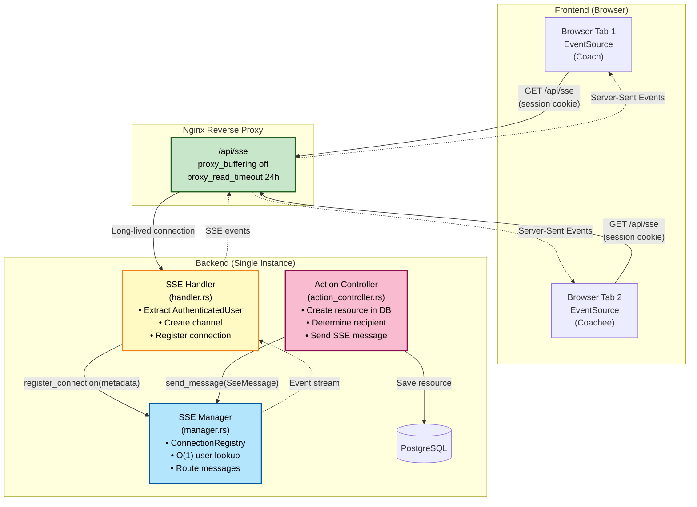
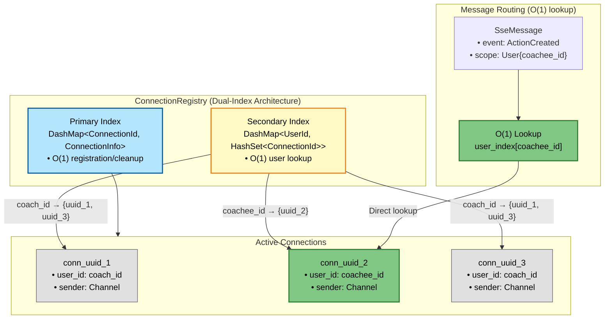

# SSE Communication Implementation Plan

## Overview
Add Server-Sent Events (SSE) infrastructure to enable real-time, unidirectional communication from backend to frontend. The implementation supports single-user messages and broadcasts to all clients. Each authenticated user maintains one app-wide SSE connection that persists across page navigation.

**⚠️ IMPORTANT: Single Instance Limitation**
This implementation uses in-memory connection tracking (DashMap) and **only works with a single backend instance**. If you scale horizontally (multiple backend replicas), SSE events will randomly fail. Redis Pub/Sub is required for multi-instance deployments. See "Multi-Instance Architecture" section below for migration path.

## Requirements

### Initial Requirements
- The backend should be able to send a message to a specific logged-in user (all their browser tabs)
- The backend should be able to broadcast a message to all logged-in users
- Messages are ephemeral - if a user is offline, they miss the message and see fresh data on next page load

### First Concrete Use Case
When two users are viewing the same coaching session, when one user creates a new action/note/resource, that resource is automatically visible to the other user without having to refresh the page.

### System-Level Events
Support critical system events like forcing a user to logout when viewing any page in the application (e.g., password compromised, permissions revoked).

### Future Requirements (Out of Scope for Initial Implementation)
- In the future the backend may need to broadcast to specific organizations
- In the future we may add message persistence/replay for critical events
- In the future we may add connection metrics and monitoring
- In the future we may add rate limiting per connection

---

## Architecture Diagram

### Overall System Architecture



### Message Flow Sequence


### SSE Manager Internal Structure



### Event Types and Scopes


### Connection Lifecycle


---

## Phase 0: Docker Compose Documentation

### 0.1 Add SSE Scaling Warning to docker-compose.yaml
**File:** `docker-compose.yaml`

**Add a prominent comment above the rust-app service definition (before line 57):**

```yaml
  ######################################################
  # CRITICAL: SSE Connection Management Limitation
  #
  # The rust-app service MUST run as a single instance (replicas: 1)
  # because SSE connections are tracked in-memory using DashMap.
  #
  # ⚠️  DO NOT SCALE HORIZONTALLY WITHOUT REDIS PUB/SUB ⚠️
  #
  # If you need to scale beyond 1 replica:
  # 1. Add Redis service to docker-compose.yaml
  # 2. Update SseManager to use Redis Pub/Sub
  # 3. See docs/implementation-plans/sse-communication.md
  #    "Multi-Instance Architecture" section
  #
  # Symptom if misconfigured: SSE events randomly fail
  # (~50% with 2 replicas, ~67% with 3 replicas, etc.)
  ######################################################
  rust-app:
```

**Why:** This prevents accidentally scaling to multiple instances without implementing Redis Pub/Sub, which would cause intermittent SSE failures that are hard to debug.

---

## Phase 1: Nginx Configuration

### 1.1 Update Nginx Configuration
**File:** `nginx/conf.d/refactor-platform.conf`

**Why:** SSE connections are long-lived (hours) and require special nginx configuration to prevent buffering events or timing out connections. Without these settings, SSE events would be delayed and connections would close after 60 seconds. The 15-second keep-alive from Axum ensures the connection stays healthy within the 24-hour timeout window.

**Add before the main frontend location block (line 139):**

```nginx
# SSE endpoint requires special configuration to prevent nginx from
# buffering events or timing out long-lived connections. Without these
# settings, SSE events would be delayed and connections would close after
# 60 seconds. The 15-second keep-alive from Axum ensures the connection
# stays healthy within the 24-hour timeout window.
location /api/sse {
    rewrite ^/api(.*)$ $1 break;
    proxy_pass http://backend;

    # SSE-specific settings
    proxy_buffering off;           # Enable immediate event streaming
    proxy_cache off;                # No caching for real-time streams
    proxy_read_timeout 24h;         # Allow long-lived connections
    proxy_connect_timeout 60s;
    proxy_send_timeout 60s;

    # Standard proxy headers
    proxy_set_header Host $host;
    proxy_set_header X-Real-IP $remote_addr;
    proxy_set_header X-Forwarded-For $proxy_add_x_forwarded_for;
    proxy_set_header X-Forwarded-Proto $scheme;
    proxy_set_header X-Forwarded-Host $host;
    proxy_set_header X-Forwarded-Port $server_port;
    proxy_set_header X-Request-ID $http_x_request_id$request_id;
    proxy_set_header Connection '';  # Clear connection header for streaming

    # Enable chunked transfer encoding
    chunked_transfer_encoding on;

    # CORS headers (same as other API routes)
    add_header 'Access-Control-Allow-Origin' 'https://myrefactor.com' always;
    add_header 'Access-Control-Allow-Credentials' 'true' always;
}
```

---

## Phase 2: Backend Infrastructure Setup

### 2.1 Add Required Dependencies
**File:** `web/Cargo.toml`

Add these dependencies:
```toml
async-stream = "0.3"
dashmap = "6.1"
```

**Why:**
- `async-stream`: Provides `try_stream!` macro for clean SSE stream implementation
- `dashmap`: Thread-safe concurrent HashMap for connection registry

**Note:** Other required dependencies (`tokio`, `futures`, `axum`, `serde`) are already in the crate.

---

### 2.2 Create SSE Module Structure
**Files to create:**
- `web/src/sse/mod.rs`
- `web/src/sse/manager.rs`
- `web/src/sse/connection.rs`
- `web/src/sse/handler.rs`
- `web/src/sse/messages.rs`

---

### 2.3 Define Message Types
**File:** `web/src/sse/message.rs`

**Purpose:** Define strongly-typed event messages that can be sent over SSE

**Key design decisions:**
- Type-safe event variants (not generic JSON) for compile-time guarantees
- All events include context (coaching_session_id or coaching_relationship_id) for client-side filtering
- All events are ephemeral (no persistence)
- Two message scopes: User (specific user) and Broadcast (all users)
- Trait-based event type extraction (no string manipulation or unwrap!)

```rust
use domain::{actions, agreements, notes, overarching_goals, Id};
use serde::Serialize;

/// Trait for getting the SSE event type name
pub trait EventType {
    fn event_type(&self) -> &'static str;
}

#[derive(Debug, Clone, Serialize)]
#[serde(tag = "type", content = "data")]
pub enum Event {
    // Actions (session-scoped)
    #[serde(rename = "action_created")]
    ActionCreated {
        coaching_session_id: Id,
        action: actions::Model,
    },
    #[serde(rename = "action_updated")]
    ActionUpdated {
        coaching_session_id: Id,
        action: actions::Model,
    },
    #[serde(rename = "action_deleted")]
    ActionDeleted {
        coaching_session_id: Id,
        action_id: Id,
    },

    // Agreements (relationship-scoped)
    #[serde(rename = "agreement_created")]
    AgreementCreated {
        coaching_relationship_id: Id,
        agreement: agreements::Model,
    },
    #[serde(rename = "agreement_updated")]
    AgreementUpdated {
        coaching_relationship_id: Id,
        agreement: agreements::Model,
    },
    #[serde(rename = "agreement_deleted")]
    AgreementDeleted {
        coaching_relationship_id: Id,
        agreement_id: Id,
    },

    // Overarching Goals (relationship-scoped)
    #[serde(rename = "goal_created")]
    GoalCreated {
        coaching_relationship_id: Id,
        goal: overarching_goals::Model,
    },
    #[serde(rename = "goal_updated")]
    GoalUpdated {
        coaching_relationship_id: Id,
        goal: overarching_goals::Model,
    },
    #[serde(rename = "goal_deleted")]
    GoalDeleted {
        coaching_relationship_id: Id,
        goal_id: Id,
    },

    // System events
    #[serde(rename = "force_logout")]
    ForceLogout { reason: String },
}

impl SseEventType for Event {
    fn event_type(&self) -> &'static str {
        match self {
            Event::ActionCreated { .. } => "action_created",
            Event::ActionUpdated { .. } => "action_updated",
            Event::ActionDeleted { .. } => "action_deleted",
            Event::AgreementCreated { .. } => "agreement_created",
            Event::AgreementUpdated { .. } => "agreement_updated",
            Event::AgreementDeleted { .. } => "agreement_deleted",
            Event::GoalCreated { .. } => "goal_created",
            Event::GoalUpdated { .. } => "goal_updated",
            Event::GoalDeleted { .. } => "goal_deleted",
            Event::ForceLogout { .. } => "force_logout",
        }
    }
}

#[derive(Debug, Clone)]
pub struct Message {
    pub event: Event,
    pub scope: MessageScope,
}

#[derive(Debug, Clone)]
pub enum MessageScope {
    /// Send to all connections for a specific user
    User { user_id: Id },
    /// Send to all connected users
    Broadcast,
}
```

**Why trait-based approach:**
- No string manipulation or `unwrap()` calls
- Compile-time enforcement: adding a new event variant will cause a compile error until `event_type()` is updated
- Event type names match serde renames exactly (single source of truth)
- Zero runtime overhead (returns `&'static str`)

---

### 2.4 Implement Connection Types and Registry
**File:** `web/src/sse/connection.rs`

**Purpose:** High-performance connection registry with dual indices for O(1) lookups

**Key design decisions:**
- Dual-index architecture: O(1) lookup by both connection_id and user_id
- Type-safe `ConnectionId` newtype prevents string confusion
- Eliminated redundant `connection_id` from info struct
- Automatic cleanup of empty user indices

**Implementation:**
```rust
use domain::Id;
use std::collections::HashSet;
use std::convert::Infallible;
use tokio::sync::mpsc::UnboundedSender;
use axum::response::sse::Event;
use dashmap::DashMap;
use log::*;

/// Unique identifier for a connection (server-generated)
#[derive(Debug, Clone, PartialEq, Eq, Hash)]
pub struct ConnectionId(String);

impl ConnectionId {
    pub fn new() -> Self {
        Self(Id::new_v4().to_string())
    }

    pub fn as_str(&self) -> &str {
        &self.0
    }
}

impl Default for ConnectionId {
    fn default() -> Self {
        Self::new()
    }
}

/// Connection information (no redundant connection_id)
#[derive(Debug, Clone)]
pub struct ConnectionInfo {
    pub user_id: Id,
    pub sender: UnboundedSender<Result<Event, Infallible>>,
}

/// High-performance connection registry with dual indices for O(1) lookups
pub struct ConnectionRegistry {
    /// Primary storage: lookup by connection_id for registration/cleanup - O(1)
    connections: DashMap<ConnectionId, ConnectionInfo>,

    /// Secondary index: fast lookup by user_id for message routing - O(1)
    user_index: DashMap<Id, HashSet<ConnectionId>>,
}

impl ConnectionRegistry {
    pub fn new() -> Self {
        Self {
            connections: DashMap::new(),
            user_index: DashMap::new(),
        }
    }

    /// Register a new connection - O(1)
    pub fn register(&self, user_id: Id, sender: UnboundedSender<Result<Event, Infallible>>) -> ConnectionId {
        let connection_id = ConnectionId::new();

        // Insert into primary storage
        self.connections.insert(
            connection_id.clone(),
            ConnectionInfo { user_id, sender },
        );

        // Update secondary index
        self.user_index
            .entry(user_id)
            .or_insert_with(HashSet::new)
            .insert(connection_id.clone());

        connection_id
    }

    /// Unregister a connection - O(1)
    pub fn unregister(&self, connection_id: &ConnectionId) {
        // Remove from primary storage
        if let Some((_, info)) = self.connections.remove(connection_id) {
            let user_id = info.user_id;

            // Update secondary index
            if let Some(mut entry) = self.user_index.get_mut(&user_id) {
                entry.remove(connection_id);

                // Clean up empty user entries
                if entry.is_empty() {
                    drop(entry); // Release lock before removal
                    self.user_index.remove(&user_id);
                }
            }
        }
    }

    /// Send message to specific user - O(1) lookup + O(k) send where k = user's connections
    pub fn send_to_user(&self, user_id: &Id, event: Event) {
        if let Some(connection_ids) = self.user_index.get(user_id) {
            for conn_id in connection_ids.iter() {
                if let Some(info) = self.connections.get(conn_id) {
                    if let Err(e) = info.sender.send(Ok(event.clone())) {
                        warn!(
                            "Failed to send event to connection {}: {}. Connection will be cleaned up.",
                            conn_id.as_str(), e
                        );
                    }
                }
            }
        }
    }

    /// Broadcast message to all connections - O(n) (unavoidable, but explicit)
    pub fn broadcast(&self, event: Event) {
        for entry in self.connections.iter() {
            if let Err(e) = entry.value().sender.send(Ok(event.clone())) {
                warn!(
                    "Failed to send broadcast to connection {}: {}",
                    entry.key().as_str(), e
                );
            }
        }
    }

    /// Get total connection count - O(1)
    pub fn connection_count(&self) -> usize {
        self.connections.len()
    }

    /// Get active user count - O(1)
    pub fn active_user_count(&self) -> usize {
        self.user_index.len()
    }

    /// Get connections per user (for monitoring/debugging) - O(1)
    pub fn connections_per_user(&self, user_id: &Id) -> usize {
        self.user_index
            .get(user_id)
            .map(|set| set.len())
            .unwrap_or(0)
    }
}

impl Default for ConnectionRegistry {
    fn default() -> Self {
        Self::new()
    }
}
```

**Performance characteristics:**
- Registration: O(1)
- Unregistration: O(1)
- Send to specific user: O(1) + O(k) where k = user's connections (typically 1-3)
- Broadcast: O(n) where n = total connections
- Get active users: O(1)

---

### 2.5 Implement SSE Manager
**File:** `web/src/sse/manager.rs`

**Purpose:** Central manager for routing messages to connections via the registry

**Key struct:**
```rust
use crate::sse::connection::{ConnectionRegistry, ConnectionId};
use crate::sse::message::{MessageScope, Event as SseEvent, Message as SseMessage};
use axum::response::sse::Event;
use domain::Id;
use log::*;
use std::sync::Arc;

pub struct Manager {
    registry: Arc<ConnectionRegistry>,
}

impl Manager {
    pub fn new() -> Self {
        Self {
            registry: Arc::new(ConnectionRegistry::new()),
        }
    }

    /// Register a new connection and return its unique ID
    pub fn register_connection(
        &self,
        user_id: Id,
        sender: tokio::sync::mpsc::UnboundedSender<Result<Event, std::convert::Infallible>>,
    ) -> ConnectionId {
        let connection_id = self.registry.register(user_id, sender);
        debug!("Registered SSE connection {} for user {}", connection_id.as_str(), user_id);
        connection_id
    }

    /// Unregister a connection by ID
    pub fn unregister_connection(&self, connection_id: &ConnectionId) {
        debug!("Unregistering SSE connection {}", connection_id.as_str());
        self.registry.unregister(connection_id);
    }

    /// Send a message based on its scope
    pub fn send_message(&self, message: SseMessage) {
        use crate::sse::message::EventType;

        let event_type = message.event.event_type();

        let event_data = match serde_json::to_string(&message.event) {
            Ok(json) => json,
            Err(e) => {
                error!("Failed to serialize SSE event: {}", e);
                return;
            }
        };

        let event = Event::default()
            .event(event_type)
            .data(event_data);

        match message.scope {
            MessageScope::User { user_id } => {
                self.registry.send_to_user(&user_id, event);
            }
            MessageScope::Broadcast => {
                self.registry.broadcast(event);
            }
        }
    }

    /// Get total connection count
    pub fn connection_count(&self) -> usize {
        self.registry.connection_count()
    }

    /// Get active user count
    pub fn active_user_count(&self) -> usize {
        self.registry.active_user_count()
    }
}

impl Default for Manager {
    fn default() -> Self {
        Self::new()
    }
}
```

**Message routing logic:**
- User scope: O(1) lookup to user's connections, send to all (typically 1-3)
- Broadcast: O(n) iteration through all connections
- Backend determines recipients based on business logic (not client-controlled)

---

### 2.6 Implement SSE Handler
**File:** `web/src/sse/handler.rs`

**Purpose:** Axum HTTP handler for SSE endpoint

**Handler signature:**
```rust
use crate::extractors::authenticated_user::AuthenticatedUser;
use crate::AppState;
use async_stream::try_stream;
use axum::extract::State;
use axum::response::sse::{Event, KeepAlive, Sse};
use axum::response::IntoResponse;
use log::*;
use std::convert::Infallible;
use tokio::sync::mpsc;

/// SSE handler that establishes a long-lived connection for real-time updates.
/// One connection per authenticated user, stays open across page navigation.
pub async fn sse_handler(
    AuthenticatedUser(user): AuthenticatedUser,
    State(app_state): State<AppState>,
) -> impl IntoResponse {
    debug!("Establishing SSE connection for user {}", user.id);

    let (tx, mut rx) = mpsc::unbounded_channel();

    // Register returns the connection_id
    let connection_id = app_state.sse_manager.register_connection(user.id, tx);

    let manager = app_state.sse_manager.clone();

    let stream = try_stream! {
        while let Some(event) = rx.recv().await {
            yield event?;
        }

        // Connection closed, clean up
        manager.unregister_connection(&connection_id);
    };

    Sse::new(stream).keep_alive(KeepAlive::default())
}
```

**Implementation approach:**
1. Extract user from authenticated session (via cookie)
2. Create channel for this connection
3. Register connection with Manager (returns ConnectionId)
4. Create async stream that yields events from channel
5. On stream drop, unregister connection using ConnectionId
6. Keep-alive every 15 seconds (default) prevents nginx timeout

---

### 2.7 Add Module Documentation
**File:** `web/src/sse/mod.rs`

```rust
//! Server-Sent Events (SSE) infrastructure for real-time updates.
//!
//! This module provides a type-safe, app-wide SSE implementation for pushing
//! real-time updates from the backend to authenticated users.
//!
//! # Architecture
//!
//! - **Single connection per user**: Each authenticated user establishes one
//!   SSE connection that stays open across page navigation.
//! - **Dual-index registry**: O(1) lookups for both connection management and
//!   user-scoped message routing via separate DashMap indices.
//! - **User and Broadcast scopes**: Messages can be sent to specific users or
//!   broadcast to all connected users.
//! - **Ephemeral messages**: All events are ephemeral - if a user is offline,
//!   they miss the event and see fresh data on next page load.
//! - **Type-safe events**: All event types are strongly typed for compile-time
//!   safety and better frontend TypeScript integration.
//!
//! # Message Flow
//!
//! 1. Frontend establishes SSE connection via `/sse` endpoint
//! 2. Backend extracts user from session cookie (AuthenticatedUser)
//! 3. Connection registered in ConnectionRegistry with dual indices
//! 4. When a resource changes (e.g., action created):
//!    - Controller determines recipient (e.g., other user in relationship)
//!    - Controller sends message via `app_state.sse_manager.send_message()`
//!    - Manager performs O(1) lookup in user_index to find connections
//!    - Events sent only to matching connections
//! 5. Frontend receives event and updates UI based on context
//!
//! # Example: Sending an event
//!
//! ```rust,ignore
//! use web::sse::messages::{MessageScope, Event as SseEvent, Message as SseMessage};
//!
//! // In a controller after creating an action
//! app_state.sse_manager.send_message(SseMessage {
//!     event: SseEvent::ActionCreated {
//!         coaching_session_id,
//!         action: action.clone(),
//!     },
//!     scope: MessageScope::User { user_id: recipient_id },
//! });
//! ```
//!
//! # Frontend Integration
//!
//! Frontend establishes connection once on app mount:
//!
//! ```typescript
//! const es = new EventSource('/api/sse', { withCredentials: true });
//! es.addEventListener('action_created', (e) => {
//!   const { coaching_session_id, action } = JSON.parse(e.data);
//!   // Update UI if viewing this session
//! });
//! ```
//!
//! # Security Considerations
//!
//! - Authentication required (AuthenticatedUser extractor)
//! - Session cookie must be valid
//! - Backend determines recipients (not client-controlled)
//! - nginx configured for long-lived connections (24h timeout)
//! - Keep-alive messages prevent idle timeout
//!
//! # Modules
//!
//! - `connection`: ConnectionRegistry with dual-index architecture and type-safe ConnectionId
//! - `handler`: Axum SSE endpoint handler
//! - `manager`: High-level message routing (delegates to ConnectionRegistry)
//! - `message`: Type-safe event and scope definitions

pub mod connection;
pub mod handler;
pub mod manager;
pub mod message;

pub use manager::Manager;
```

---

### 2.8 Update AppState
**File:** `service/src/lib.rs`

**Add SseManager to AppState:**
```rust
use std::sync::Arc;

pub struct AppState {
    pub database_connection: Arc<DatabaseConnection>,
    pub config: Config,
    pub sse_manager: Arc<web::sse::Manager>,  // NEW
}
```

**Note:** This requires making `Manager` public in the web crate.

---

### 2.9 Add SSE Route
**File:** `web/src/router.rs`

**Add SSE endpoint:**
```rust
// Add to imports
use crate::sse;

// Add new function
fn sse_routes(app_state: AppState) -> Router {
    Router::new()
        .route("/sse", get(sse::handler::sse_handler))
        .route_layer(from_fn(require_auth))
        .with_state(app_state)
}

// In define_routes():
pub fn define_routes(app_state: AppState) -> Router {
    Router::new()
        .merge(sse_routes(app_state.clone()))
        // ... existing routes
}
```

---

### 2.10 Initialize SSE Manager
**File:** `src/main.rs`

```rust
let sse_manager = Arc::new(web::sse::Manager::new());
let app_state = AppState {
    database_connection: db,
    config,
    sse_manager,
};
```

---

## Phase 3: Integration with Controllers

### 3.1 Update Action Controller
**File:** `web/src/controller/action_controller.rs`

**After creating an action, send SSE event to the other user in the coaching relationship:**

```rust
use crate::sse::message::{MessageScope, Event as SseEvent, Message as SseMessage};

pub async fn create(
    CompareApiVersion(_v): CompareApiVersion,
    AuthenticatedUser(user): AuthenticatedUser,
    State(app_state): State<AppState>,
    Json(action_model): Json<Model>,
) -> Result<impl IntoResponse, Error> {
    debug!("POST Create a New Action from: {action_model:?}");

    let action = ActionApi::create(app_state.db_conn_ref(), action_model, user.id).await?;

    // Send SSE notification to other user in coaching relationship
    if let Some(coaching_session_id) = action.coaching_session_id {
        if let Ok(recipient_id) = determine_other_user_in_coaching_session(
            app_state.db_conn_ref(),
            coaching_session_id,
            user.id,
        ).await {
            app_state.sse_manager.send_message(SseMessage {
                event: SseEvent::ActionCreated {
                    coaching_session_id,
                    action: action.clone(),
                },
                scope: MessageScope::User { user_id: recipient_id },
            });
        }
    }

    Ok(Json(ApiResponse::new(StatusCode::CREATED.into(), action)))
}

// Helper function to determine the other user in a coaching session
async fn determine_other_user_in_coaching_session(
    db: &DatabaseConnection,
    coaching_session_id: Id,
    current_user_id: Id,
) -> Result<Id, Error> {
    use domain::coaching_session;
    use domain::coaching_relationship;

    let session = coaching_session::find_by_id(db, coaching_session_id).await?;
    let relationship = coaching_relationship::find_by_id(db, session.coaching_relationship_id).await?;

    // Return the OTHER user (not the current user)
    if relationship.coach_id == current_user_id {
        Ok(relationship.coachee_id)
    } else {
        Ok(relationship.coach_id)
    }
}
```

**Similarly update:**
- `update()` - Send ActionUpdated to other user
- `delete()` - Send ActionDeleted to other user
- `update_status()` - Send ActionUpdated to other user

**Apply same pattern to:**
- `agreement_controller.rs` (AgreementCreated/Updated/Deleted)
- `overarching_goal_controller.rs` (GoalCreated/Updated/Deleted)

**Business logic pattern:**
- For session-scoped resources (actions, notes): Send to other user viewing the coaching session
- For relationship-scoped resources (agreements, goals): Send to other user in the coaching relationship
- The creator already sees the resource via optimistic UI update, only the OTHER user needs notification

---

### 3.2 Handle Auth Changes (Security)
**File:** `web/src/controller/user_session_controller.rs`

**On logout, send ForceLogout event:**

```rust
use crate::sse::messages::{MessageScope, SseEvent, SseMessage};

pub async fn delete(
    AuthenticatedUser(user): AuthenticatedUser,
    State(app_state): State<AppState>,
    // ... other params
) -> Result<impl IntoResponse, Error> {
    // Existing logout logic...

    // Send force logout event (ephemeral - only if user is connected)
    app_state.sse_manager.send_message(SseMessage {
        event: SseEvent::ForceLogout {
            reason: "User logged out".to_string(),
        },
        scope: MessageScope::User { user_id: user.id },
    });

    // ... rest of logout
}
```

**Also add to:**
- User deletion endpoint (`web/src/controller/organization/user_controller.rs` `delete()`)
- Password change endpoint (forces re-auth)
- Permission changes (when admin changes user roles)

---

## Phase 4: Frontend Integration

### 4.1 Create SSE Client Hook
**File:** `~/Desktop/refactor/refactor-platform-fe/src/hooks/useSSE.ts`

**Purpose:** React hook to establish and manage app-wide SSE connection

```typescript
import { useEffect, useRef } from 'react';
import { siteConfig } from '@/site.config';

export function useSSE() {
  const eventSourceRef = useRef<EventSource | null>(null);

  useEffect(() => {
    // Establish single app-wide SSE connection
    const es = new EventSource(`${siteConfig.env.backendServiceURL}/sse`, {
      withCredentials: true, // Send session cookie
    });

    es.onopen = () => {
      console.log('SSE connection established');
    };

    es.onerror = (error) => {
      console.error('SSE connection error:', error);
      // EventSource will automatically reconnect
    };

    eventSourceRef.current = es;

    return () => {
      console.log('Closing SSE connection');
      es.close();
    };
  }, []); // Empty deps - establish once on app mount

  return eventSourceRef.current;
}
```

---

### 4.2 Create Typed Event Handler Hook
**File:** `~/Desktop/refactor/refactor-platform-fe/src/hooks/useSSEEventHandler.ts`

**Purpose:** Type-safe event handler registration

```typescript
import { useEffect } from 'react';

type SseEventHandler<T = any> = (data: T) => void;

export function useSSEEventHandler(
  eventSource: EventSource | null,
  eventType: string,
  handler: SseEventHandler
) {
  useEffect(() => {
    if (!eventSource) return;

    const listener = (e: MessageEvent) => {
      try {
        const data = JSON.parse(e.data);
        handler(data);
      } catch (error) {
        console.error(`Failed to parse ${eventType} event:`, error);
      }
    };

    eventSource.addEventListener(eventType, listener);

    return () => {
      eventSource.removeEventListener(eventType, listener);
    };
  }, [eventSource, eventType, handler]);
}
```

---

### 4.3 Establish SSE in App Root
**File:** App root component or layout

```typescript
import { useSSE } from '@/hooks/useSSE';
import { useSSEEventHandler } from '@/hooks/useSSEEventHandler';
import { useAuthStore } from '@/lib/providers/auth-store-provider';

function AppLayout({ children }: Props) {
  const { userSession } = useAuthStore();
  const eventSource = useSSE(); // Establish once for entire app

  // Global force logout handler
  useSSEEventHandler(eventSource, 'force_logout', (data) => {
    console.log('Force logout:', data.reason);
    // Clear auth state and redirect
    window.location.href = '/login?reason=forced_logout';
  });

  return <>{children}</>;
}
```

---

### 4.4 Use SSE in Coaching Session Page
**File:** Coaching session page component

```typescript
import { useSSE } from '@/hooks/useSSE';
import { useSSEEventHandler } from '@/hooks/useSSEEventHandler';

function CoachingSessionPage({ sessionId }: Props) {
  const [actions, setActions] = useState<Action[]>([]);
  const eventSource = useSSE(); // App-wide connection

  // Handle action created events
  useSSEEventHandler(eventSource, 'action_created', (data) => {
    // Only update if viewing this coaching session
    if (data.coaching_session_id === sessionId) {
      setActions(prev => [...prev, data.action]);
    }
  });

  // Handle action updated events
  useSSEEventHandler(eventSource, 'action_updated', (data) => {
    if (data.coaching_session_id === sessionId) {
      setActions(prev =>
        prev.map(a => a.id === data.action.id ? data.action : a)
      );
    }
  });

  // Handle action deleted events
  useSSEEventHandler(eventSource, 'action_deleted', (data) => {
    if (data.coaching_session_id === sessionId) {
      setActions(prev => prev.filter(a => a.id !== data.action_id));
    }
  });

  // ... rest of component
}
```

**Key pattern:**
- Single app-wide SSE connection (via `useSSE()`)
- Events include context (coaching_session_id) for client-side filtering
- Only update UI if viewing the relevant coaching session
- Same pattern applies to Notes, Agreements, and Goals

---

## Phase 5: Testing

### 5.1 Backend Unit Tests
**File:** `web/src/sse/connection.rs` (tests module)

**Test cases:**
- Connection registration creates both indices
- Multiple connections for same user tracked correctly
- Unregistration cleans up both indices
- Empty user indices are removed
- User-scoped send targets only correct connections
- Broadcast sends to all connections
- Connection count and active user count tracking

```rust
#[cfg(test)]
mod tests {
    use super::*;
    use domain::Id;
    use tokio::sync::mpsc;

    #[test]
    fn registration_creates_both_indices() {
        let registry = ConnectionRegistry::new();
        let user_id = Id::new_v4();
        let (tx, _rx) = mpsc::unbounded_channel();

        let conn_id = registry.register(user_id, tx);

        assert_eq!(registry.connection_count(), 1);
        assert_eq!(registry.active_user_count(), 1);
        assert_eq!(registry.connections_per_user(&user_id), 1);
    }

    #[test]
    fn multiple_connections_same_user() {
        let registry = ConnectionRegistry::new();
        let user_id = Id::new_v4();

        let (tx1, _rx1) = mpsc::unbounded_channel();
        let (tx2, _rx2) = mpsc::unbounded_channel();

        registry.register(user_id, tx1);
        registry.register(user_id, tx2);

        assert_eq!(registry.connection_count(), 2);
        assert_eq!(registry.active_user_count(), 1); // Same user
        assert_eq!(registry.connections_per_user(&user_id), 2);
    }

    #[test]
    fn unregistration_cleans_up_indices() {
        let registry = ConnectionRegistry::new();
        let user_id = Id::new_v4();
        let (tx, _rx) = mpsc::unbounded_channel();

        let conn_id = registry.register(user_id, tx);
        registry.unregister(&conn_id);

        assert_eq!(registry.connection_count(), 0);
        assert_eq!(registry.active_user_count(), 0); // Should clean up empty entry
    }

    #[tokio::test]
    async fn send_to_user_only_targets_user_connections() {
        let registry = ConnectionRegistry::new();

        let user1 = Id::new_v4();
        let user2 = Id::new_v4();

        let (tx1, mut rx1) = mpsc::unbounded_channel();
        let (tx2, mut rx2) = mpsc::unbounded_channel();

        registry.register(user1, tx1);
        registry.register(user2, tx2);

        let event = axum::response::sse::Event::default().data("test");
        registry.send_to_user(&user1, event);

        // User1 receives
        assert!(rx1.try_recv().is_ok());
        // User2 does not
        assert!(rx2.try_recv().is_err());
    }

    #[tokio::test]
    async fn broadcast_sends_to_all_connections() {
        let registry = ConnectionRegistry::new();

        let (tx1, mut rx1) = mpsc::unbounded_channel();
        let (tx2, mut rx2) = mpsc::unbounded_channel();

        registry.register(Id::new_v4(), tx1);
        registry.register(Id::new_v4(), tx2);

        let event = axum::response::sse::Event::default().data("broadcast");
        registry.broadcast(event);

        // Both users receive
        assert!(rx1.try_recv().is_ok());
        assert!(rx2.try_recv().is_ok());
    }
}
```

**Additional Manager tests in** `web/src/sse/manager.rs`:
- Message serialization
- Event type extraction
- Scope-based routing delegates correctly to registry

---

### 5.2 Backend Integration Tests
**File:** `web/tests/sse_integration_test.rs`

**Test cases:**
- Unauthenticated requests return 401
- SSE connection established with valid session
- Connection metadata extracted correctly
- Events flow correctly through the stream
- Connection cleanup on disconnect
- Keep-alive messages sent at correct interval

---

### 5.3 End-to-End Test
**Manual testing scenario:**
1. Open two browser windows
2. Log in as Coach in window 1, Coachee in window 2
3. Navigate both to same coaching session
4. Create action in window 1
5. Verify action appears in window 2 without refresh
6. Verify action appears immediately (not delayed)
7. Test with Notes, Agreements, Goals
8. Test force logout (admin forces logout in one window, other windows redirect)
9. Test connection reconnection (kill backend, restart, verify SSE reconnects)

---

## Architecture Diagram

```
┌─────────────────────────────────────────────────────────────┐
│                         Frontend                             │
│  ┌──────────────────┐       ┌──────────────────┐           │
│  │  Browser Tab 1   │       │  Browser Tab 2   │           │
│  │  EventSource     │       │  EventSource     │           │
│  │  (user session)  │       │  (user session)  │           │
│  └────────┬─────────┘       └────────┬─────────┘           │
└───────────┼──────────────────────────┼──────────────────────┘
            │                          │
            │ GET /sse (with cookie)   │ GET /sse (with cookie)
            │                          │
┌───────────┼──────────────────────────┼──────────────────────┐
│           ▼                          ▼          Backend      │
│  ┌────────────────────────────────────────────────┐         │
│  │           SSE Handler (handler.rs)             │         │
│  │  - Extract user from AuthenticatedUser         │         │
│  │  - Create channel for connection               │         │
│  │  - Register with Manager                    │         │
│  └──────────────────┬─────────────────────────────┘         │
│                     │                                        │
│                     ▼                                        │
│  ┌────────────────────────────────────────────────┐         │
│  │         Manager (manager.rs)                │         │
│  │  ┌──────────────────────────────────────────┐ │         │
│  │  │  ConnectionRegistry                       │ │         │
│  │  │  • Primary: DashMap<ConnId, Info>        │ │         │
│  │  │  • Secondary: DashMap<UserId, Set>       │ │         │
│  │  └──────────────────────────────────────────┘ │         │
│  │                                                │         │
│  │  send_message(Message)                     │         │
│  │    → O(1) lookup in user_index                │         │
│  │    → Send to matching channels                │         │
│  └──────────────────▲───────────────────────────┘          │
│                     │                                        │
│  ┌──────────────────┴───────────────────────────┐          │
│  │      Action Controller (action_controller.rs) │          │
│  │  - Create action in DB                        │          │
│  │  - Determine OTHER user in relationship       │          │
│  │  - Send User-scoped SseMessage                │          │
│  └───────────────────────────────────────────────┘          │
└─────────────────────────────────────────────────────────────┘
```

## Security Considerations

- **Authentication required**: All SSE connections must have valid session cookie
- **Backend-controlled routing**: Recipients determined by server, not client
- **Ephemeral messages**: No persistence reduces attack surface
- **Connection cleanup**: Automatic cleanup on disconnect prevents resource leaks
- **nginx timeout**: 24h timeout prevents indefinite connections
- **No client-controlled parameters**: No query params that could be manipulated

---

## Multi-Instance Architecture (Future Migration Path)

### When to Migrate

Migrate to multi-instance architecture when:
- You need horizontal scaling (more than 1 backend replica)
- You're experiencing performance bottlenecks with single instance
- You need high availability (failover between instances)


## Future Enhancements (Not in Initial Implementation)

### Message Scopes to Add Later:
- `MessageScope::Organization { org_id: Id }` - Broadcast to org members
- `MessageScope::Coach { coach_id: Id }` - Coach to all their coachees

### Additional Events:
- `SessionStarted`, `SessionEnded` (coaching session lifecycle)
- `UserJoinedSession`, `UserLeftSession` (presence)
- Collaborative editing conflicts/resolutions

### Advanced Features:
- Connection heartbeat monitoring and health checks
- Message persistence/replay for critical events (e.g., force logout)
- Rate limiting per connection (prevent abuse)
- Metrics/monitoring (active connections, messages sent, latency)
- Redis Pub/Sub backend for horizontal scaling (when moving to multiple instances)
- Compression for large payloads
- Connection recovery tokens (resume on disconnect)

---

## References

- [Axum SSE Documentation](https://docs.rs/axum/latest/axum/response/sse/index.html)
- [MDN Server-Sent Events](https://developer.mozilla.org/en-US/docs/Web/API/Server-sent_events)
- [Nginx SSE Proxy Configuration](https://nginx.org/en/docs/http/ngx_http_proxy_module.html)
- [SSE vs WebSocket Comparison](https://ably.com/blog/websockets-vs-sse)
